# ABB机器人的认识
 
## ABB机器人软件的下载
ABB机器人软件
https://pan.baidu.com/share/init?surl=hjgkpdmxi2wo1Ym-U0hsCQ&pwd=uldl
下载地址（提取码：uldl）
### ABB机器人的类型

#### 直角坐标机器人
直角坐标机器人一般为2-3个自由度运动，每个运动自由度之间的空间夹角为直角。自动控制的，可重复编程，所有的运动均按程序运行。一般由控制系统、驱动系统、机械系统、操作工具等组成。灵活，多功能，因操作工具的不同功能也不同。高可靠性、高速度、高精度。可用于恶劣的环境，可长期工作，便于操作维修。

#### 平面关节型机器人
平面关节型机器人又称为SCARA型机器人是圆柱坐标机器人的一种形式。SCARA机器人有3个旋转关节其轴线相互平行，在平面内进行定位和定向。另一个关节是移动关节，用于完成未端件在垂直于平面的运动。具有精度高，有较大动作范围，坐标计算简单，结构轻便，响应速度快，但是负载较小，主要用于电子、分拣等领域。
SCARA系统在x,y方向上具有顺从性，而在Z轴方向具有良好的刚度，此特性特别适合于装配工作，SCARA的另一个特点是其串接的两杆结构，类似人的手臂，可以伸进有限空间中作业然后收回，适合于搬动和取放物件，如集成电路板等。
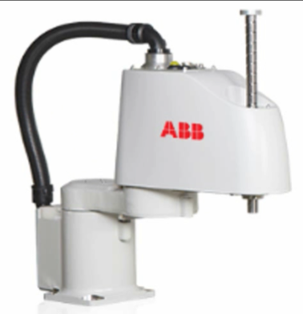

#### 并联机器人
并联机器人又称DELTA机器人属于高速、轻载的并联机器人，一般通过示教编程或视觉系统捕捉目标物体由三个并联的伺服轴确定抓具中心(TCP)的空间位置实现目标物体的运输，加工等操作。Delta机器人主要应用于食品、药品和电子产品等加工、装配。Delta机器人以其重量轻、体积小、运动速度快、定位精确、成本低效率高等特点，正在市场上被广泛应用。
Delta机器人是典型的空间三自由度并联机构，整体结构精密、紧凑，驱动部分均布于固定平台，这些特点使它具有如下特性:
1.承载能力强、刚度大、自重负荷比小、动态性能好
2.并行三自由度机械臂结构，重复定位精度高。
3.超高速拾取物品，一秒钟多个节拍。
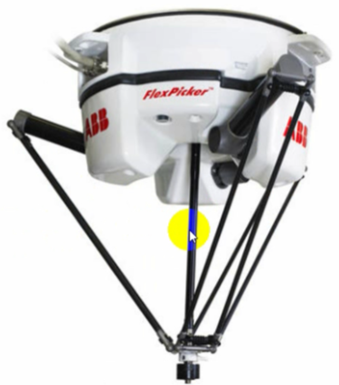

#### 串联机器人
串联机器人，拥有五个或六个旋转轴，类似于人类的手臂。应用领域有装货、卸货、喷漆、表面处理、测试、测量、弧焊、点焊、包装、装配、切屑机床、固定特种装配操作、锻造、铸造等。
串联机器人一般地，有很高的自由度，5~6轴，适合于几乎任何轨迹或角度的工作可以自由编程，完成全自动化的工作提高生产效率，可控制的错误率代替很多不适合人力完成、有害身体健康的复杂工作，比如，汽车外壳点焊、金属部件打磨。
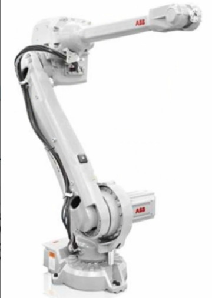

#### 协助机器人
在传统的工业机器人逐渐取代单调、重复性高、危险性强的工作之时，协作机器人也将会慢慢渗入各个工业领域，与人共同工作。这将引领一个全新的机器人与人协同工作时代的来临，随着工业自动化的发展，我们发现需要协助型的工业机器人配合人来完成工作任务。这样子的话，比工业机器人的全自动化工作站具有更好的柔性和成本优势。
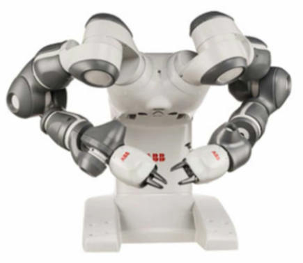

## ABB机器人的拆箱操作
1.机器人到达现场后，第一时间检查外观是否有破损，是否有进水等等异常情况。如果有问题请马上联系厂家及物流公司进行处理。
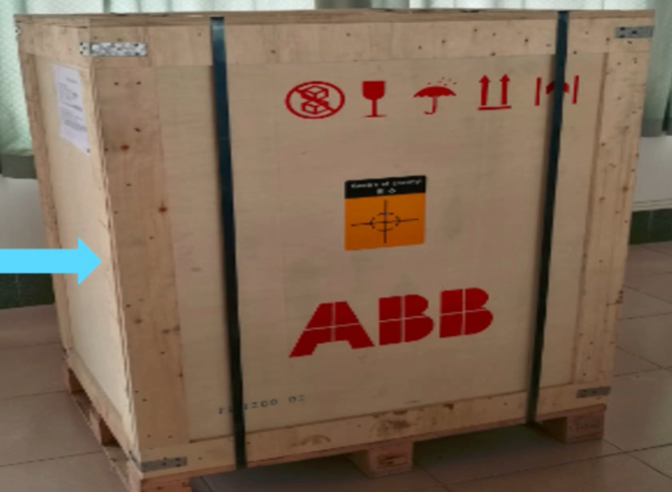

2.使用合适的工具剪断箱子上的两条钢扎带。
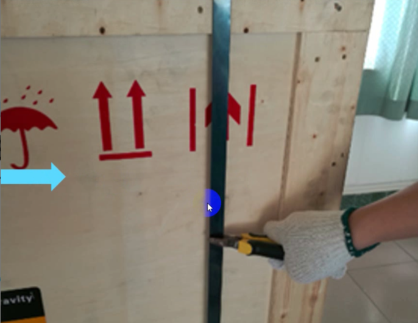

3.将剪断的钢扎带取走。
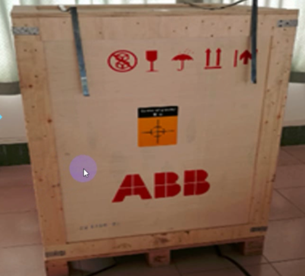

4.需要两人根据箭头方向，将箱体向上抬起放置到一边，与包装底座进行分离。
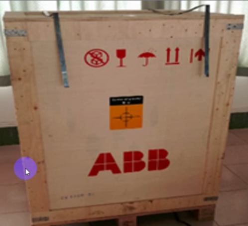

5.尽量保证箱体的完成以便日后重复使用。
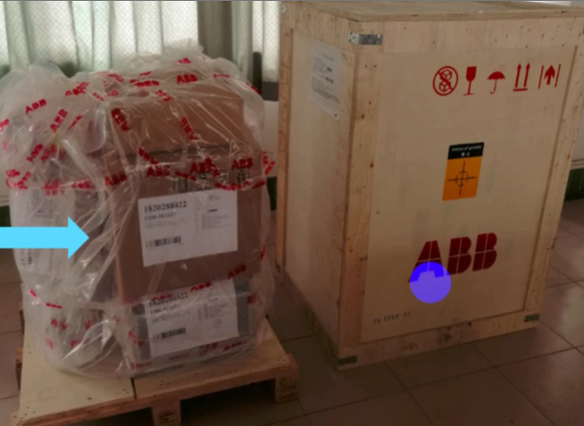

### 工业机器人清点标准装箱物品
1.以ABB机器人IRB1200为例，包括4个主要物品机器人本体、示教器、线缆配件及控制柜
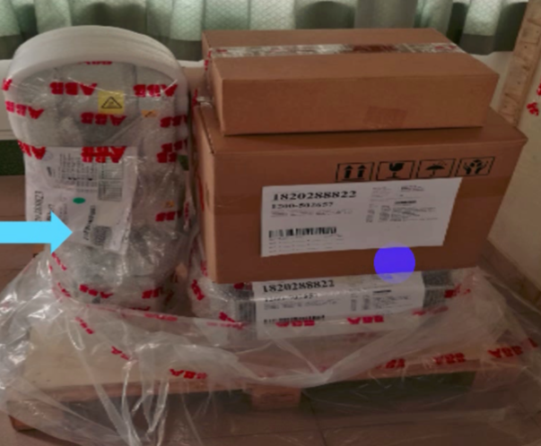
2.两个纸箱打开后，展开的内容物

3.随机的文档:SMB电池安全说明、出厂清单、基本操作说明书和装箱单.
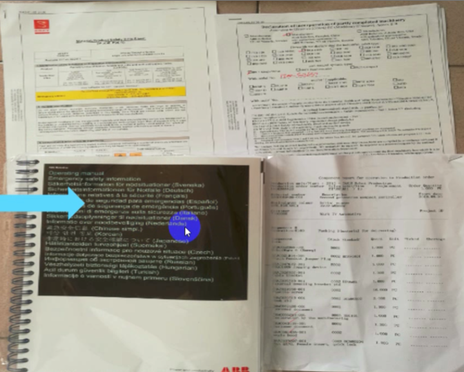

### 机器人本体与控制柜安装
1.将控制柜从底座上安放到机器人工作台下面去。
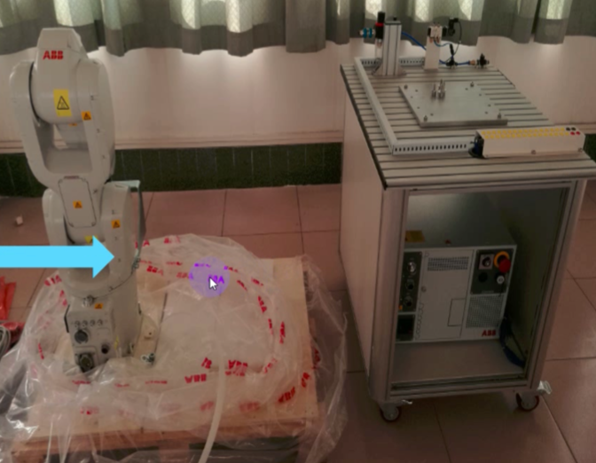

2.使用扳手拆掉将机器人固定在底座上的螺丝。一共有4枚
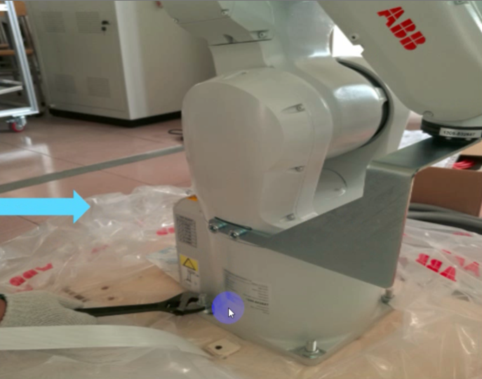

3.将机器人安装到机器人工作台，并且坚固到机器人本体底盘上的4颗螺丝。然后，将固定机器人姿态的支架拆卸。
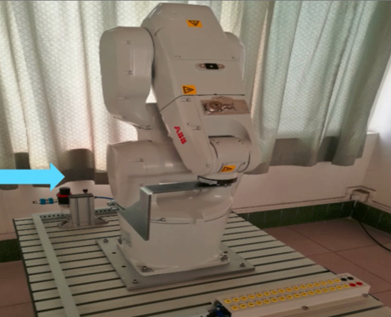

### 机器人本体与控制柜电气连接步骤
1.机器人本体与控制柜之间需要连接三条电缆:
A:动力电缆
B:SMB电缆
C:示教器电缆
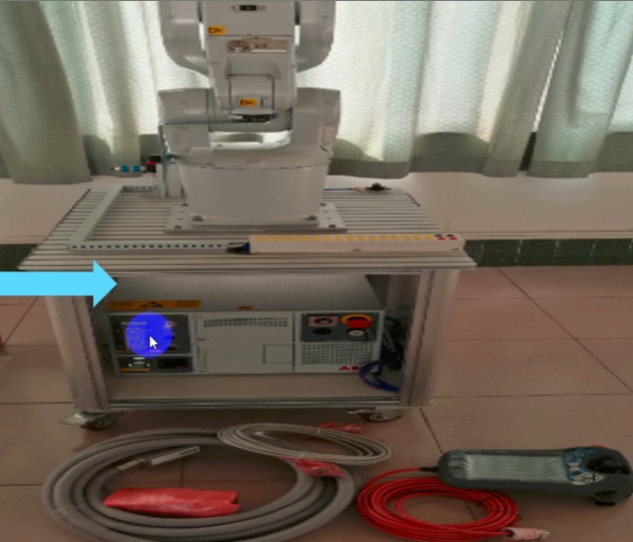
2.将动力电缆标注为XP1的插头接入控制柜，如图所示。
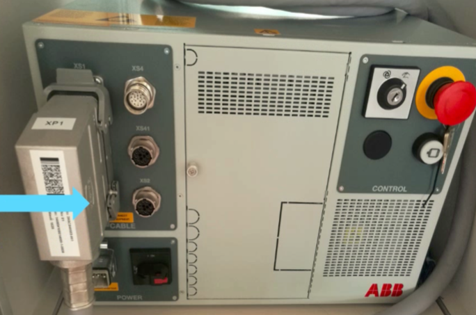
3.将动力电缆标为R1.MP的插头接入机器人本体底座的插头上，如图所示。
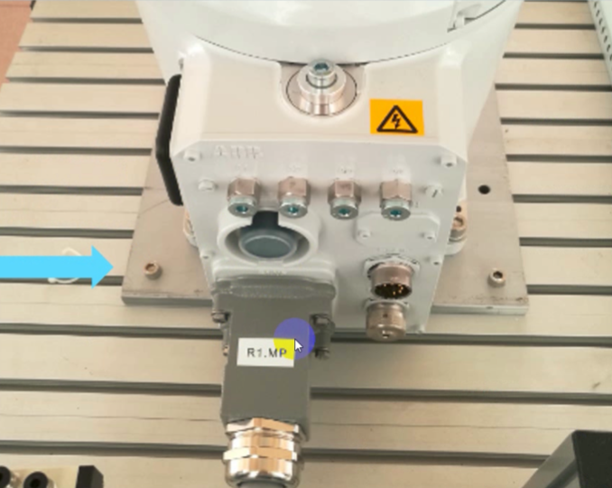
4.将SMB电缆(直头)接头插入到控制柜XS2端口。
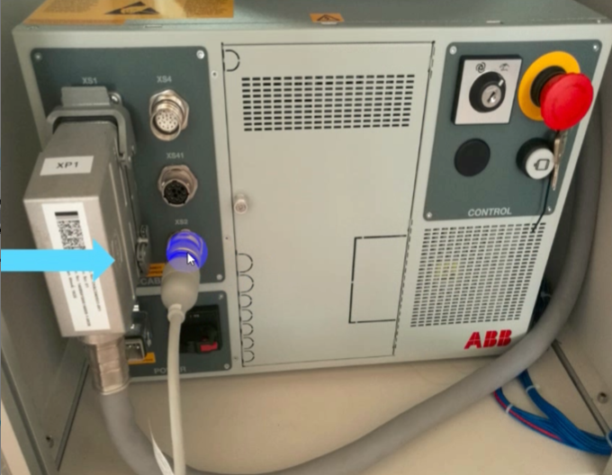
5.将SMB电缆(弯头)接5)头插入到机器人本体底座SMB端口。
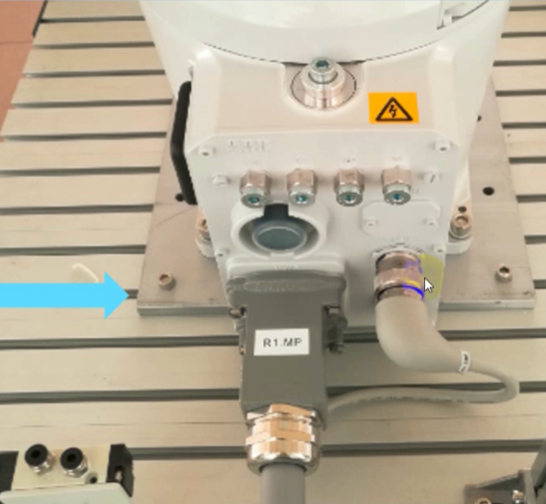
6.将示教器电缆(红色)的接头插入到控制柜XS4端
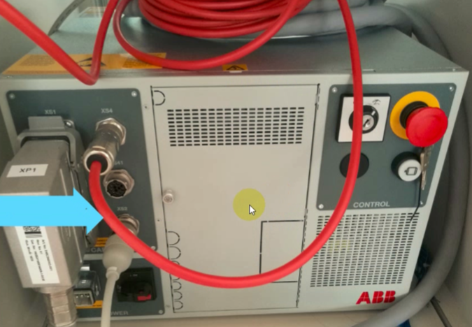
7.此项目中IRB1200是使用单相220V供电，最大功率0.5kw。根据此参数，准备电源线并且制作控制柜端的接头.
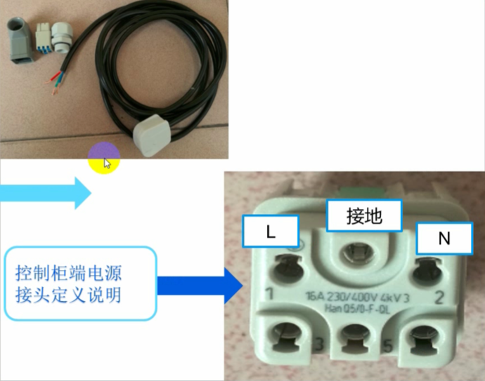
8.将电源线根据定义进行接线，一定要将电线涂锡后插入接头压紧
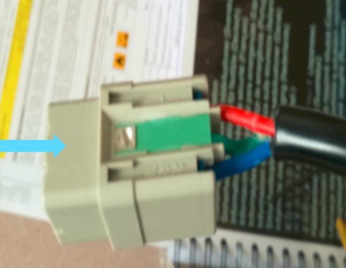
9.已制作好的电源线如图所示。
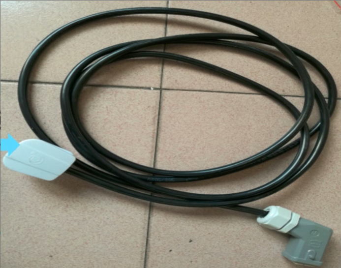
10.在检查后，将电源接头插入控制柜XP0端口并锁紧.
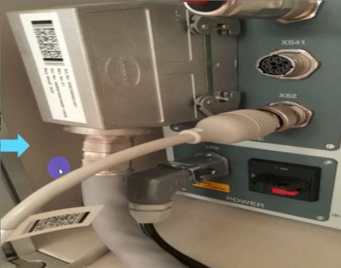
11.将示教器支架安装到合适的位置，然后将示教器放好。
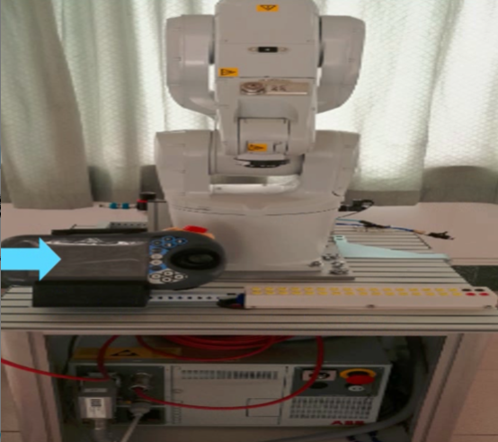

## ABB机器人示教器的介绍
认识示教器一配置必要的操作环境
在示教器上，绝大多数的操作都是在触摸屏上完成的，同时也保留了必要的按钮和操作装置。
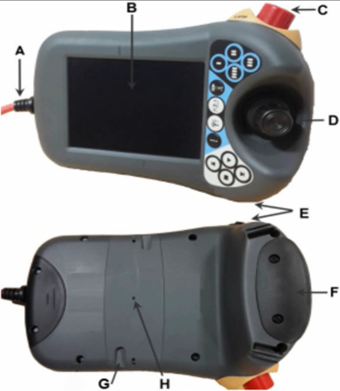
A 链接电缆
B 触摸屏
C 急停开关
D 手动操纵摇杆
E USB端口
F 使能器按钮
G 触摸屏用笔
H 示教器复位按钮

在了解了示教器的构造以后来看看应该如何去拿示教器
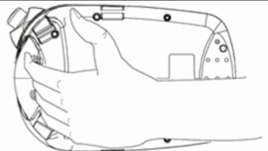

这个时候，你就能舒适地将示教器放在左手上，然后用右手进行屏幕和按钮的操作
了
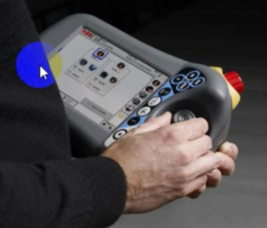

