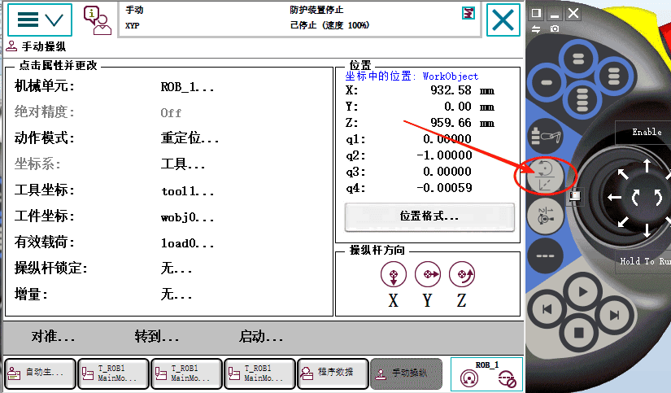

# 第四章 3.ABB机器人建立工具数据

## 设置工具坐标
【菜单】【手动操纵】【工具坐标】

在工具坐标里面有个默认的tool0，这个是法兰的坐标中心
垂直于法兰盘的是它的蓝色Z轴，红色线向下是X轴，向右是绿色Y轴

## 给机器人装上工具后，我们希望工具的末端走到指定点

首先要告诉机器人，工具的tcp点在哪？也就是工具数据

#### 第一步： 点击工具坐标系

#### 第二步： 点击新建

#### 第三步 点击初始值

里面有个robhold参数，默认是TRUE，这个说明工具是装在机器人末端的。
如果是False，说明这个工具是一个固定工具
tFrame 表示工具坐标
包含一个trans ,它里面是相当于工具tcp点相对于法兰中心点那个坐标系点偏移出来的，稍后使用6点法去校这个坐标系

rot 表示法兰坐标系的方位

tload 表示工具的负载数据
mass 表示工具有多重
cof 表示工具的重心
aom 表示惯性 轴方位

ix
iy
iz 惯性距

#### 工具内参数说明
rohold
rohold 代表机器人负载数据，其功能是对机器人自身的负载状况进行定义，涵盖负载的质量、重心位置以及惯性参数等信息。这些数据对机器人动力学计算意义重大，像运动规划和扭矩补偿等计算都要以此为依据。
tframe
tframe 也就是工具坐标系，它的作用是定义工具相对于法兰的位置和姿态。借助这个坐标系，能够确定工具中心点（TCP）的位置以及工具的方向。
trans
trans 表示工具坐标系的位置偏移量，具体指的是从机器人法兰中心到 TCP 在 X、Y、Z 三个方向上的距离。
rot
rot 代表工具坐标系的姿态，一般会用四元数（quaternion）或者欧拉角（Euler angles）来描述工具的旋转状态。
tload
tload 指的是工具负载数据，主要用于定义工具的负载属性，包括质量、重心位置以及惯性张量等。这些数据会对机器人的动态性能产生影响，在进行精确运动控制时不可或缺。
aom
aom 即_axis of motion_（运动轴），它的作用是定义工具的运动方向或者工作轴。在进行特定工艺操作，例如焊接、涂胶时，需要明确工具的运动方向，此时 aom 就显得尤为重要。

#### 注意要点
进行精确的 tload 和 rohold 设置，是保障机器人运动精度和避免过载的关键。
在对 tframe 进行修改之后，必须重新校准 TCP，以此保证位置精度。
aom 的设置要与具体的应用场景相匹配，比如在进行激光加工时，就需要让光束方向与 aom 保持一致。

### 将工具重量修改成1,单位千克，点击【确定】

【确定】

### 通过六点法去校机器人的TCP点对应法兰中心点的偏移
#### 第一步 编辑，定义

#### 第二步 选择TCP和Z，X

#### 第三步 通过示教器将机器人通过不同姿态对准一个点，姿态差距越大越好
返回选中 点 1，点击【修改位置】，操作6次，使所有点都被修改

#### 延申器点X 就是这个工具坐标系的X方向
如果我们把机器人从这个方向向前拉，等会建的工具坐标系就是向后的，X正方向是向后的。如下

如果我们将TCP点向后拉，等会建的工具坐标系X向方向是向前，如下

#### 延申器点Z 就是这个工具坐标系的Z方向
我们将工具往上拉，一般高度要大于250毫米，那么它的Z的正方形就是向下的

#### X和Z轴方向确定了，Y轴自动确定了
点击【确定】

一下就是计算出来的结果，点击【确定】

### 校出来的工具坐标用途
点击切换至重定位运动，让机器人动一下改变机器人的姿态，无论怎么变化姿态，TCP点都应该指向同一个点，看有没有偏差，偏差越大说明校验的不准，应该重新校验

