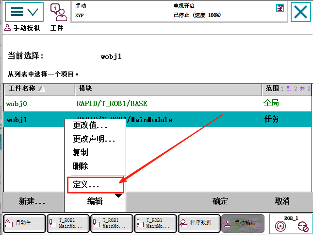

# ABB机器人的工件坐标系

## ABB机器人的工件坐标系步骤，先切换到手动

### 第一步 建立工件坐标之前，用哪个工具坐标，要先选对确定

### 第二步 建立工件坐标

### 第三步 点击新建

### 第四步 点击初始值，点击确定

#### 第四步 。1 初始值参数说明

### 第五步 确定

### 第六步 定义工件坐标

### 第七步 选择3点法

### 第八步 将机器人移动到 用户点X1，点击修改位置

### 第九步 将机器人移动到 用户点X2，点击修改位置

### 第十步 将机器人移动到 用户点Y1，点击修改位置

### 第十一步 点击【确定】

这样工件坐标就建好了

## 坐标原点取决于
用户点X1和用户点X2决定了X的方向，用户点Y1决定了Y的方向。

如果把用户Y1点选在中间

也就是说用户点Y1在用户点X1和用户点X2连线90度投影的交叉点就是工件坐标系原点。
