# ABB机器人的有效载荷
就是机器人用工具去抓取工件的时候，抓工件的重量和中心，我们得告诉机器人。
机器人用来计算加减速、惯性等。

机器人工具上面也有一个重心，机器人工具上的重心参考的是tool0,我们的工具坐标系。
## ABB机器人有效载荷的建立
### 第一步 点击有效载荷
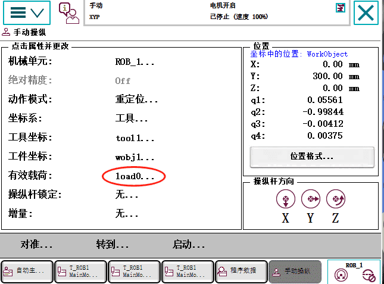
### 第二步 新建有效载荷
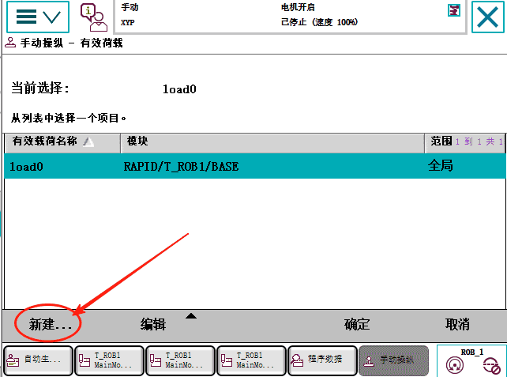
### 第三步 点击初始值
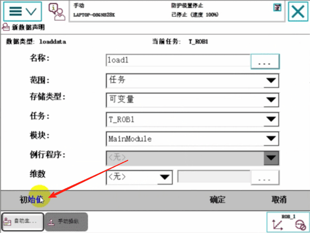
### 第四步 设置mass重量，单位千克
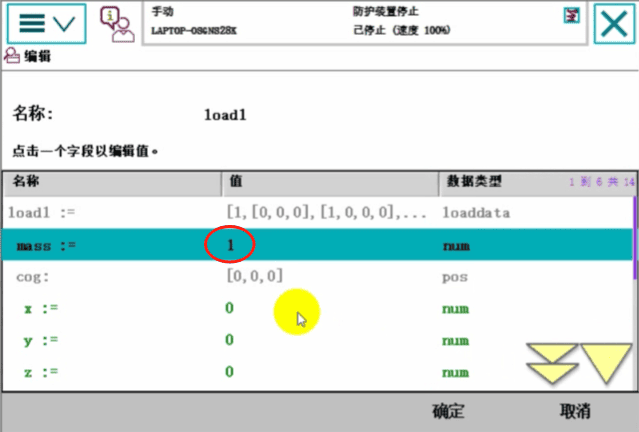
### 第五步 设置重心，参考建的工具坐标tool1
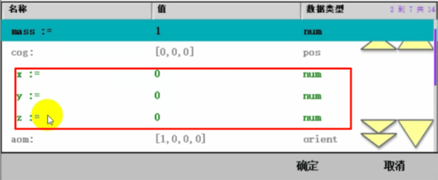
### 第六步 设置惯性轴距
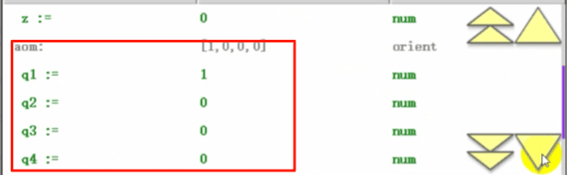
一般情况下只需要设置mass重量和它的重心位置就可以了。
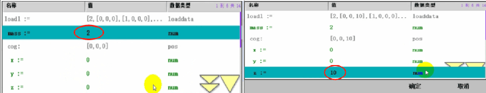
### 第七步 点击确定
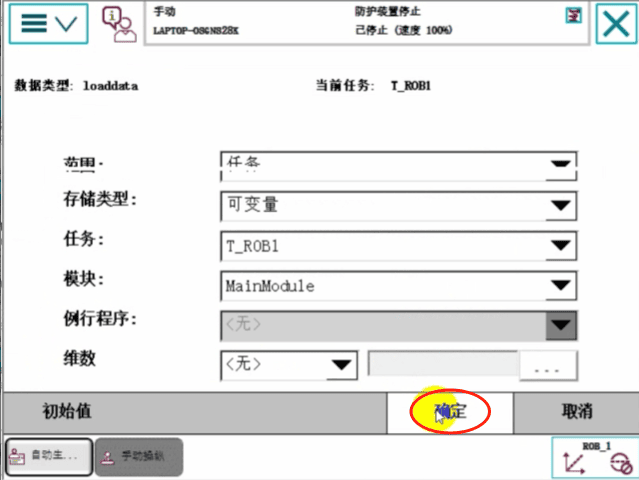
这样就建好了一个有效载荷。

## ABB机器人有效载荷使用
比如说让机器人进行搬运
### 第一步 点击程序编辑器，插入MoveJ指令
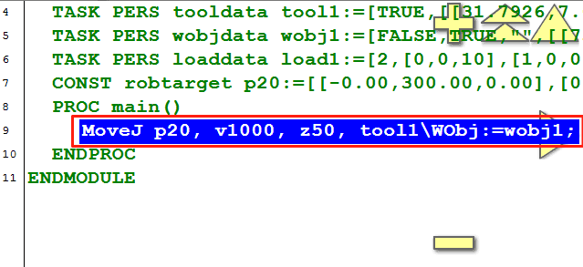
### 第二步 点击添加指令，选择Common,选择Set一个信号置位do1
这个do1是说机器人上装了一个吸盘，置位这个do1表示吸盘电磁阀打开，这时候就吸上了工件
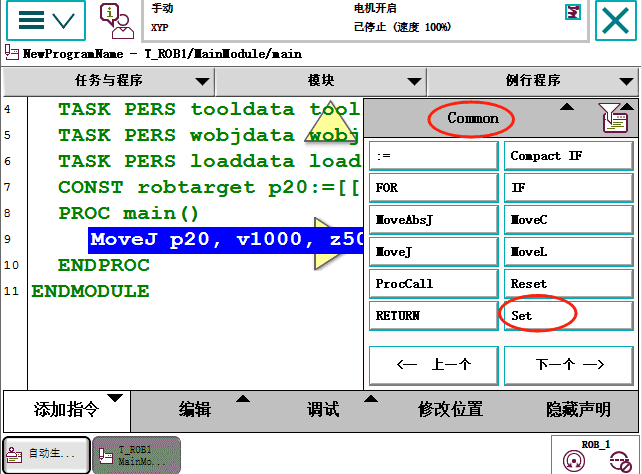
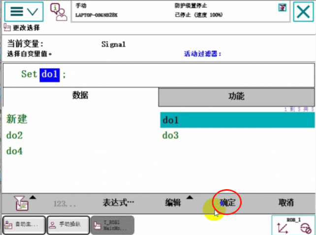
### 第三步 点击添加指令，选择Settings。选择GripLoad,
吸上工件之后，就要使用GripLoad，启用负载
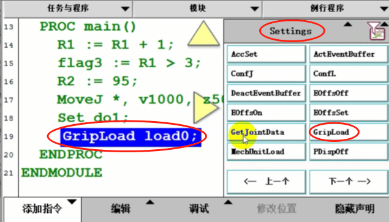
### 第四步 点击Load，选择Load1,点击确定，说明有负重了
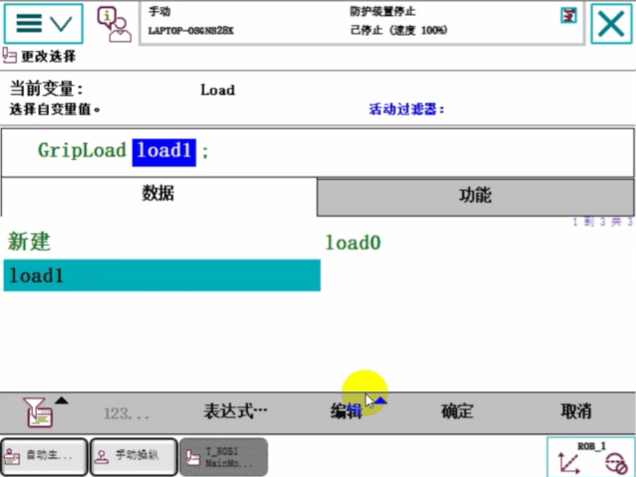
### 第五步  抓上之后再运动搬走物品
运动到指定位置，再Reset do1放下，将电磁阀关掉，电磁阀关掉之后，要告诉机器人，这个物品放下了。点击添加指令，选择Settings。选择GripLoad。
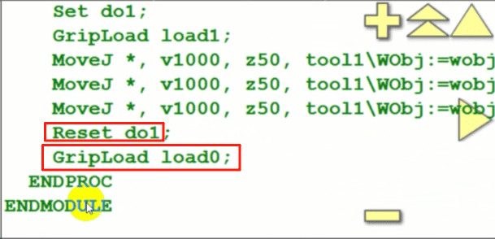
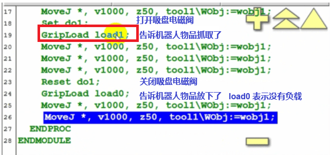

