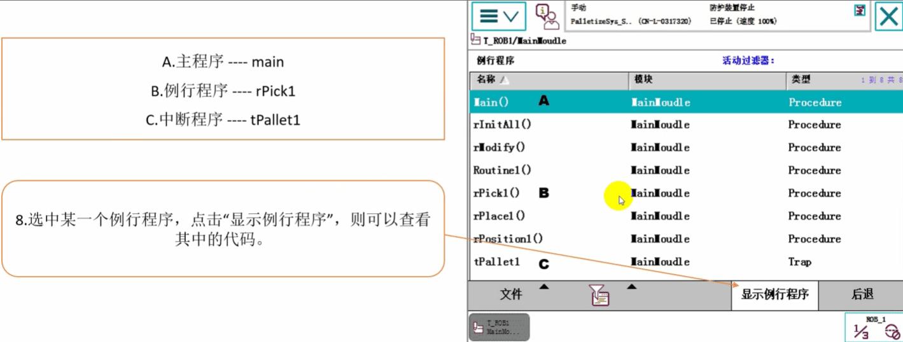
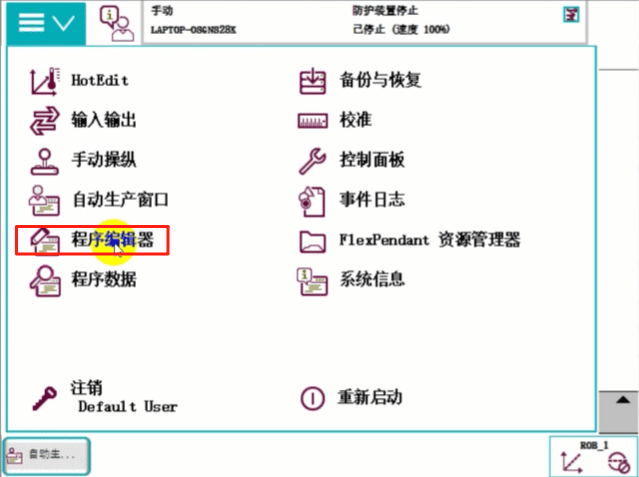
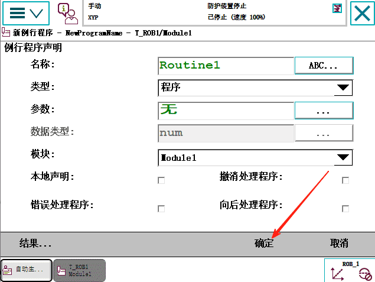

#  认识任务、程序模块和例行程序

## 建立程序的步骤

### 第一步 点击 程序编辑器

### 第二步 点击 任务与程序

可以看到一个名为T_ROB1的任务，点击【显示模块】

### 第三步 选中MainModule，点击“显示模块"则可以查看到该模块里的所有例行程序。
MainModule又称为用户模块

点击 显示模块

### 第四步 选中某一个例行程序，点击“显示例行程序”，则可以查看其中的代码。

## 仿真模拟

### 第一步 打开示教器

### 第二步 切换到手动模式

### 第三步 点击【主菜单】【程序编辑器】

### 第四步 点击【程序与任务】

### 第五步 点击【显示模块】

### 第六步 点击【文件】，【新建模块】

### 第七步 选择用户类型，点击【确定】

### 第八步 选择刚刚建立的“Module1”程序模块。点击“显示模块”

点击“显示模块”

### 第九步 单击“例行程序”

### 第十步 点击【文件】，【新建例行程序】

### 第十一步 填写程序名称，选择程序类型等后点【确定】

这里就是建的普通的例行程序

### 第十二步 再建一个主程序，将名字命名位"main"后点击【确定】
选择【文件】【新建例行程序】

双击“Main”主程序

这样就说明了怎么建立一个模块，在模块里面添加例行程序

## 如何进行指令编辑 掌握常用的Rapid编程指令
### 点击 程序编辑器

如果里面有用户程序的话，就不会有这个提示框，会直接进入程序
如果点击【新建】他会给你建一个主程序出来
如果点击【加载】就是把之前写的模块加载进来
点击【取消】

### 点击【文件】【新建模块】

### 设定模块名称(img12/这里就使用默认名称Module1)，点击“确定”。

### 选中Module，点击“显示模块”

### 点击“例行程序”

### 新建例行程序

### 设定例行程序名称(img12/这里就使用默认名称Routine1)，点击“确定”。

### 选中Routine1，点击“显示例行程序”

#### 选中要插入指令的程序位置，高显为蓝色
#### 点击“添加指令"打开指令列表
#### 点击此按钮可切换到其它分类的指令列表

## 常用指令介绍
### 赋值指令  :=

#### 点击【添加指令】【:=】

#### 点击“< VAR >”,点击【更改数据类型】

#### 设置数据类型 在列表中找到“num"并选中，然后点击“确定”

#### 选中“reg1”

#### 选中“< EXP >”并蓝色高亮显示 打开“编辑"菜单，选择“仅限选定内容”

#### 通过软键盘输入数字“5”，然后点击“确定”

#### 在这里就能看到所增加的指令。

### 添加带数学表达式的赋值指令的操作
#### 在指令列表中选择“:=”

#### 选中“reg2”

#### 选中“< EXP >”并蓝色高亮显示
点击“reg1”,点击+按钮

#### 打开“编辑"菜单，选择“仅限选定内容”

#### 通过软键盘输入数字“4”，然后点击“确定”

#### 点击“下方”

#### 放大缩小 翻页 移动功能介绍

