# 线性运动指令 MoveL

## 机器人在空间中进行运动主要是四种方式
### 关节运动(img13/MOVEJ)
### 线性运动(img13/MOVEL)
### 圆弧运动(img13/MOVEC)
### 绝对位置运动(img13/MOVEABSJ)

### Key:在添加或修改机器人的运动指令之前一定要确认所使用的工具坐标与工件坐标。

## 线性运动指令 MoveL的使用
### 单击左上角主菜单按钮 选择“手动操纵”
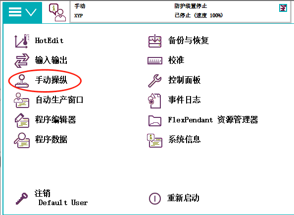
### 确认已选定工具坐标与工件坐标
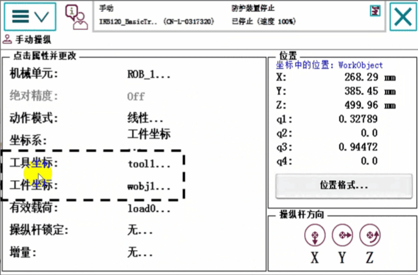
#### 首先我们来看看线性运动指令MoveL，线性运动是机器人的TCP从起点到终点之间的路径始终保持为直线，一般如焊接，涂胶等应用对路径要求高的场合进行使用此指令线性运动示意图如图所示
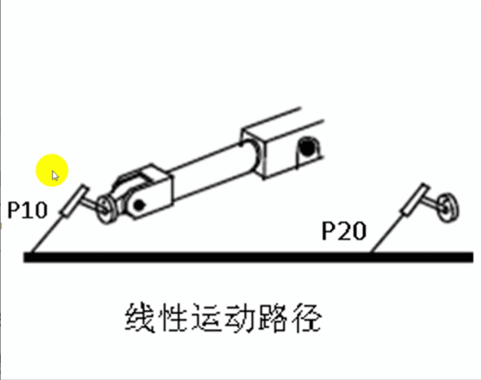
## 添加线性运动指令MoveL的操作
### 第一步 选中“< SMT >”为添加指令的位置。 在指令列表中选择“MoveL”
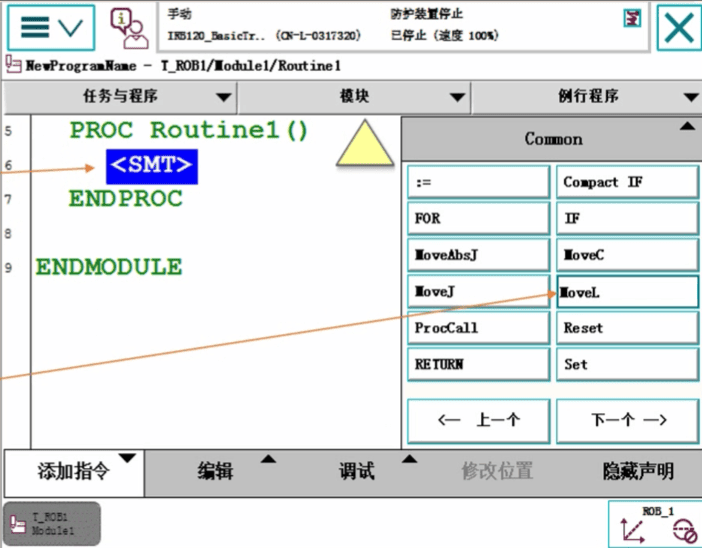
### 选中" * "号并蓝色高亮显示，再单击" * "号 (img13/说明:将"*"号用变量名字代替。)
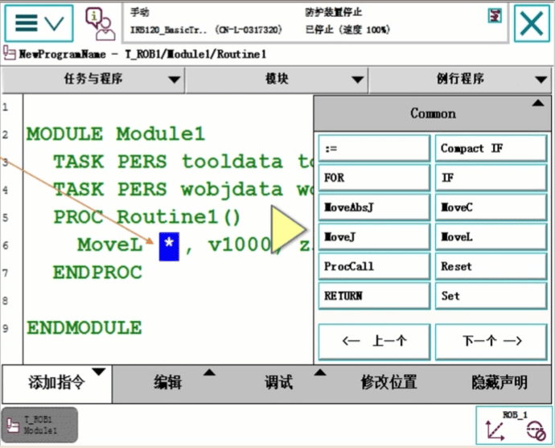

### 点击“新建”。
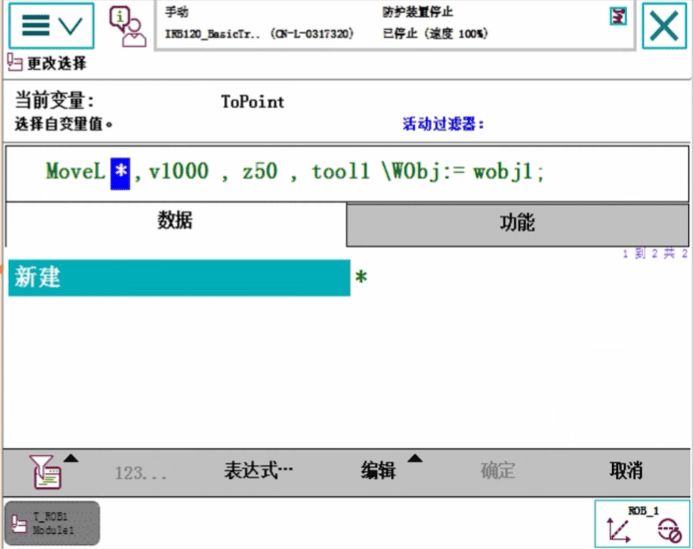
### 对目标点数据属性进行设定后，点击“确定”
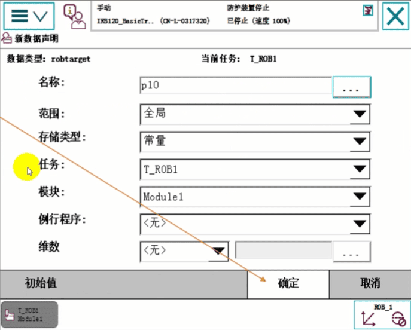

### "*"号已经被P10目标点变量代替 点击“确定”
机器人当前TCP的位置就是这个p10
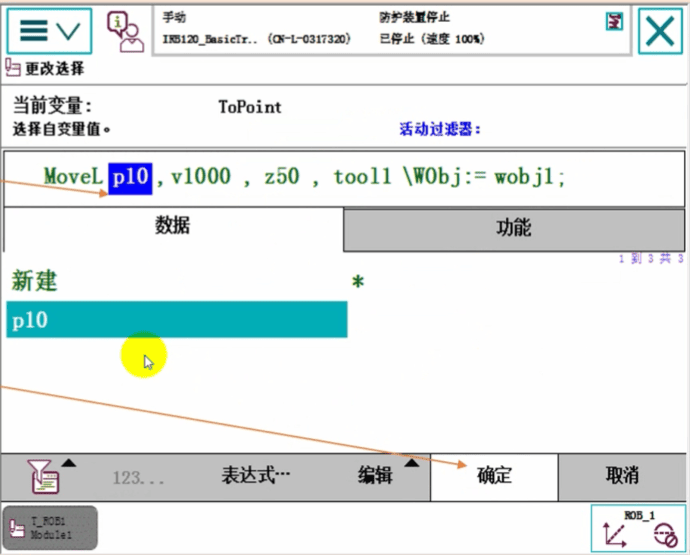
### 点击“添加指令"将指令列表收起来
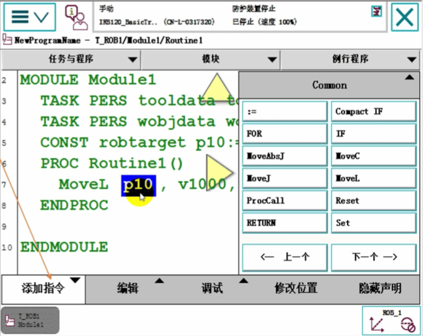
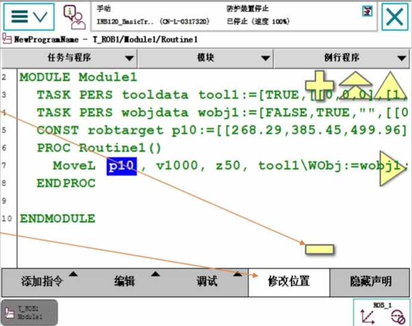
### 选中“p10”，点击“修改位置”，则p10将存储工具tool1在工件坐标系wobj1中的位置信息。
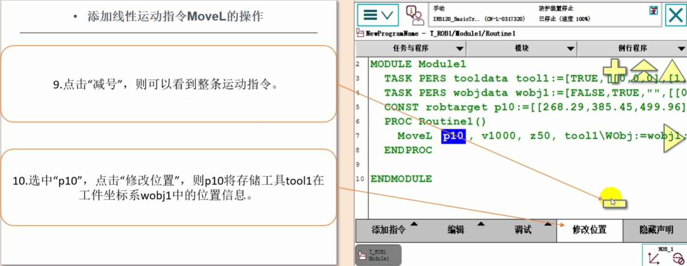
### 线性运动指令MoveL解析
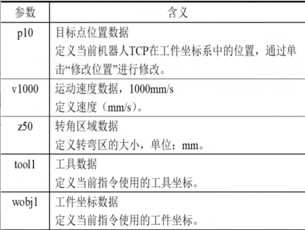
## 关节运动指令 MoveJ
关节运动指令是在对路径精度要求不高的情况，机器人的工具中心点TCP从一个位置移动到另一个位置，两个位置之间的路径不一定是直线。如图所示

关节运动指令适合机器人大范围运动时使用，不容易在运动过程中出现关节轴进入机械死点的问题，
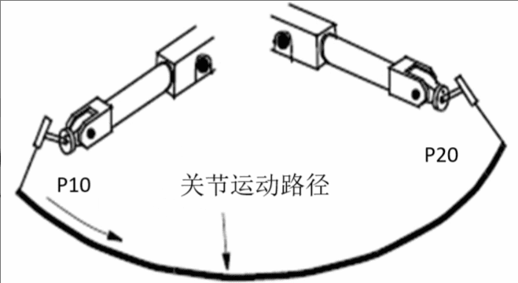

### MoveL和MoveJ指令的实际使用例子
关于速度
速度一般最高只有5000mm/s在手动限速状态下，所有的运动速度被限速在250mm/s
### 指令:MoveL p1,v200,z10,tool1\Wobj:=wobj1;
机器人的TCP从当前位置向p1点(img13/图6-3)以线性运动方式前进，速度是200mm/s，转弯区数据是10mm，距离p1点还有10mm的时候开始转弯，使用的工具数据是tool1，工件坐标数据是wobj1。

### 指令:MoveL p2,v100,fine, tool1\Wobj:=wobj1;
机器人的TCP从p1向p2点(img13/图6-3)以线性运动方式前进，速度是100mm/s，转弯区数据是fine，机器人在p2点稍作停顿，使用的工具数据是tool1，工件坐标数据是wobj1。

### 指令:MoveJ p3,v500,fine,tool1\Wobj:=wobj1;
机器人的TCP从p2向p3点(img13/图6-3)以关节运动方式前进，速度是100mm/s，转弯区数据是fine，机器人在p3点停止，使用的工具数据是tool1，工件坐标数据是wobj1。

### 关于转弯区
fine指机器人TCP达到目标点，在目标点速度降为零。机器人动作有所停顿然后再向下一运动，如果是一段路径的最后一个点一定要为fine。转弯区数值越大，机器人的动作路径就越圆滑与流畅。
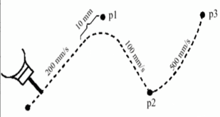

## 圆弧运动指令 MoveC
圆弧路径是在机器人可到达的空间范围内定义三个位置点，第一个点是圆弧的起点，第二个点用于圆弧的曲率，第三个点是圆弧的终点。如图所示
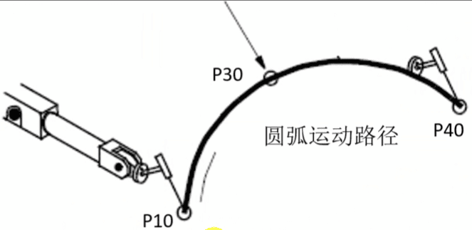

### 圆弧运动指令 MoveC解析
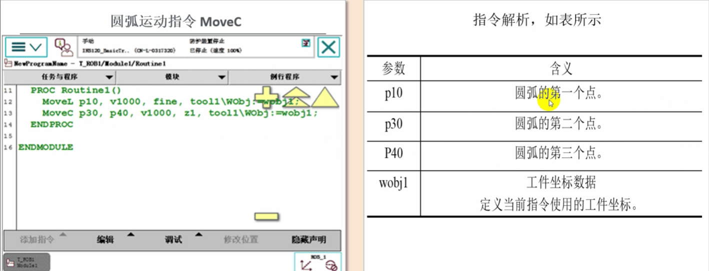
```
PROC Routine1(img13/)
        // p10是圆弧的第一个点
	MoveL p10, v1000, fine, tool1\WObj:=wobj1;
	// p30是圆弧的曲率 p40是圆弧的终点
        MoveC p30, p40, v1000, z1, tool1\Wobj:=wobj1;
 ENDPROC
ENDMODULE
```
## 绝对位置运动指令 MoveAbsJ
### 绝对位置运动指令是机器人的运动使用6个轴和外轴的角度值来定义目标位置数据。
### MoveAbsJ常用于机器人六个轴回到机械零点(img13/0度)的位置。前提是0点已经校出来了。
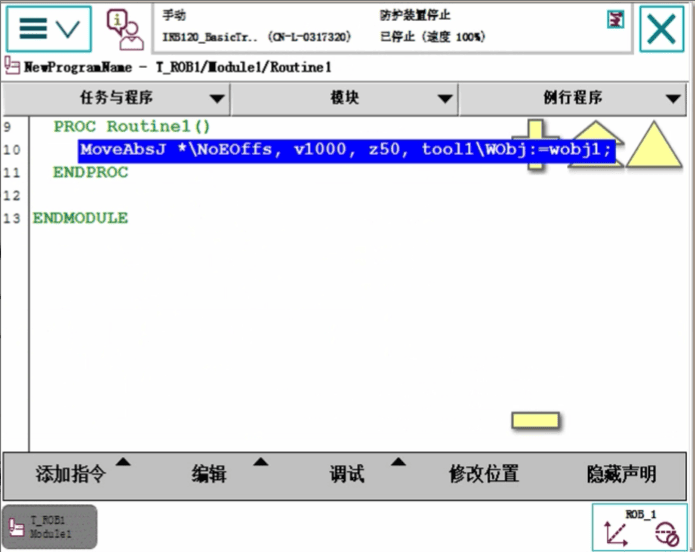


