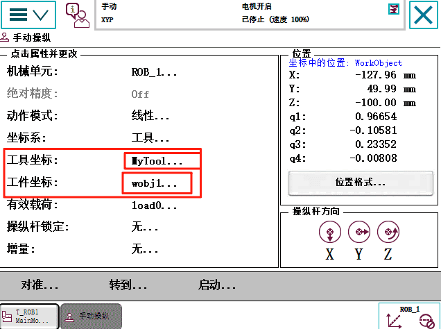
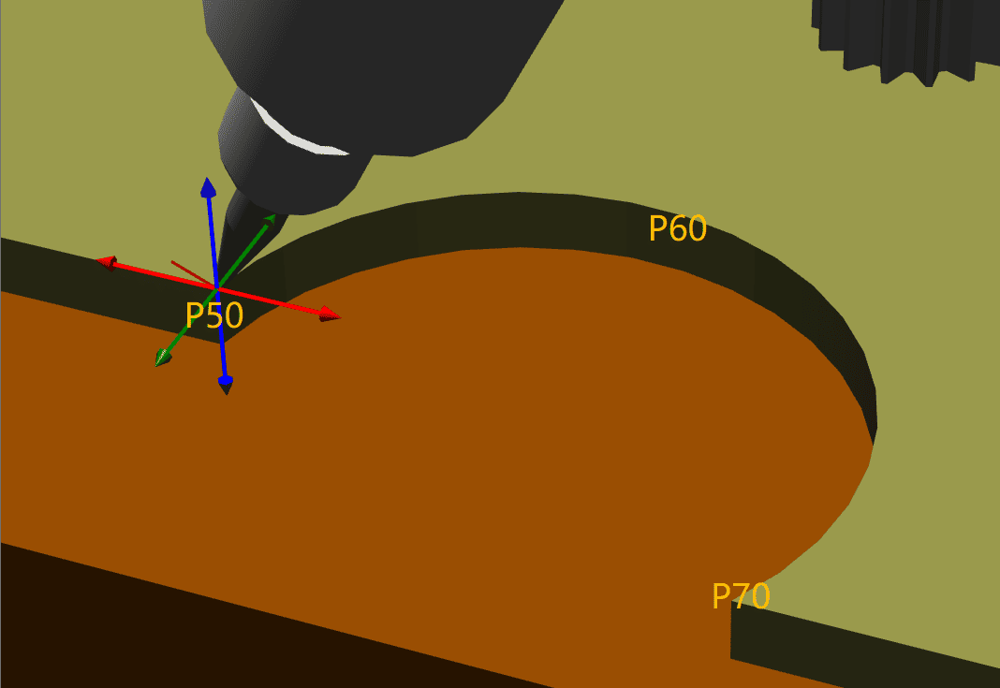
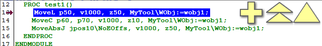
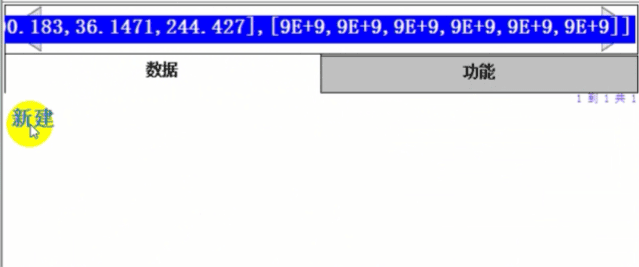
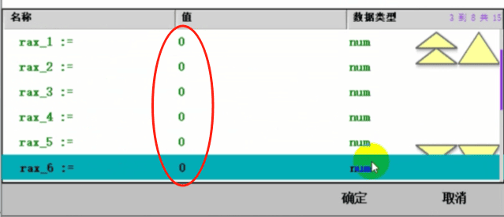

 # ABB机器人MoveL和MoveJ的区别 MoveC画一个弧形 使用绝对位置运动回原点

 ## ABB机器人MoveL和MoveJ的区别

 ## ABB机器人如何使用MoveC画一个圆弧
 先点击【手动操作】确定【工具坐标】和【工件坐标】

### 确定圆弧路径点：
使用示教盒或离线编程工具，引导机器人沿着预定义的圆弧路径移动，记录下起点、中间点和终点的坐标，并将这些点的数据存储为机器人程序中的位置变量，数据类型为 robtarget。

### 编写程序：
在机器人编程环境中，按照 MoveC 指令的语法格式编写代码。指令基本格式为 “MoveC 中间点，目标点，速度，转弯区数据，工具坐标系”，
例如 
"MoveL p50, v1000, z50, MyTool\WObj:=wobj"
“MoveC p60, p70, v1000, z10, MyTool\WObj:=wobj”，表示工具 MyTool 以速度 v1000，转弯半径 z50，沿由当前点p50点、 p60点、p70点确定的圆弧路径移动至 p70 点。

### 设置相关参数：
根据实际需求设置合适的速度参数，速度会影响机器人画圆弧的快慢。同时，合理设置转弯区数据，该数据决定了机器人在接近目标点时的运动方式，数值越小，转弯越急，若设置不当可能导致机器人运动不顺畅，一般可根据圆弧的曲率和机器人的性能来设置。

### 运行程序：
完成程序编写和参数设置后，将程序的指针移至主程序起始位置，给机器人上电，点击程序运行按钮，机器人便会按照编写的 MoveC 指令沿圆弧路径运动，绘制出所需圆弧。

#### 编程过程中需注意，起点、中间点和终点不能共线，否则 MoveC 指令将导致机器人线性移动而非圆弧运动。并且圆弧指令上两个点之间的路径角度不可超过 240

 ## ABB机器人如何使用MoveAbsJ回到机械原点
点击 添加指令 MoveABsj, 
MoveAbsI *\NoEOffs,v1000，z50，MyTool\wobj:=wobj1;
双击 * 号，点击新建，命名为jpos10,

点击初始值
将6个轴都设位0度，点击确定

运行MoveAbsI jpos10\NoEOffs,v1000，z50，MyTool\wobj:=wobj1;