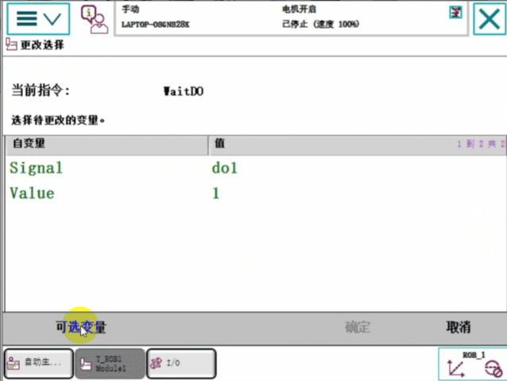
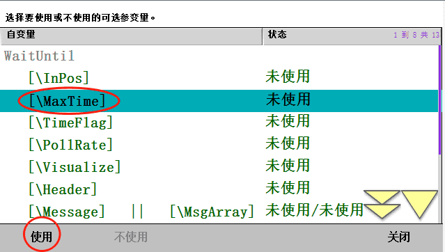

# I/O控制指令

IO控制指令用于控制IO信号，以达到与机器人周边设备进行通讯的目的。

## set 数字信号置位指令
[学习建输入输出信号](https://www.52gongkong.com/blog-detail/69)
Set数字信号置位指令用于将数字输出(img15/DigitalOutput)置位为“1”。

## Reset 数字信号复位指令
Reset数字信号复位指令用于将数字输出(img15/Digital0utput)置位为“0”.

如果在Set，Reset指令前有运动指令MoveJ,MoveL,Movec,MoveAbsi的转变区数据必须使用fine才可以准确到达目标点后输出I0信号状态的变化。

## WaitDl数字输入信号判断指令
WaitDl数字输入信号判断指令用于判断数字输入信号的值是否与目标的一致。

在例子中，程序执行此指令时，等待di1的值为1。为1的话，则程序继续往下执行，如果到达最大等待时间300秒(img15/此时间可根据实际进行设定)以后，di1的值还不为1的话，则机器人报警或进入出错处理程序。

## WaitDO数字输出信号判断指令

### 第一步 修改aitDO等待时间
双击WaitDO，选择【可选变量】

### 第二步 选择[\MaxTime] 点击“使用”，点击“关闭”

### 第三步 击 MaxTime , 默认是60秒， 

### 第四步 点击左下角[123]按钮可以改掉， 点击 确定

### 第五步 现在就表示等待do1为1，最多等5秒

## WaitUntil 信号判断指令
WaitUntil信号判断指令，可用于布尔量，数字量和I信号值的判断，如果条件到达指令中的设定值，程序继续往下执行，否则就一直等待，除非设定了最大等待时间。

### 第一步 WaitUntil选择数据类型

### 第二步 点击新建

### 第三步 点击确定，新建一个布尔量

### 第四步 点击表达式

### 第五步 选择 仅选定限定内容

### 第六步 输入表达式 点击确定

### 第七步 点击确定 表示判断当flag1=true时再往下执行

### 第八步 WaitUntil修改时间 双击WaitUntil

### 选择 可选变量

### 选择MaxTime,点击使用，点击关闭

### 点击 确定

### 这样我们也可以更改时间的

### 点击 MaxTime

### 点击时间

### 修改时间

### 点击确定 点击确定

### 这样WaitUntil时间就改好了

### 这样如果等待了10秒 flag1还没有为1 机器人就会报警，如下图

