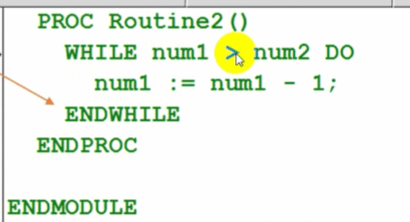

# ABB机器人逻辑判断指令

## CompactlF 紧凑型条件判断指令
如果flag1的状态为TRUE，则do1被置位为1.
CompactIF紧凑型条件判断指令用于当一个条件满足了以后就执行一句指令。
不满足就直接执行下一行。

## IF条件判断指令
如果num1为1，则flag1会赋值为TRUE.如果num1为2，则flag1会赋值为FALSE除了以上两种条件之外，则执行do1置位为1

IF条件判断指令，就是根据不同的条件去执行不同的指令Key:条件判定的条件数量可以根据实际情况进行增加与减少

“=” 等号表示判断
":=" 冒号等号表示赋值

旋转IF点击IF 点击添加ELSEIF或ELSE

## FOR重复执行判断指令
例行程序Routine1，重复执行10次

FOR重复执行判断指令，是用于一个或多个指令需要重复执行数次的情况。

表示3到10执行8次，每次reg2+1，直到10

## WHILE条件判断指令
当num1>num2的条件满足的情况下，就一直执行num1:=num1-1的操作。
WHILE条件判断指令，用于在给定的条件满足的情况下，直重复执行对应的指令。

只要条件满足就会一直执行

