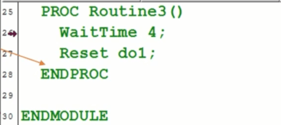
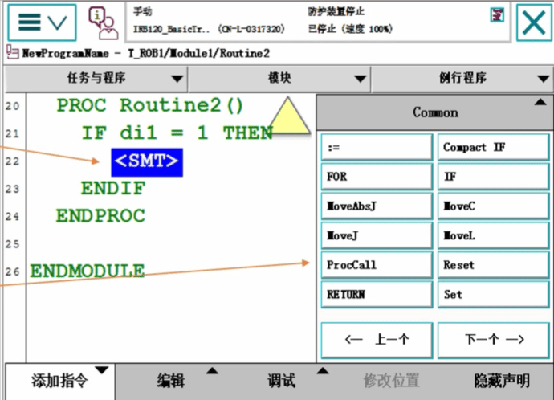

## WaitTime等待指令
等待4秒钟以后，程序向下执行Reset do1指令
WaitTime时间等待指令，用于程序在等待一个指定的时间以后，再继续向下执行。

## ProcCall调用例行程序指令
选中“< SMT >"为要调用例行程序的位置
在指令列表中选择“ProcCall”指令

调用例行程序 要先有例行程序

## RETURN返回例行程序指令
当di1=1时，执行RETURN指令，程序指针返回到调用Routine2的位置并继续向下执行Set do1这个指令。
RETURN返回例行程序指令，当此指令被执行时，则马上结束本例行程序的执行，返回程序指针到调用此例行程序的位置。

