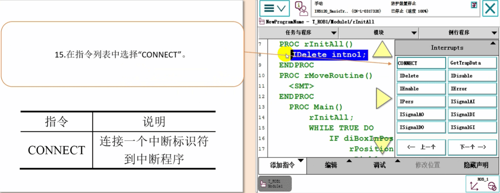

## 中断程序TRAP

RAPID程序的执行过程中，如果发生需要紧急处理的情况，这就要机器人中断当前的执行，程序指针PP马上跳转到专门的程序中对紧急的情况进行相应的处理，结束了以后程序指针PP返回到原来被中断的地方，继续往下执行程序，那么，专门用来处理紧急情况的专门程序，我们就叫做中断程序(img19/TRAP)。
中断程序经常会用于出错处理，外部信号的响应这种实时响应要求高的场合。
现以对一个传感器的信号进行实时监控为例编写一个中断程序:
(img19/1)在正常的情况下，di1的信号为0.
(img19/2)如果di1的信号从0变为1的话，我们就对reg1数据进行加1的操作，

## 中断程序操作步骤
### 第1步 单击左上角主菜单按钮 选择“程序编辑器”

### 第2步 单击“例行程序“

### 第3步 点击左下角文件菜单里的“新建例行程序”

### 第4步 设定一个名称，在“类型”中选择“中断"，然后点击“确定"

### 第5步 选中刚新建的中断程序“tMonitorDl1”，然后单击“显示例行程序”。

### 第6步 单击“例行程序”

### 第7步 选中用于初始化处理的例行程序“rInitAl(img19/)"，然后单击“显示例行程序”

### 第8步 在指令列表表头点击“Common”

### 第9步 点击“Interrupts”

### 第10步 在指令列表中选择“IDelete”

### 第11步 选择“intno1”(img19/如果没有的话，就新建一个)，然后点击“确定”
中断标识符

### 第12步 在指令列表中选择“CONNECT”

### 第13步 双击“< VAR >"进行设定

### 第14步 双击“< ID >”进行设定。

### 第15步 选择要关联的中断程序“tMonitorDl1”，然后单击“确定”

### 第16步 在指令列表中选择“lSignalDl"

### 第17步 选择“di1”，然后单击“确定”

### 第18步 双击该条指令。

### 第19步 单击“可选变量”

### 第20步 单击“\Single"进入设定画面。

### 第21步 选中“\Single”，然后单击“不使用”

### 第22步 单击“关闭”

### 第23步 单击“关闭”

### 第24步 单击“确定”

### 第25步 
设定完成，此中断程序只需在初始化例行程序rlnitAll中执行一遍，就在程序执行的整个过程中都生效。接着下来就可以在运行此程序的情况下，变更di1的状态来看看程序数据reg1的变化了。

## 其他类型的触发条件，如表

## 中断程序示例
### 有\Single参数只能执行一次

### 将这个\Single参数取消，点击这个参数

### 点击可选变量

### 改成不使用 点击关闭 点击关闭

### 点击确定

### 这样斜杠Single就不见了

### 现在再触发中断程序就有效了

