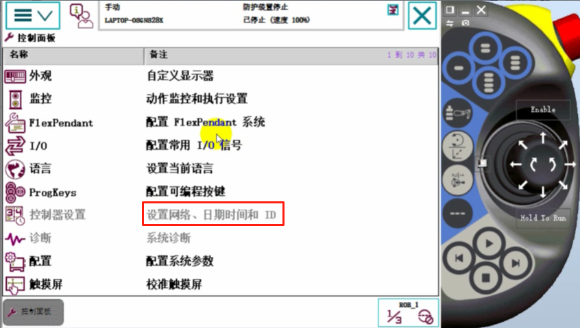
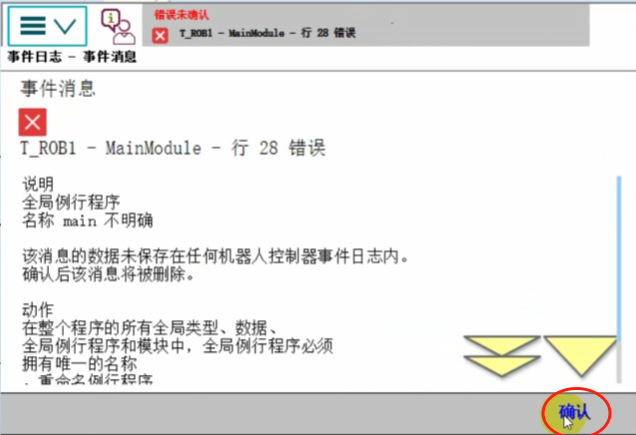

# 第二章：ABB示教器的基本操作

## 示教器语言切换和备份与恢复

1. 打开 RobotStudio 6.08【下载】，打开虚拟示教器

2. 示教器语言默认是英文的，我们将其切换为中文
首先点击示教器的主菜单

选择【Control Panel】，选择【Language】

选择【Chinese】，点击下面的【OK】

点击【Yes】后重启

重启之后，示教器就是中文界面了

## 示教器的时间设置
虚拟示教器设置不了，必须真实示教器设置

## 示教器使能键的使用
虚拟示教器的使能键就是这个【Enable】按钮，当按下这个使能键，示教器上就会显示使能已开启。
真实示教器的使能按钮，在示教器的背面。

按下【Enable】使能键盘以后，点击操作摇杆，机器人就会动起来。

## 机器人的手动和自动模式切换
点击虚拟示教器的钥匙按钮，选择左边的表示自动模式。

选择自动模式以后，左上角会显示当前是自动模式

当切换到手动模式，并且按下使能键，就会显示电机开启，电气开启状态作操作杆电机是可以运动的。
速度是按照100%进行运行的，这个后面可以调。

变位机通常有变位机或导轨等
电机这个区别表示查询机器人的事件日志

## ABB机器人的备份与恢复
### 备份
点击【主菜单】【备份与恢复】
ABB机器人备份的时候备份的不仅仅可以进程序备份，还可以将整个系统备份。

点击备份当前系统

### 恢复
点击【主菜单】【备份与恢复】【恢复系统】，选择路径恢复哪个备份，点击【恢复】，
真实示教器会重启。

### 单独导入程序的操作
就是用电脑离线编程编程之后，将程序保存到U盘上，让将U盘插到示教器或控制柜上。
【主菜单】【程序编辑器】

点击【模块】，

选择【文件】，选择【加载模块】【是】

选择上级目录，选择要加载的文件模块，选择【确定】

点击【确定】

这样程序就加载进来了

### 加载EIO系统参数文件
先将机器人调整至手动模式。

【主菜单】【控制面板】【系统配置参数】
选择【文件】【加载参数】，选择自己的EIO系统参数文件加载进去就可以了。

也可以将EIO文件另存为。

