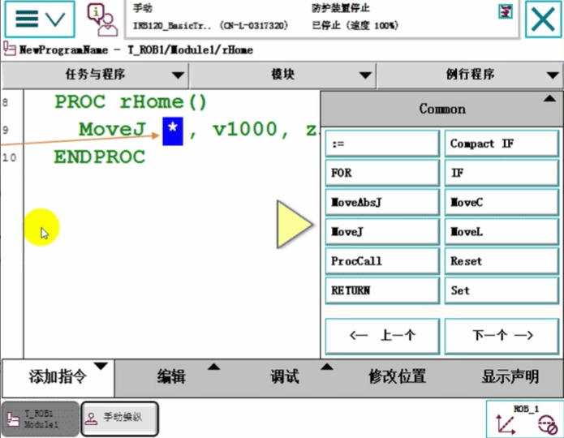
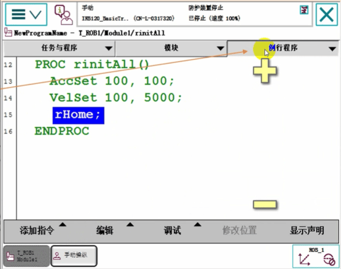
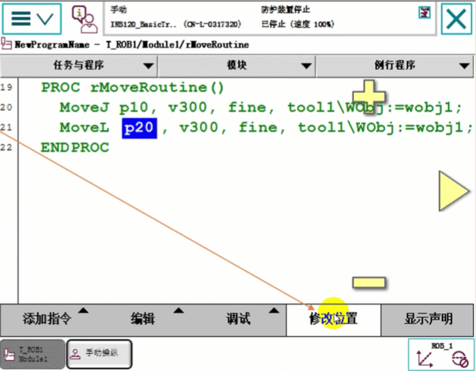
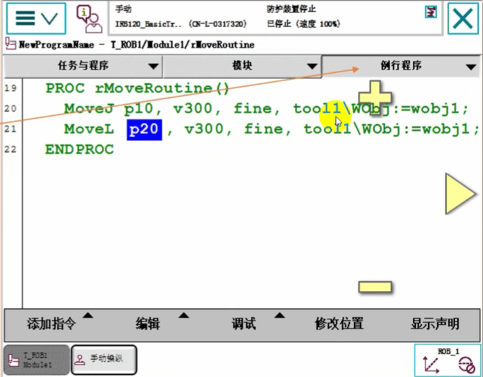
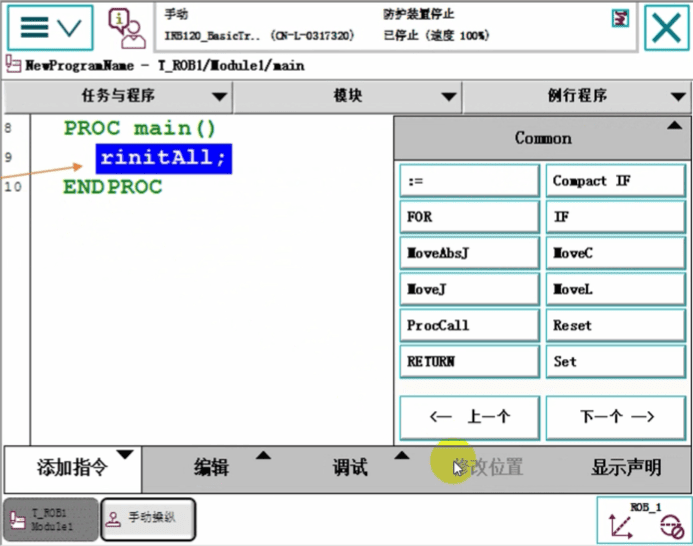

## ABB机器人建立一个可以运行的基本RAPID程序步骤

## 编制一个程序的基本流程
一. 确定需要多少个程序模块。多少个程序模块是由应用的复杂性所决定的，比如可以将位置计算、程序数据、逻辑控制等等分配到不同的程序模块，方便管理。

-

二. 确定各个程序模块中要建立的例行程序，不同的功能就放到不同的程序模块中去，如夹具打开，夹具关闭这样的功能就可以分别建立成例行程序，方便调用与管理。

三. 确定工作要求:
1. 机器人空闲时，在位置点pHome等待。
2. 如果外部信号di1输入为1时，机器人沿着物体的一条边从p10到p20走一条直线，结束以后回到pHome点。

## 建立程序的步骤

### 1单击主菜单，选择“程序编辑器”

### 2点击取消

### 3.点击左下角文件菜单里的“新建模块”

### 4选择“是”

### 5定义程序模块的名称后，单击“确定“

### 6选中”Module1“,单击”显示模块“

### 7点击”例行程序“

### 8点击”新建例行程序“

### 9建立一个主程序Main,单击确定

### 10选择rHome。单击”显示例行程序“
根据第10、11、12步骤建立相关的例行程序rHome(img20/)用于机器人回等待位。rInitAll(img20/)初始化。rMoveRoutine(img20/)存放直线运动路径

### 11在“手动操纵"菜单内，确认已选中要使用的工具坐标与工件坐标。

### 12回到程序编辑器，单击“添加指令"，打开指令列表，插入MoveJ指令

### 13双击“*”，进入指令参数修改画面

### 14通过新建或选择对应的参数数据，设定为图中虚线框所示的数值。单击“确定”。

### 15选择合适的动作模式，使用摇杆将机器人运动到图中的位置，作为机器人的空闲等待点。

### 16选中“pHome”目标点，单击“修改位置”，将机器人的当前位置数据记录到pHome里

### 17单击“修改"进行确认。

### 18单击“例行程序"标签

### 19选中“rinitA!"例行程序，然后单击“显示例行程序

在此例行程序中，加入在程序正式运行前，需要作初始化的内容，如速度限定，夹具复位，等等。具体根据需
要添加。在此例行程序rInitAll中只增加了两条速度控制的指令(img20/在添加指令列表的Settings类别中)和调用了回等待位的例行程序rHome

AccSet 控制加速度
VelSet 控制速度

### 20单击“例行程序"标签

### 20选中“rMoveRountine”例行程序，然后单击“显示例行程序”。

### 22添加“Move」"指令，并将参数设定为图中所示

### 23选择合适的动作模式，使用摇杆将机器人运动到图中的位置，作为机器人的p10点。

### 24选中“p10”目标点，单击“修改位置”，将机器人的当前位置数据记录到p10里。

### 25添加“Movel"指令，并将参数设定为图中所示

### 26选择合适的动作模式，使用摇杆将机器人运动到图中的位置，作为机器人的p20点。

### 27选中“p20”目标点，单击“修改位置”，将机器人的当前位置数据记录到p20里。

### 28单击“例行程序”标签

### 29选中“main"主程序，然后单击“显示例行程序"，进行程序主体架构的设定。

### 30在开始位置用ProcCall调用初始化例行程序。

### 31添加“WHILE"指令，并将条件设定为“TRUE”
使用WHILE指令构建一个死循环的目的在于将初始化程序与正常运行的路径程序隔离开。初始化程序只在一开始时执行一次，然后就根据条件循环执行路径运动。

### 32添加“IF”指令到图中所示位置。

### 33选择“<EXP>”，然后打开“编辑"菜单，选择“ABC...

### 34使用软键盘输入“di1=1”，然后单击“确定”
此处不能直接判断数字输出信号的状态，如do1=1(img20/这是错误的)。要使用功能DOutput(img20/)。

### 35在IF指令的循环中，调用两个例行程序rMoveRoutine和rHome。

### 36在选中IF指令的下方，添加WaitTime指令，参数是0.3秒

### 37主程序解读:
1.首先进入初始化程序进行相关初始化的设置。
2.进行WHILE的死循环，目的是将初始化程序隔离开
3.如果di1=1的话，则机器人执行对应的路径程序。
4.等待0.3秒的这个指令的自的是防止系统CPU过负荷而设定的。

### 38打开“调试”菜单
### 39单击“检查程序”，对程序的语法进行检查

### 40单击“确定"完成。
如果有错，系统会提示出错的具体位置与建议操作。

