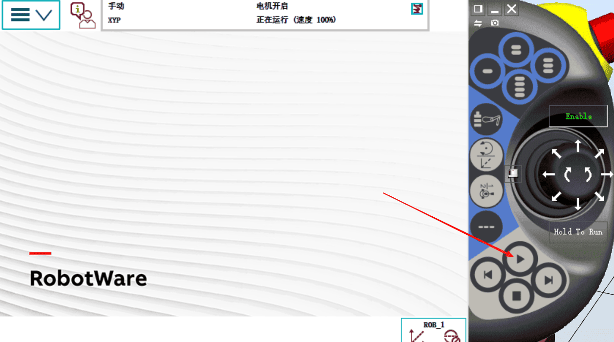
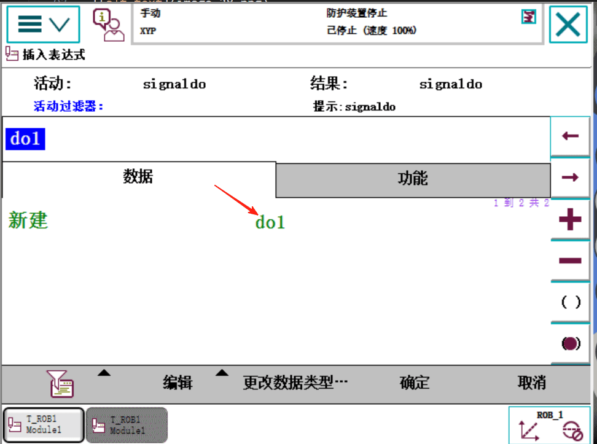

## 建立一个RAPID程序例子

## 分析需求：
本地案例我们希望机器人执行如下工作功能
1. 点击 调试开始按钮,机器人回到安全点。

2. 按一次 可编程按钮一 机器人开始绕桌子边缘转圈运动

3. 再按一次 可编程按钮一 机器人停止运动

## 例行程序分拆
main(img21/) 主程序
rHome(img21/) 回安全点程序
rInitAll(img21/) 初始化程序
rMoveRoutine(img21/) 运行动作程序

## 准备工作一：先按需求建立do信号
[ABB机器人IO信号的配置与接线 通讯板卡的配置](https://www.52gongkong.com/blog-detail/69/)

[机器人IO信号的配置与接线IO信号的关联和可编程按键的设置](https://www.52gongkong.com/blog-detail/70/)

## 准备工作二：建立好工具和工件坐标
[ABB机器人建立工具数据及六点法校机器人工具坐标的TCP点](https://www.52gongkong.com/blog-detail/73/)
[怎么建立ABB机器人的工件坐标系(3点法)](https://www.52gongkong.com/blog-detail/74)

## 准备工作三：可编程按钮的设置
[主菜单][控制面板][配置可编程按钮]如下

### 新建模块
[主菜单] [程序编辑器] [模块] [文件] [新建模块]

### 选中 Module1，点击显示模块

### 点击例行程序,调到手动模式, [文件][新建例行程序]

### 将例行程序命名为main,点击确定

### 再新建一个例行程序名字叫rHome,点击确定

### 再新建一个例行程序名字叫rInitAll,点击确定

### 再新建一个例行程序名字叫rMoveRoutine存放运动路径

## 编写安全点程序,点开rHome

### 先把机器人移动到一个安全点，就是机器人不工作时候的位置。比如如下

### 在这个位置添加MoveJ指令
前提是工具和工件坐标已经装备好。

### 点击*号，点击新建，输入pHome

### 选择pHome作为安全点

### 设置为精确到达fine点

### 

## 点击例行程序,去rInitAll初始化程序 rInitAll里面

### 设置AccSet加速度为 30,50

### 控制速度VelSet

### 调用rHome

## 点击例行程序rMoveRoutine

### 这这里面写运动程序
1. 首先将机器人拖到这个位置

2. 选择MoveJ指令

3. 点击* 击新建p10,以及选择fine精确到达

4. 再将机器人移动到这个位置

5. 添加MoveL指令

6. 再将机器人移到这个位置

7. 再点击MoveL指令

8. 在将机器人移动到这个位置

9. 在点击MoveL指令
10. 在建机器人移动到如下点位

11. 在点击MoveL指令

## 点击例行程序，点击main，在主程序调用这些指令

### 用ProcCall先调用初始化指令

### 在里面写一个WHILE TRUE死循环

### 在里面加一个IF的条件判断

### 更改数据类型

### 选择signaldo数据类型 点击确定

### 选择do1 

### 点击编辑 点击仅限选定内地

### 设置当do1=1的时候为true，点击确定

## 在IF判断里面调用rHome程序
要求do1为1时循环执行回安全点和绕桌转

### 再调用一下rMoveRoutine运行程序

## 在WHILF循环的里面下面再加WaitTime指令，防止CPU超负荷

这样程序就写好了

## 调试一下
点击调试， 点击PP移至Main, 点击【Enable】使能上电

### 点击运行按钮，机器人回到安全点，等待do1信号

如下：再安全点等待do1指令

### 点击可编程按钮1
此前配置过

这样机器人就一直循环绕桌子边缘转

### 再点一下可编程按钮1, 将do1复位机器人就停止了，调试完成

