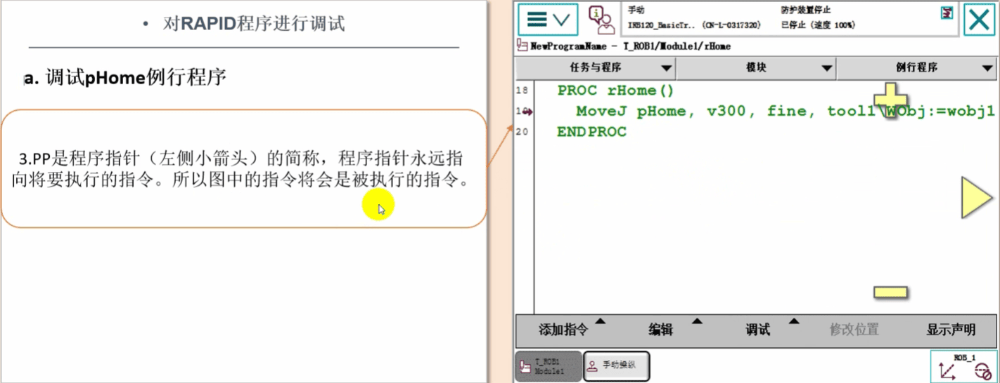

# ABB机器人的调试与模块保存

## 对RAPID程序进行调试
在完成了程序的编辑以后，接着下来的工作就是对这个程序进行调试，调试的目的有以下两个:
1.检查程序的位置点是否正确。
2.检查程序的逻辑控制是否有不完善的地方，

调整机器人的速度

## RAPID程序模块的保存
在调试完成并且在自动运行确认符合设计要求后，就要对程序模块做一个保存的操作。可以根据需要将程序模块保存在机器人的硬盘或U盘上。

### 第一步 单击左上角主菜单按钮 选择“程序编辑器”

### 第二步 单击“模块”标签

### 第三步 选中需要保持的程序模块。
### 第四步 打开“文件"菜单，选择另存模块为.”，就可以将程序模块保存到机器人的硬盘或U盘。

