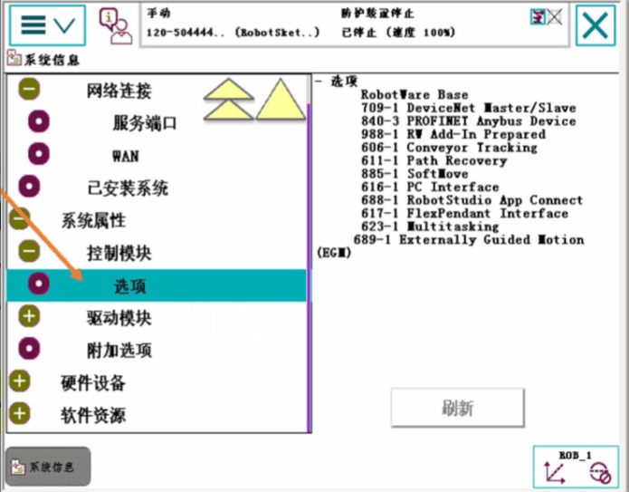
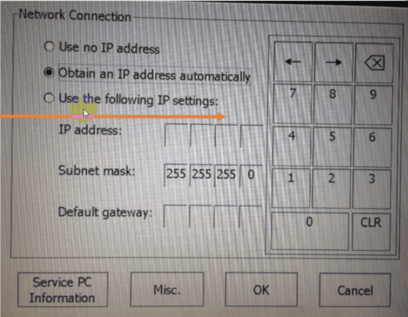

## ABB机器人系统信息查看

### 单击菜单, 点击系统信息

### 在此界面中可以分别浏览控制器属性、系统属性、硬件设备软件资源;

## 查看控制器属性
### 控制器属性下拉菜单中网络连接里面的服务端口可以查看其IP地址，服务端口是用于Robotstuido联机调试口，般电脑端自动获取IP即可连接上机器人，也可以将PC端IP设置成同一字段的IP;

## 查看系统属性
### 系统属性主要包括控制模块、驱动模块和附加选项等信息，主要是关于该机器人所购置的相关选项，在正式使用机器人之前需要详细了解一下当前机器人拥有哪些功能选项方可便于后续的使用;

### 展开系统属性，点击控制模块下面的选项，查看控制选项及语言相关信息;
### 机器人拥有众多功能选项可以购置，如区域监控、伺服软化、输送链跟踪、路径恢复、切割包、弧焊包等，建议在采购之前规划好需要购置的选项，若采购后增加选项则需要重装系统;
### 有709-1 DeviceNet Master/Slave选项才能添加板卡

### 展开系统属性，点击驱动模块下面Robot1的选项，查看驱动选项相关信息;

### 点击附件选项，查看相关信息;

## 查看硬件设备信息
### 硬件设备中包含了已连接的所有硬件的相关信息;

### 展开硬件设备，点击控制柜中的计算机系统，查看相关信息;

### 展开硬件设备，点击控制柜中的电源系统，查看相关信息

### 展开硬件设备，点击控制柜中的安全面板，查看相关信息;

### 展开硬件设备，点击控制柜中的驱动模块，查看相关信

### 展开硬件设备，点击控制柜中的机械单元，查看相关信息;

## 查看软件资源信息
### 软件资源中包含了系统、RAPID、通讯的相关信息;
### Remote Service Embedded选项自2016年下半年起作为默认配置，出厂时已默认具备该功能，详细信息可以联系ABB机器人售后服务部门

### 展开软件资源，点击系统，查看相关信息

### 展开软件资源，点击通讯，在远程服务菜单中查看相关信息

## 工业机器人系统重启的操作
### 1.掌握系统重启的操作
### 2.理解高级菜单中不同重启项的作用
在机器人使用过程中，经常会使用到各种重新启动，例如当机器人配置参数更改后，需要热启动才可生效，这就是我们常说的热启动，除此之外，机器人还具有各种功能的高级重启，接下来我们就来了解一下各类高级启动的功能及用法。

### 1.打开“ABB”菜单栏，点击重新启动;

### 2.如果点击重启，则机器人系统重新启动，配置的相关参数及属性开始生效，即我们通常所说的热启动:热启动较为常用，所以在此处设置了重启，另外在高级启动中也有重启的操作，功能与此处一致;
### 3.点击高级，进入到“高级”启动界面;

### 点击高级

### 其中，启动引导应用程序在虚拟示教器中是没有的，只有在真实的示教器中才可查看到，主要用于设置机器人IP地址以及管理当前操作系统;选中“启动引导安装程序”，点击下一个，点击启动进入到该启动界面:
### 机器人每次正常关机时均会自动生成一个当前配置的镜像文件，当下次开机时如有系统问题，则可尝试恢复到上次自动保存的状态，可用于快速排除一般的系统故障;

### 5.Install system，用于U盘安装机器人操作系统，建议大家使用Robotstudio直接连接机器人进行安装系统，操作会更为简单快捷;

### 6.Setting中用于设置机器人IP地址，机器人需具备PCInterface功能才可设置，可将机器人与其他设备进行以太网连接，例如视觉应用中可以将机器人与摄像头设置成同IP字段，从而进行数据交互;

### 7.Select System，可切换不同的操作系统，出厂默认只有一个操作系统，客户可根据实际情况安装多个操作系统，便于适用于不同的应用场景;注意，每个操作系统均需官方授权:在此界面选择需要启动的系统，点击select,点击Close；

### 8.系统会提示即将启动的系统名称，确认无误后点击OK即可;
### 9.若勾选了ResetSystem,则系统重启时，当前选择的操作系统会恢复到出厂设置，会清空当前启动系统中的所有配置及代码;

