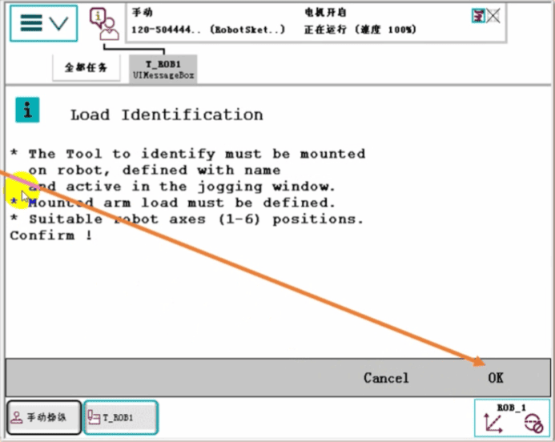

## 认识ABB机器人认识服务例行程序

机器人在出厂时默认配置了一系列的系统服务例行程序，可用于一些特定的操作，例如SMB电池关闭、维护信息管理、载荷测试、关节轴校准等，此任务主要介绍前三个较为常用的服务例行程序;调用例行程序必须在主程序中进行，通过ABB菜单栏进入到程序编辑器中;

### 1.服务例行程序调用

#### 1.程序编辑器菜单中，点击调试，点击PP移至Main;
#### 2.点击 调用例行程序..

系统服务例行程序数量会根据机器人选项配置的差异而有所不同，本任务介绍的3个均是出厂默认配置就带有的:SMB电池关闭、维护信息管理、载荷测定;

### 2.服务例行程序--SMB电池关闭的操作
当机器人长时间停用状态下，建议将SMB电池关闭，用以延长电池寿命，等下一次使用时只需重新更新转数计数器即可正常运行

#### 1.选中Bat_Shutdown
#### 2.点击转到

#### 3.手动模式下，使能上电
#### 4.点击“播放”

#### 5.点击Shutdown
#### 6.点击Exit
电池关闭后，切断主电源，则SMB所存储的数据丢失，即关节轴原点丢失，下次上电，电池自动激活，需要重新更新一下转数计数器方可正常使用，更新操作请参考任务3中的内容;

### 3.服务例行程序---维护信息管理功能的操作
ServiceInfo是基于Service Information System(img24/SIS的服务例行程序，该软件功能可以简化机器人系统的维护。它对机器人操作时间和模式进行监控，并于维护活动来临时提示操作员。机器人系统中内置了数个计时器，每当任何一个计时器计时超过设置的上限时，则当每次开机时均会弹出维护保养的相关信息，例如:“距离上一次检修已过365天，请按照维护保养手册内容进行检修..”;当我们按照要求完成了相关维护保养操作之后，需要重置该时钟，此操作需要运行ServiceInfo服务例行程序;维护保养内容可在官方机器人手册中的产品手册中对应的维护保养章节中查找到;

#### 1.进入例行程序调用界面,1.选中Servicelnfo
#### 2.点击转到，然后参照之前的操作，手动模式下使能上电点击程序启动按钮;

#### 3.该界面中显示3个计时器，1为日历时间，2为运行时间，3位齿轮箱时间;状态为OK表示该计时器未超时，状态为NOK时表示该计时器超时，则每当机器人启动时弹出维护提醒信息;可通过界面下侧的1、2、3进行计时器的选择

#### 4.例如，假设1、日历时钟超时，点击1进入该计时器界面，可查看该计时器相关信息，点击Reset即可重置该时钟该计时器默认365天，主要用于检查、清洗等常规维护保养提醒;
#### 5.复位完成后，点击OK即可退出:

#### 6.假设2、运行时间超时，则点击2进入该计时器界面，可查看相关信息，该计时器主要用于更换齿轮箱润滑油提前以小时为单位，复位操作与之前的一致;

#### 7.假设3、齿轮箱时间超时，则选择3进入该计时器界面，该界面显示各个关节轴的齿轮箱维护信息，该计时器主要用于检查齿轮箱磨损状态;

### 4.服务例行程序--载荷测定的操作
机器人在运行之前，必须准确设置相关载荷，机器人载荷主要有三种，如下图所示:A:上臂载荷B:工具载荷C:有效载荷;其中B和C经常用到，我们需要准确的设置载荷的重量、重心偏移、转动惯性矩等相关信息，但是很多时候这些数据很难直接人为测量准确，此时可以使用系统白带的载荷测定程序进行自动测定，可快速准确的设置工具载荷和有效载荷;该功能不能测定上臂载荷，关于上臂载荷的设置可参考ABB机器人官方手册中的相关内容;此外，某些场合机器人只有工具载荷，例如切割、焊接、涂胶，则需要测定工具载荷即可，但是某些场合机器人拥有工具载荷和有效载荷，例如搬运、码、机床上下料，则必须先测定工具载荷，然后工具夹持工件后再测定有效载荷;

载荷测定的对象不能为tool0和Load0，请在测定之前在手动操作界面选择好需要测定的工具数据和有效载荷数据;

在运行载荷测定程序之前，需要做以下准备:在手动操作界面中已选定需要测定的工具数据;在手动操作界面中已选定需要测定的有效载荷数据
(如需测定);
工具已正确安装到位:
工件已被工具夹持并且牢固可靠;(如需测定)关节轴6接近水平，并且轴3、5、6不要过于接近极限位置，建议将机器人各个关节轴全部调整至0度进行测定;
如有上臂载荷，请提前设置好;
速度设置为100%
系统处于手动模式

#### 1.进入例行程序界面,1.选中Loadldentify
#### 2.点击转到，然后点击示教器上的“播放"按钮

#### 3.提醒注意事项:当前路径被清除;程序指针会丢失，完成后将指针移动回至Main;确认完成后点击OK;

#### 4.选择测定的对象，Tool为工具数据，Payload为有效载荷数据，假设测定工具，则应选择Tool;

#### 5.提醒注意事项:
工具已安装到机器人上，并且已在手动操作界面中选中该工具数据上臂载荷已经设置各关节轴在合适的位置，确认完成后点击OK;

#### 6.询问当前是否测定工具toolDraw，即当前手动操作界面中选中的工具数据名称，当前任务中使用的工具名称为toolDraw，确认完成后点击OK，否则点击Retry;

#### 7.询问是否已知工具的重量，1表示已知，2表示未知，3取消;若已知工具重量，则在测定之前需要将工具重量人为输入到工具数据中的mass一栏，测定过程中参考此重量信息进行测定，若未知则选择2，则机器人自行测定重量信息:

#### 8.此任务中假设未知工具重量信息，则输入2，点击确定;

#### 9.选择关节轴6允许的运动范围，建议选择+90度或-90度若因为当前安装工具的因素使得当前6轴难以实现90度的运动范围，则可以选择Other，运动范围不能小于30度;

#### 10.询问是否需要自动测试前在手动模式下进行慢速测试，如果是初次测试，不太确定机器人运动形态，建议先手动慢速测试一遍，然后再执行最终的自动测试;后续若发现机器人运动形态是安全的，则测试时可跳过手动慢速测试直接执行自动测试;此处先点YES，执行手动慢速测试;

#### 11.点击MOVE，则机器人开始执行慢速测试，此时机器人会测试各个关节能否运动至测试位置，整个过程中使能上电不能中断，否则需要重来一遍;

#### 12.机器人开始执行测试运动，屏幕上会显示运动步骤，慢速测试不会测出结果，步骤也较少，一般7步左右;

#### 13.手动慢速测试完成后，提示切换到自动或手动全速模式，建议切换到自动模式，之后电机上电，再点击一下程序启动按钮;

#### 14.机器人开始执行自动测试，此过程会比较长，一般需要20步左右，运动过程中注意观察机器人运动，遇到紧急情况请及时停止运行;

#### 15.如图所示

#### 16.测试完成后，提示切换回至手动模式，切换到手动后使能上电，再点击一次示教器“播放"按钮，然后点击右下角的OK;

#### 17.自动测试出的部分载荷结果会显示在屏幕上，如果需要应用到对应测试的工具数据toolDraw里，点击YES，建议新载荷第一次测试时多测试几遍，确保测试结果接近真实值;

#### 18.测试完成后，可以查看一下测试结果，在手动操纵界面点击工具坐标;

#### 19.选中工具数据toolDraw，点击编辑里面的更改值;

#### 20.在tLoad一组数据中查看相关载荷信息，重量以及重心偏移;

#### 21.转动惯性矩等数值信息
若还有有效载荷需要测试，先创建后对应的有效载荷数据后，工具夹持住工件后再运行一遍该服务例行程序，类型选择PayLoad即可，后续步骤与上述相同

