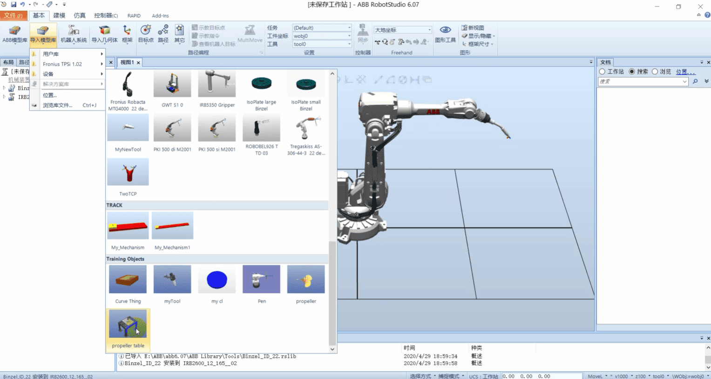

## 构建仿真工作站和手动操纵

## 1.创建工作站

### 2.导入机器人

### 3. 导入工具

### 4.点击布局,将工具名称拖到机器人名称上

选择 是

### 5.导入桌子

### 6.移动桌子

### 7.导入工件

### 8.修改工件位置

## 给机器人建立系统
点击【机器人系统】【从布局】

点击【下一个】

点击【下一个】

点击【选项】

勾选709-1,点击确定，点击完成

## 在工作站手动操作机器人

### 选择工具

