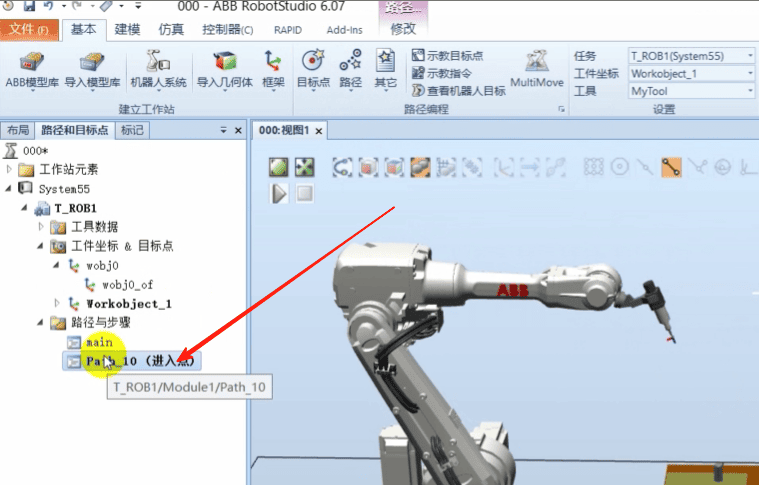
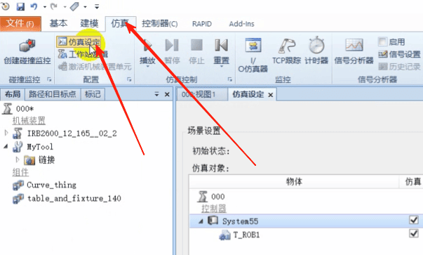

## 1创建工件坐标、运动轨迹程序以及录制仿真视频

## 一、如何在工作站创建工件坐标
### 选择工具

### 点击其他，创建工件坐标

### 选择 工件坐标框架下取点创建框架，点击

### 选择三点法

### 选择捕捉工具 捕捉X轴上2个点和Y轴上1个点

### 点击创建

### 这样工件坐标就创建好了

## 二、如何在工作站创建工作路径
### 1.先切换到 工件坐标系

### 2.将机器人移到合适位置，点击路径，控路径

路径就建好了

### 3.选择指令

### 4.点击示教指令

这样一条指令就建好了

### 5.将机器人拖到这里

### 6.选择指令 点击示教指令

### 7.移动机器人后，点击MoveL指令，点击示教指令

### 8.点击MoveL指令，点击示教指令

### 9.移动机器人，点击MoveL指令，点击示教指令

### 10.移动机器人，点击MoveL指令，点击示教指令

### 11. 希望走回去
右击，选择复制

粘贴

选择否

### 12.右击路径，选择 【自动配置】【线性\圆周移动指令】

### 13. 右击路径 ，点击 沿着路径运动
这时候机器人就沿着路径走了

## 仿真操作 ，点击 【同步】，【同步到RAPID】

### 点击确定

### 点击仿真，点击 仿真设定

### 选择T_ROB1,选择Path_10, 因为创建的路径叫Path_10

### 点击TCP跟踪，选择颜色

### 点击播放

## 三、录制仿真视频或仿真应用
### 点击仿真录像,然后点击播放

### 点击查看录像

### 点击录制应用程序
### 点击播放，点击录制视图，动作完成后，点击停止录制，点击保存

