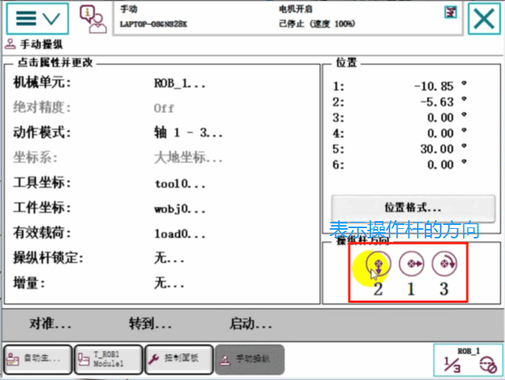
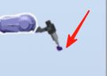
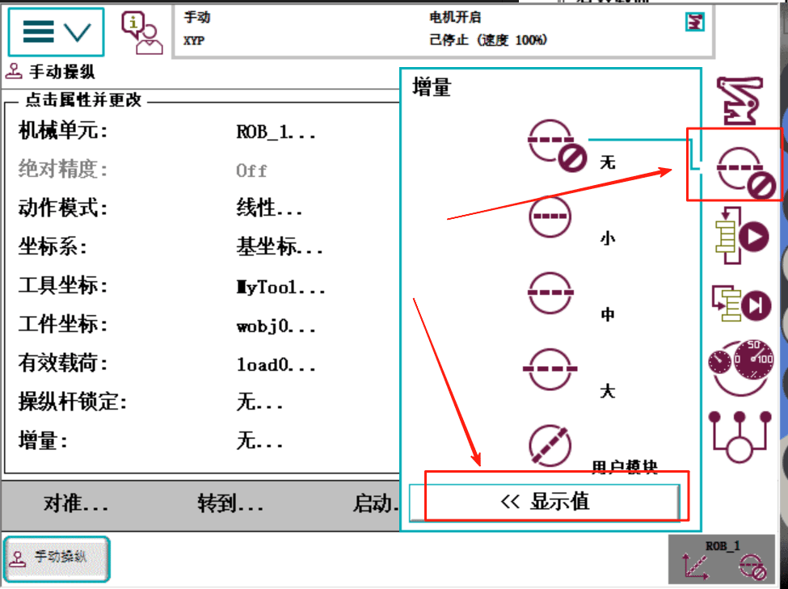

# 机器人的手动操作

先切换到手动模式
创建工作站，选择【机器人系统】【从布局】

选择【控制器】【示教器】

按住【Ctrl+Shift】拖动鼠标表示切换视角。
选择【主菜单】【手动操作】点击【Enable】使能键，示教器上会显示电机开启。
## ABB的手动单轴控制运动

【动作模式】选择1-3轴，

也就是说操作杆的上下表示控制2轴，左右表示控制1轴，旋转表示控制3轴
当电机【动作模式】切换控制轴到4-6的时候，则表示操作杆上下表示控制5轴，左右控制4轴，旋转控制4轴。

## ABB机器人的手动线性运动
先确认在手动模式

先点击【ABB模型库】，选一个机器人

在点击【导入模型库】，选择一个工具

将工具名称拖到机器人名称上去安装工具

点击【同步】，选择【确认】

同步完之后，确认一下错误

【主菜单】【手动操纵】【动作模式】，选择【线性】，【确定】

选择工具坐标

选择刚安装的工具

使机器人先回原点
右击机器人名称，选择【回到机械原点】

切换到线性的时候，我们再看操纵杆方向，就变成上下操纵X方向、左右操纵Y方向、旋转操纵Z方向了。也就是说线性的时候走的空间直角坐标系。

记得【Enable】使能给电机上电，这时候我们操纵操纵杆发现机器人的工具点走的是一个直线。

我们要注意机器人的坐标方向

加个桌子工件方便观察

选择桌子，选择移动工具，这时候可以拖动桌子移动

选择工件【位置】【放置】【三个点】

打开【选择部件】【捕捉末端】【手动线性】

点击【应用】，将工具对准桌子的一个角

【Enable】使能上电后，我们操纵机器人线性运动，沿着桌子边缘运动

## 机器人的增量(微调)操作
就是微调，有的时候移动过快对不上一个点，可以借助增量降低速度来调。

小 每点一下操纵杆，动0.05毫米
中 每点一下操纵杆，动1毫米
大 每点一下操纵杆，动5毫米

## 机器人重定位操作
其实就是让机器人调整姿态，但是顶点绕着一个点旋转。

选择【动作模式】，选择【重定位】，【确定】

这时候看到绕着哪个坐标系的点旋转，就取决于坐标系选择的什么。

## 动作模式和控制轴快捷键介绍

当前控制的轴

