# 
## 30. 第九章 创建一个滑块的机械装置

### 选择固体，矩形体，创建滑台
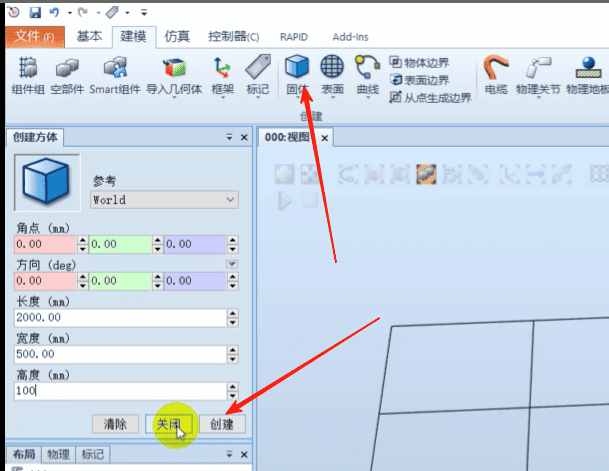

### 重命名创建的模型名称为滑台
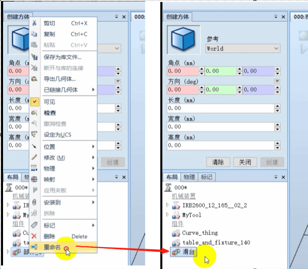

### 修改模型颜色
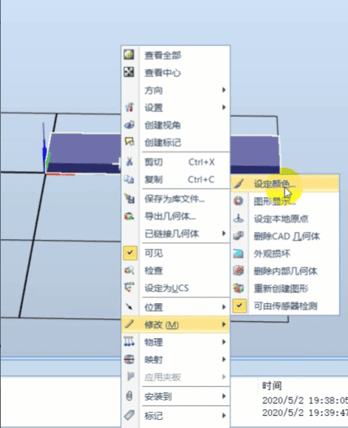

### 创建滑块
捕捉末端
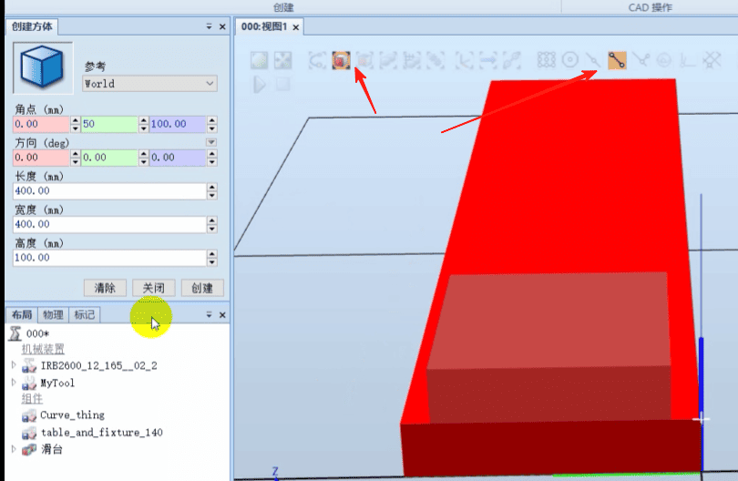

### 修改滑块名称为滑块
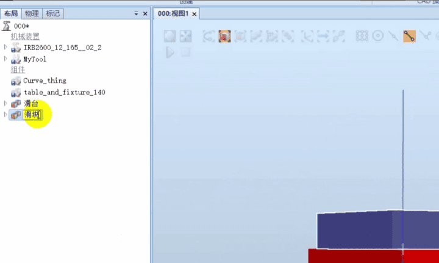

### 修改滑块颜色
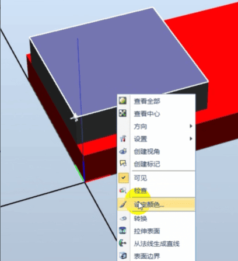

### 点击创建机械装置
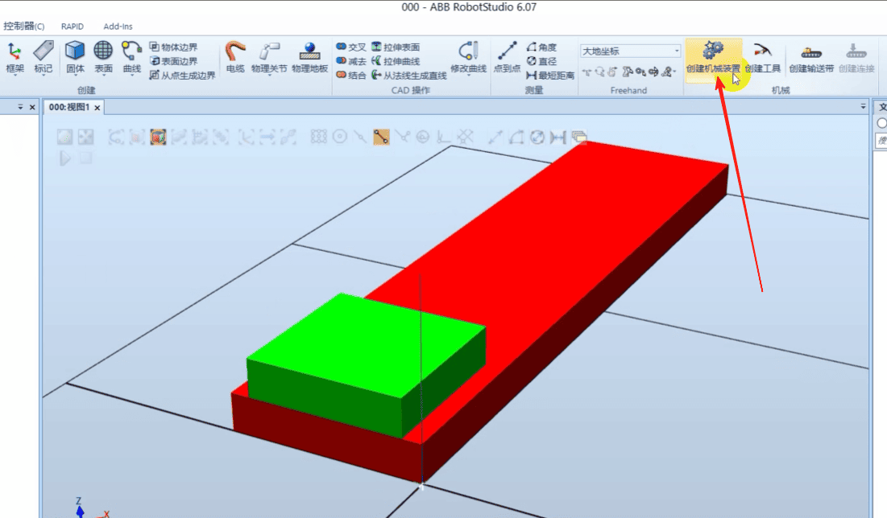

### 机械装置类型选择[设备]，名称叫做 滑台装置
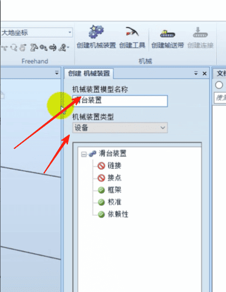

### 双击链接，
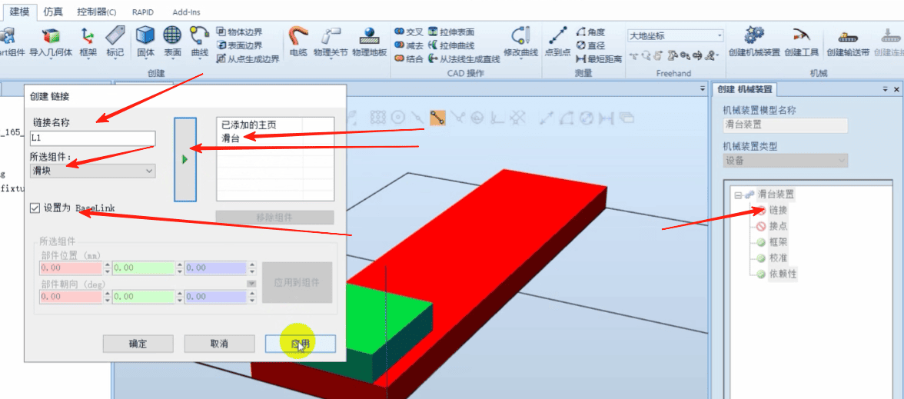

### 双击第二个链接
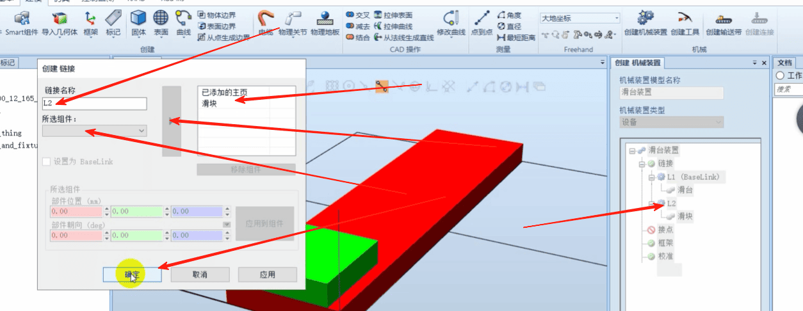

### 双击接点
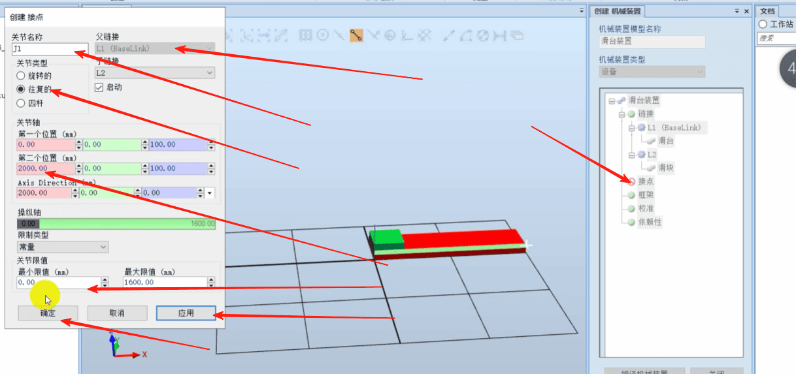

### 点击编译机械装置
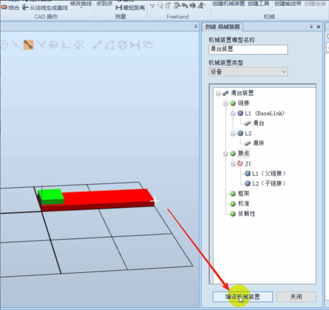

### 点击添加
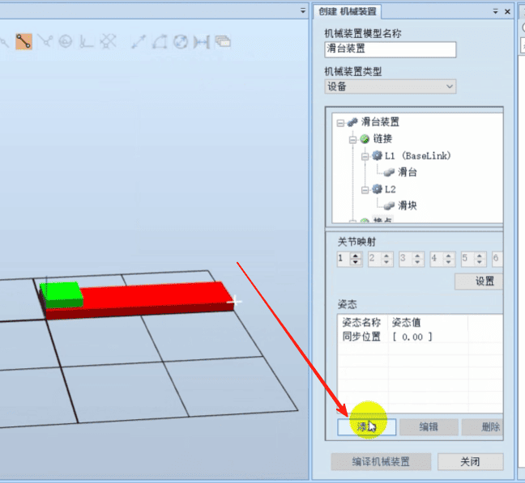
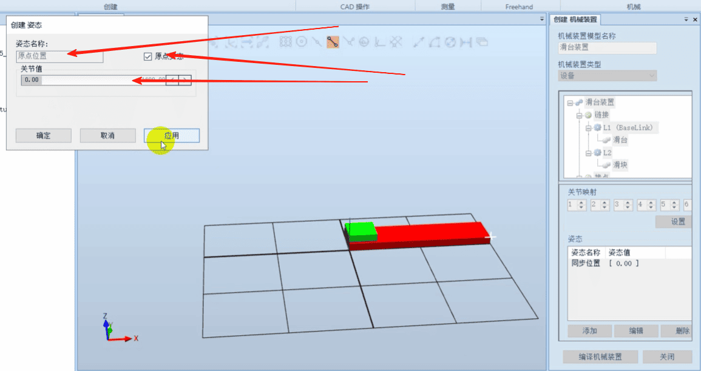
再添加
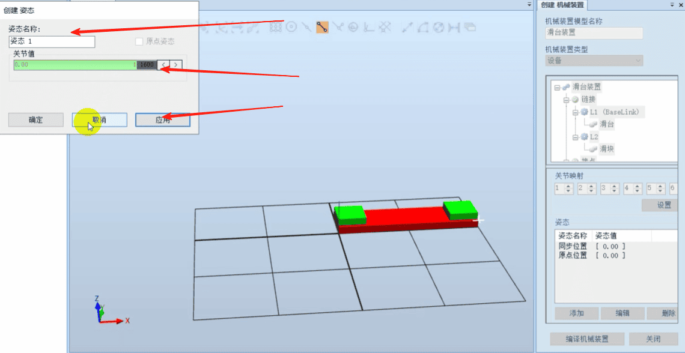

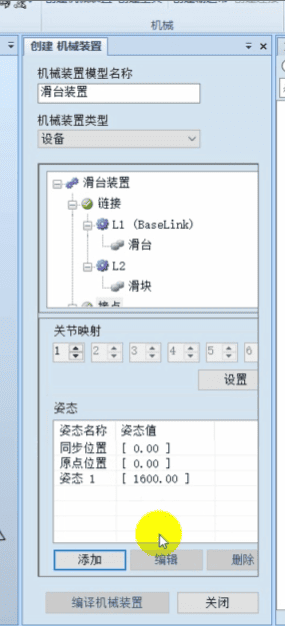

### 设置转换时间
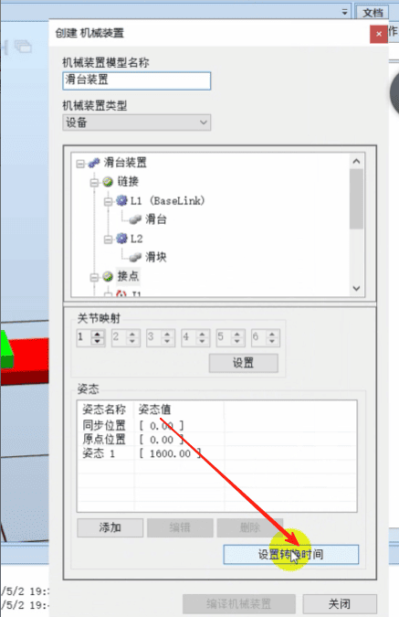
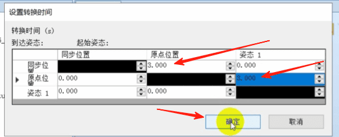

### 选择手动关节
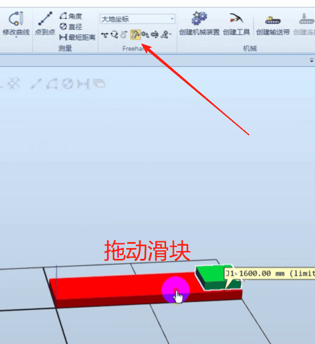

### 保存为库文件
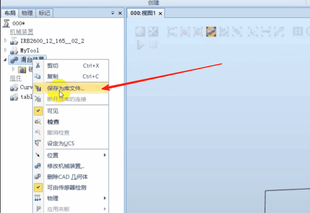

