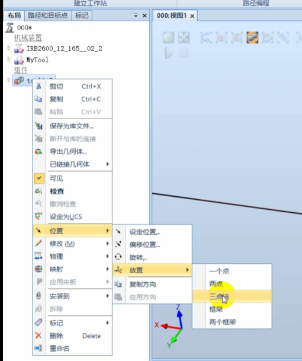
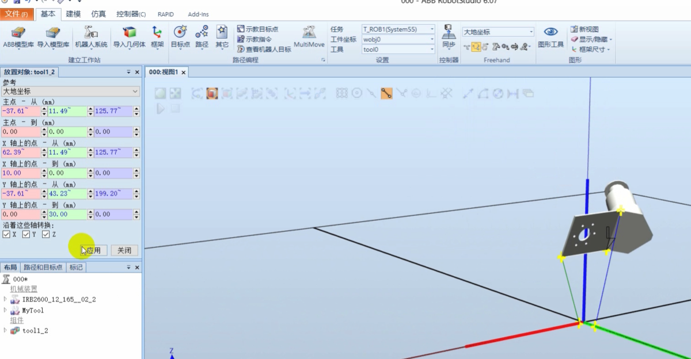
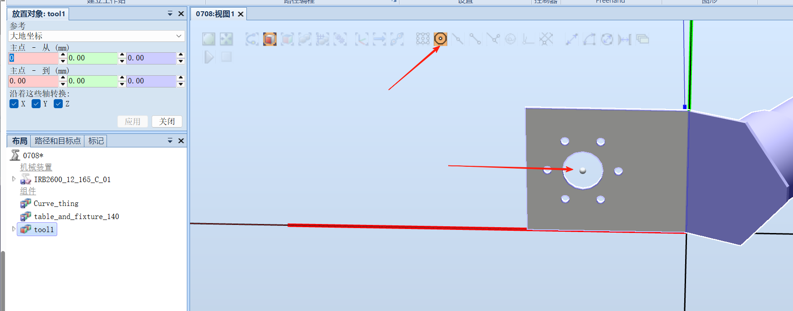
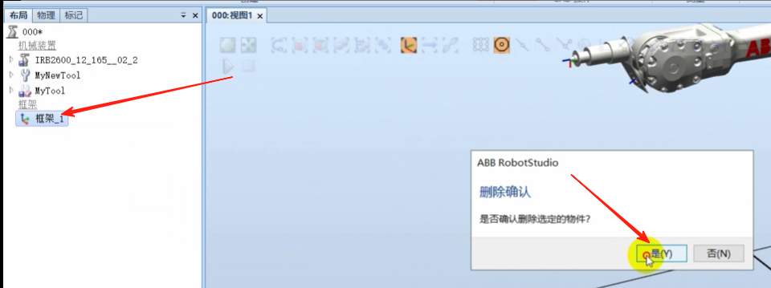

## 创建自定义工具
### 点击导入几何体 选择一个SAT文件

### 将工具坐标与大地坐标原点重合

### 右键，位置，放置，三个点

### 选择捕捉

点击应用，如下

### 在方式一次，使得原点与大地坐标原点重回
1点法

### 捕捉圆心，到大地坐标原点

如图所示

### 设置本地原点

## 创建工具坐标系
点击框架，创建框架

框架位置捕捉工具末端中心位置

### 调整坐标Z轴
右击框架，点击设定为表面的法线方向

捕捉表面

### 点击建模，点击创建工具

点击下一个

TCP信息 选择框架1，点击 完成

主角工具就创建好了

### 安装到机器人
将创建好的工具拖到机器人名称上
选择是

这样创建的工具就安装到机器人上面了

### 删除框架

