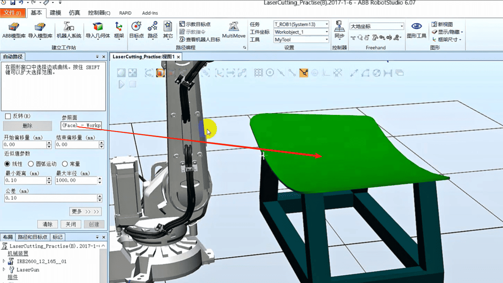

## 如何创建ABB机器人自动轨迹路径

### 捕捉工件的曲面

### 创建工件坐标
点击其他，创建工件坐标

选择3点法

这样他就有了一个和大地坐标一样的坐标系

### 点击路径，自动路径

## 参照面选择上表面

## 按住shift键，鼠标移动到曲面，直到边缘都变红色，点击

### 选择圆弧运动， 最大半径改成1000

### 最小距离0.10，公差0.1，点击创建

如下

### 点击路径右击，选择自动配置，线性/圆周移动指令

### 选择，点击应用

### 点开路径与步骤下面的路径，有感叹号的都走不到

### 选择一个没有感叹号的点，右键查看机器人目标

### 选择一个没有感叹号的点，右击选择修改位置

### 选择工件坐标下的一个点，右击修改目标，旋转

### 绕轴旋转5度，点击应用

### 以刚刚设置的点为标准，去修改其他的点

### 按住第二个点按住Shift到最后一个点右击修改目标，对准目标点方向

### 参考点选择刚刚选的那个点，点击应用

### 右击路径，点击自动配置，选择线性/圆周移动指令

这样路径里面的感叹号都没有了

### 右键路径，选择沿着路径运动

