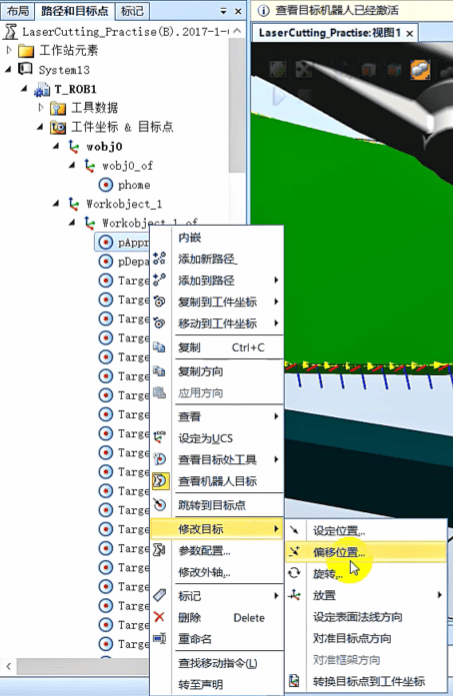

#
## 让机器人先回机械原点

### 以大地坐标为基准创建一个Home点

### 将工件目标点改成phome

### 将它【添加到路径】【Path10】第一

### 在将它【添加到路径】【Path10】最后
### 复制Target_10

### 再粘贴一下

### 将其命名为pApproach接近点

### 右键Approach修改目标，偏移位置

### 沿着Z轴方向偏移-50

### dDpart也偏移-50

### 再添加到路径的倒数第二行

### 将其添加到路径path10的第一行

### 将Target_10改成fine精确到达

### 将结束点改成fine点

### 右键路径，自动配置，线性/圆周移动指令

### 沿着路径移动

### 将最后一个点改成fine

### 右击沿着路径运动

