## 同步到RAPID
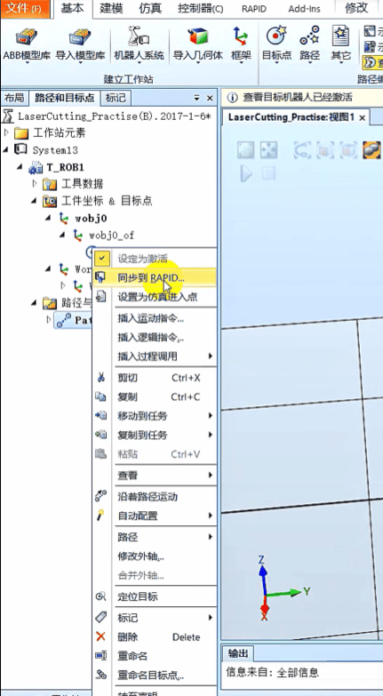
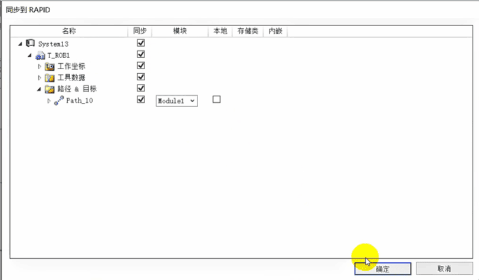
这样就同步完成了，

### 点击RAPID，点击Module1
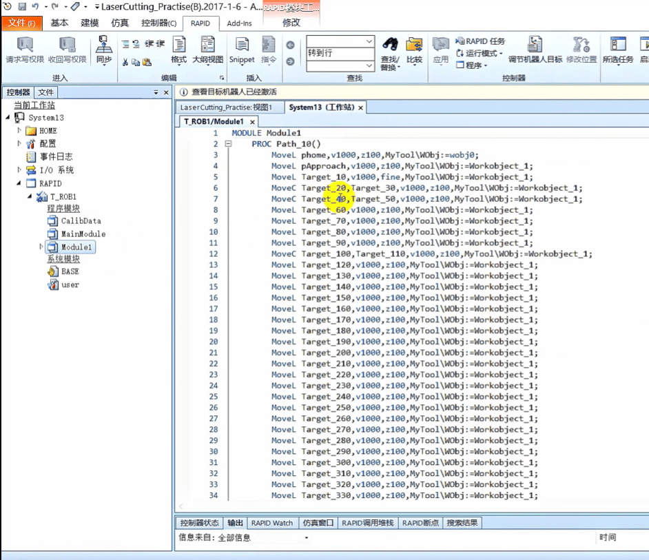

### 点击仿真设定， 进入点 选择Path_10
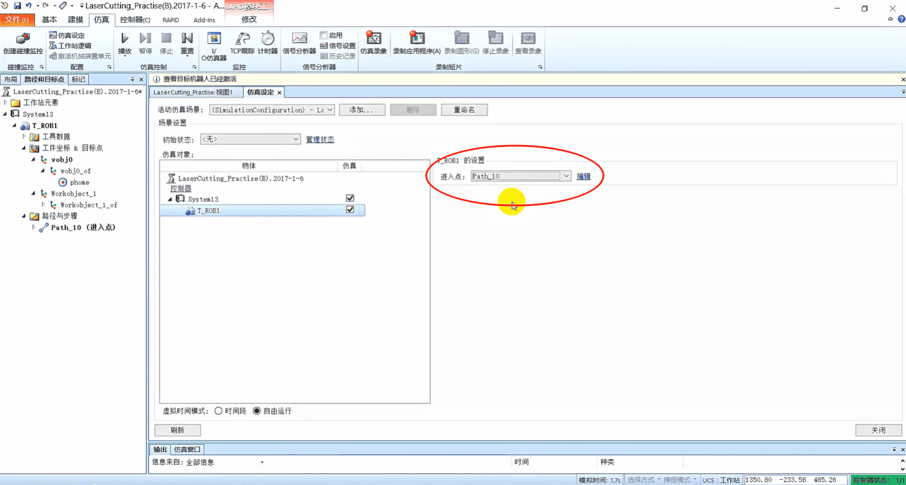

### 点击播放
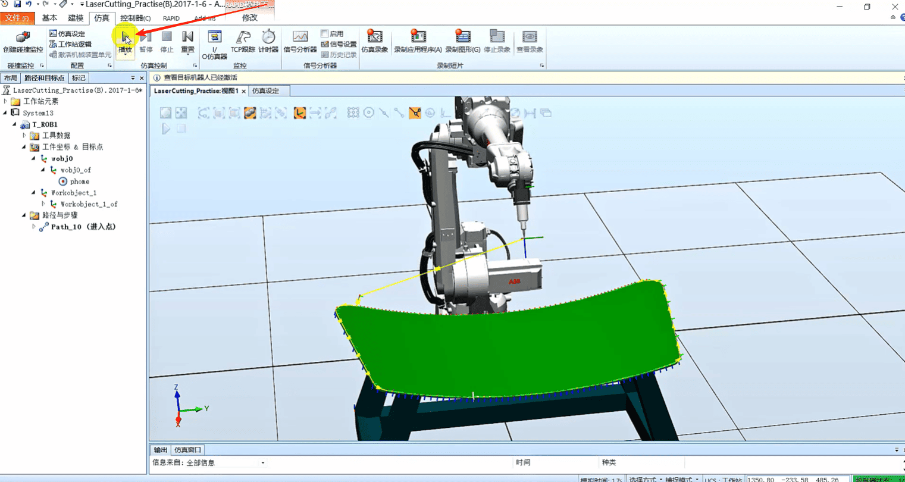

## 点击仿真 ，创建碰撞健康
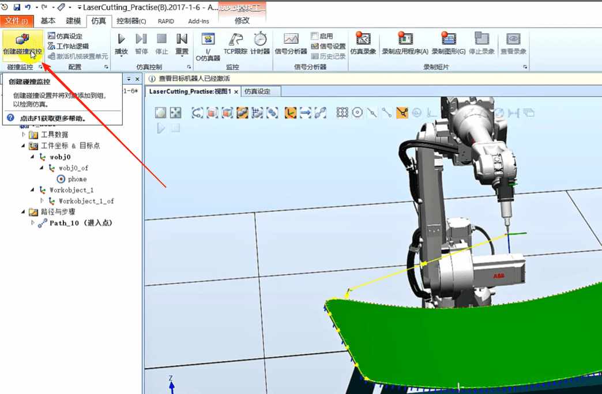

## 将工具拖到A里面，将工件拖到B里面
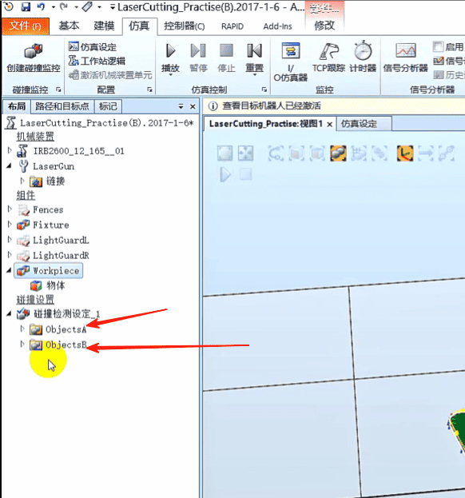

### 右击 碰撞检测设定，右击 修改碰撞监控
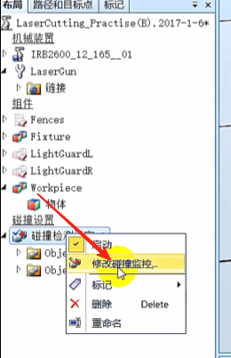

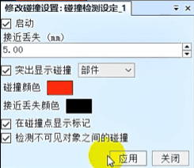

### 这样碰到就变红色了，低于5毫米就会黑色
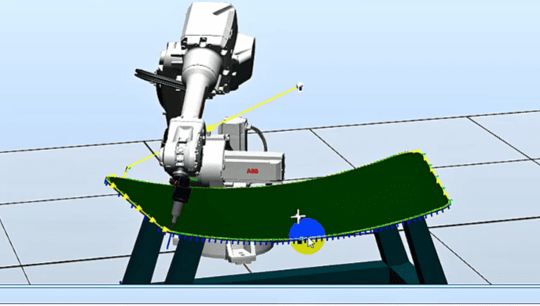

### 沿工件坐标向上提高3毫米
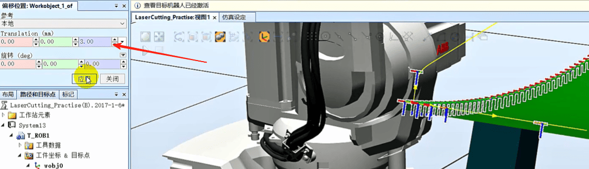

### 再同步到RAPID
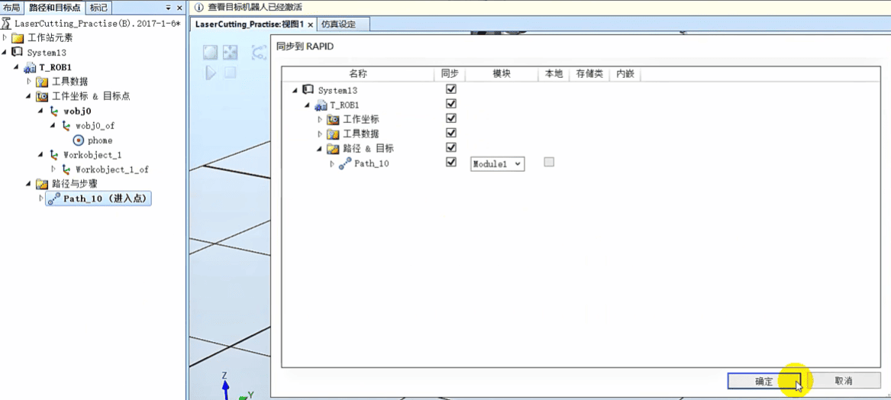

### TCP跟踪
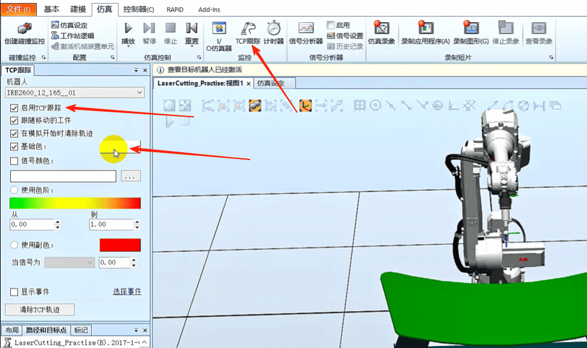

