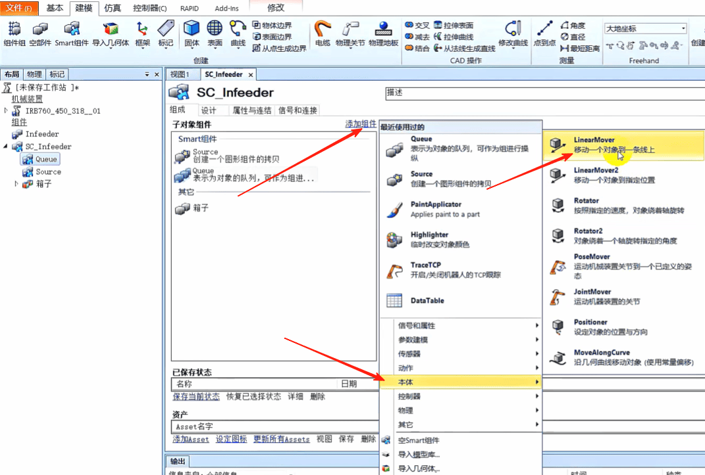

## ABB机器人码垛仿真工作站之smart组件创建动态输送链

## 需求分析
1. 输送带开启后,一直从右向左传输箱子
2. 当箱子碰到左边的挡板传感器,输送带停止
3. 当左边挡板的箱子被取走,输送带又开始从右往左传输箱子

### 1. 创建工作站

### 2. 导入机器人 IRB760

点击[确定]

### 3. 导入输送带

移动输送带

重命名输送带为 SC_Infeeder

### 4.点击仿真 重命名Smart组件为SC_Infeeder

### 5.创建矩形体做箱子 点击创建

这样部件1就创建好了,重命名为箱子

更改箱子颜色

### 6. 希望现在从右往左走,每抓走一个过来一个

将箱子拖到Smart组件SC_Infeeder里面

右击Smari组件SC_Infeeder里面，选择[编辑组件]

- 需要一直拷贝箱子

点击[添加组件]，选择[动作]，选择[Source]

Source选择SC_Infeeder/箱子，点击[应用]

- 箱子需要排队过去,所以要创建队列

点击[添加组件]，[其他],[Queue]

- 箱子需要从右边运动到左边，所以要添加一个运动
点击[添加组件],[本体][LinerMover]

- 移动的对象就是队列里面的对象

点击应用

- 添加一个传感器,检测物体碰到面传感器时停止

点击[添加组件],[传感器],[PlaneSensor]

这个面是Y和Z面上，所以X方向不需要有值，让他一直执行

- 传感器检测不能检测输送带
右击输送带Infeeder,去掉 可由传感器检测

点击[属性与连结]，点击[添加链接]

复制品是要加入队列的一个对象

加一个启动信号，点击[添加i/O_Signals],点击[确定]

当传感器检测到箱子到位这个信号，将信号发送出去,点击[信号和连接]，[确定]

目前它只识别信号的上升沿，当机器人把箱子搬走以后，传感觉就由接通变不通了，
要利用这个信号，让下一个箱子过来，所以组件里面还要添加一个取反信号

点击[添加组件]，[信号和属性],[logicGate]

点击[信号和连接]，点击[添加i/O Connection]
Sourece的执行就是复制一个产品

在单击[添加i/O Connection]，又去出发一个加入队列

在单击[添加i/O Connection]，传感器接收到一个信号，输送带就发出一个信号

在单击[添加i/O Connection]，传感器接收到信号，要剔除队列

传感器检测到结果进行取反

利用取反信号再去出发source的执行

也就是说第一次需要手动开启，然后后面被激活以后可以自动运行实现循环

### 点击仿真，播放，箱子就从右边移动到左边了

