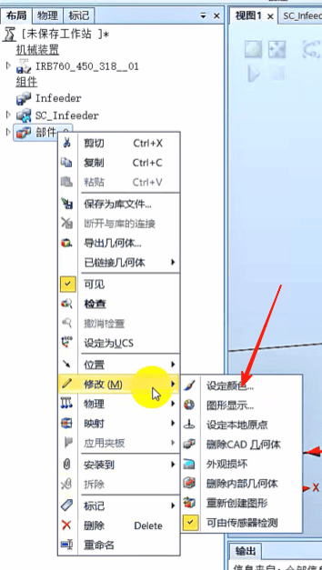
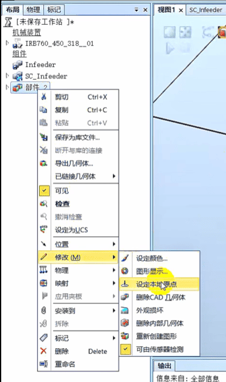
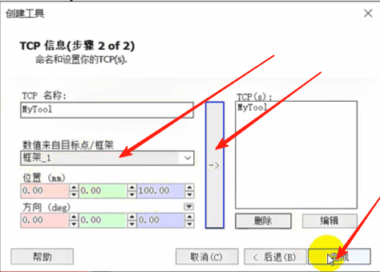
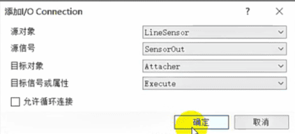
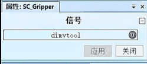
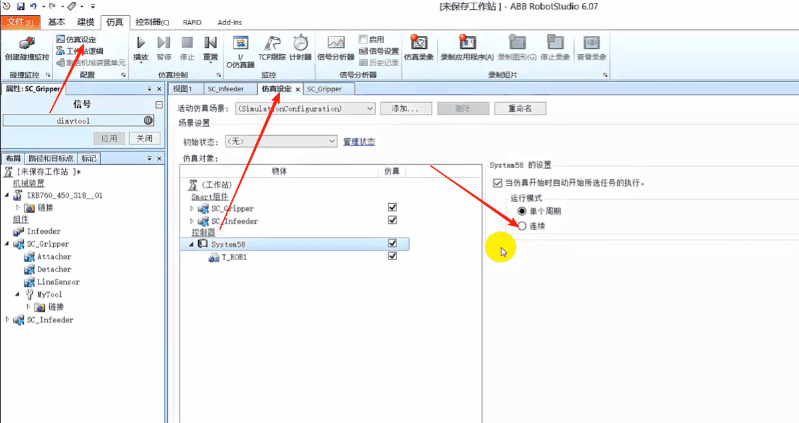

## smart组件创建动态夹具

### 1.创建吸盘工具,修改颜色

### 2.将吸盘的中心移到大地坐标原点
#### 选择[部件][位置][放置][一个点]

主点从吸盘中心到大地坐标原点，点击应用

### 3. 修改吸盘工具的本地原点
#### 选择[部件][修改][设定本地原点]

#### 全部改成0，点击应用

### 4.建立工具坐标系。点击框架，创建框架

#### 框架的位置选择上表面的中心位置，点击创建

#### 右击框架,选择[设定为表面的法线方向]

#### 表面或部分选择上表面，点击[应用]

### 5.点击创建工具，选择使用已有部件，点击下一个

#### 数值来自目标点/框架选择框架1，点击右箭头，点击完成

#### 这样工具就创建好了，删除框架1

### 6.将吸盘安装到机器人上
#### 按住拖到机器人上

#### 这样工具就装到机器人上了

### 7.创建工具的Smart组件
#### 点击Smart组件

#### 右击重命名Smart组件为SC_Gripper

#### 将吸盘工具放到Smart组件里面
#### 这样Smart组件就会随着机器人一起动

### 8.右击SC_Gripper，选择 编辑组件

#### 让Smart组件拥有工具属性,右击MyTool，设定为Role

 - -
#### 点击[添加组件][传感器][LineSensor]

#### 将传感器建在吸盘的底部中央

#### 稍后这个传感器会检测到有没有抓到箱子，如果抓到箱子会把箱子吸起来

#### 右击工具,去掉 可由传感器检测

 - -
#### 点击[添加组件][动作][Attacher]

#### 父对象就是工具，子对象就是传感器检测到的对象
 - -

#### 点击[添加组件][动作][Detacher]拆除一个对象，直接点应用

 - -
#### 添加一个取反信号,[添加组件][添加组件][LogicGate]

 - - 
#### 选择[属性与连结][添加连结]

#### 传感器检测到的对象，就是要吸附的对象

#### 吸附的子对象，就是要释放的子对象

 - - 
#### 点击[信号与连接],添加I/O___Signals
#### 来控制吸附还是释放抓取对象的

 - - 
#### 点击[添加I/O___Signals]
#### 触发线性传感器的有效激活

#### 线性传感器的对象触发吸附动作Attacher的执行

#### 点击[添加I/O___Signals]，传感器信号取反

#### 用取反信号对Detacher的执行

## 点击 [机器人系统] [从布局]

#### 下一个

#### 下一个

#### 点击[完成]

## 检测吸盘抓取
#### 选择MyTool工具

#### 选择捕捉圆心 捕捉表面，将吸盘移到箱子上

#### 点击[SC_Gripper]

#### 启动dimtool

#### 移动机器人，吸住箱子一并抬起

#### 松开，放下箱子

#### 点击[仿真设定]，选择连续

#### 双击[SC_Infeeder]
#### 点击[distart]启动
