## ABB机器人码垛仿真工作站之smart信号关联与码垛程序的三个基础示教点

### 如何将系统信号和Smart组件信息进行关联

#### Smart组件相当于一个PLC，
#### 当机器人人系统要抓取的时候，机器人系统要发生出去一个信号，那么对于Smaert组件来说就是一个输入信号，所以是di信号，
#### 比如箱子到达左边，被传感器检测到以后，输送带有个信号要发送出去，告诉机器人系统信号到了

### 1. 去机器人系统建2个信号，点击控制器，配置，【I/O System】
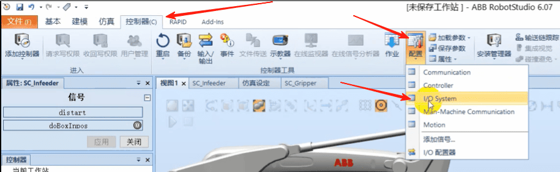
#### 点击Signal,右键 新建Signal
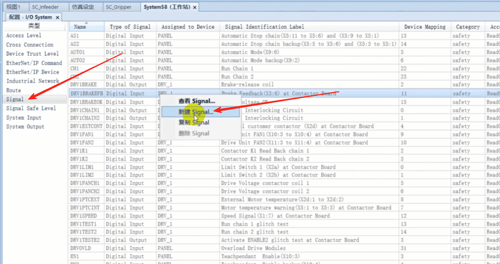
#### 新建一个di信号，是输送带到了末端传感器检测到以后发出的
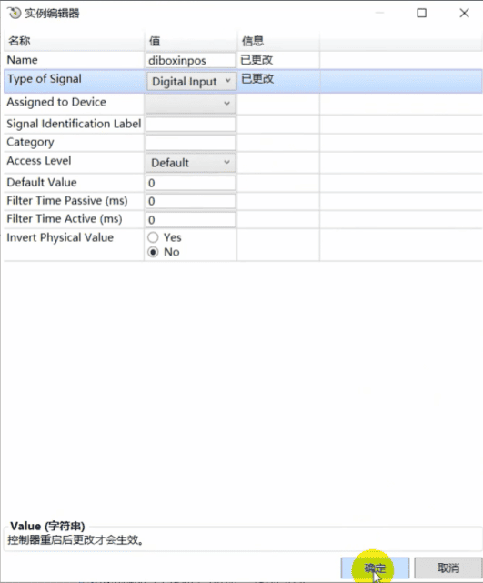
#### 点击Signal,右键 新建Signal
#### 新建一个do信号,机器人系统发送出去的信号给工具Smart系统的dimytool上
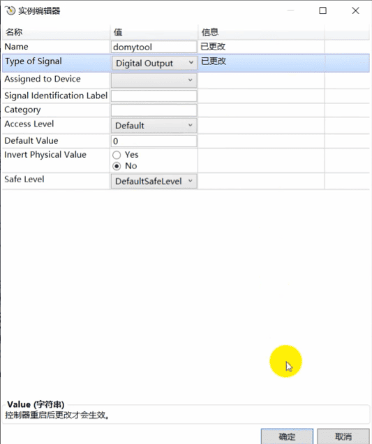
#### 点击重启生效
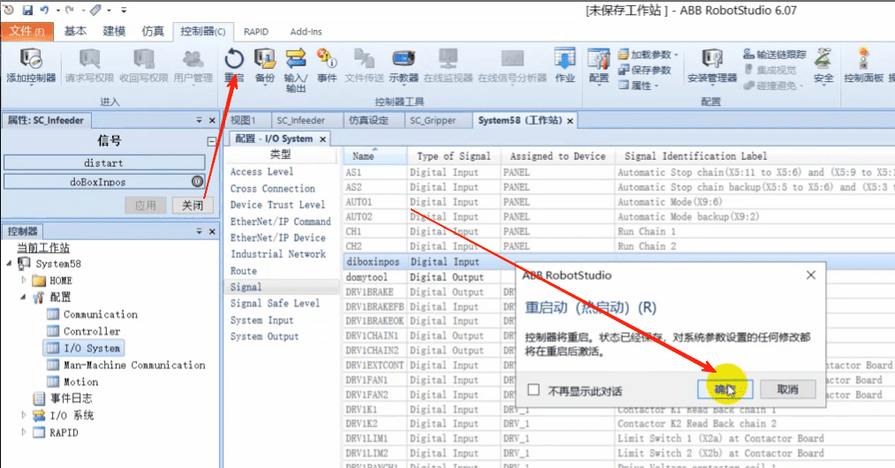

### 2. 点击仿真，工作站逻辑
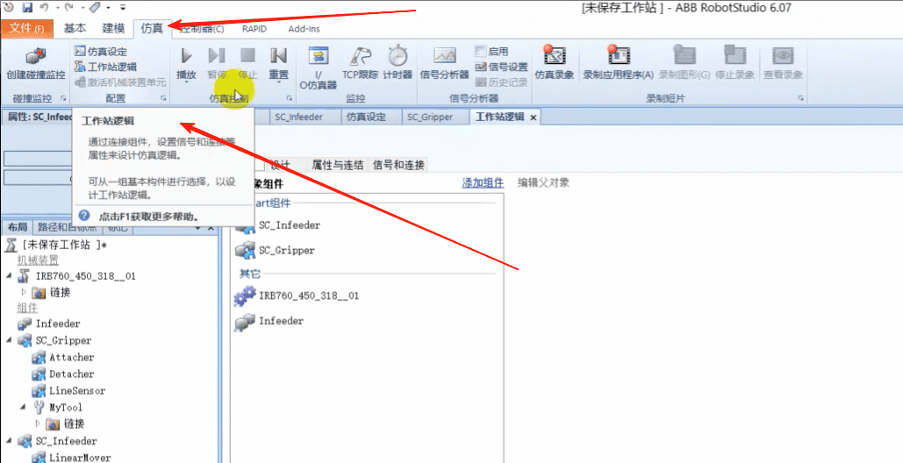
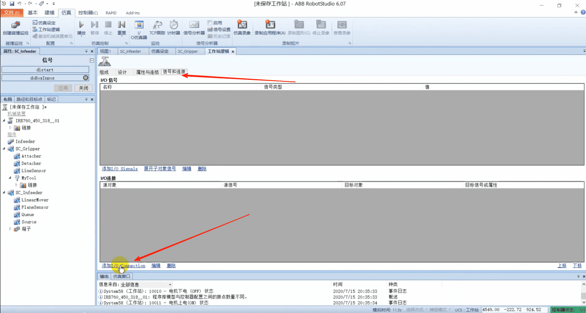
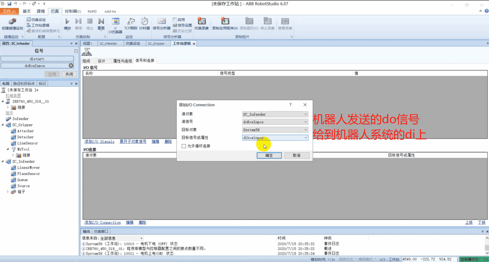
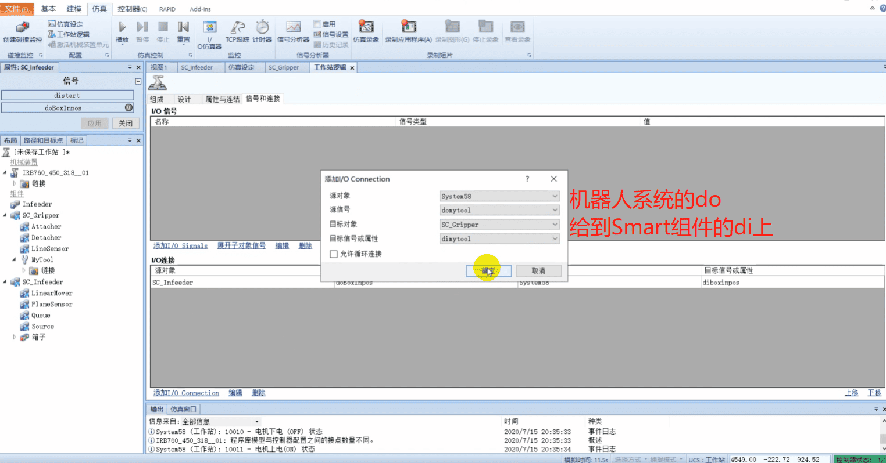

#### 这样就能用机器人系统的信号去控制Smart组件的信号
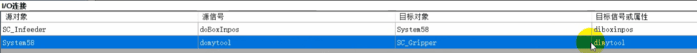

## 写程序之前，先给工作站画一个托盘，将箱子码到一个托盘上
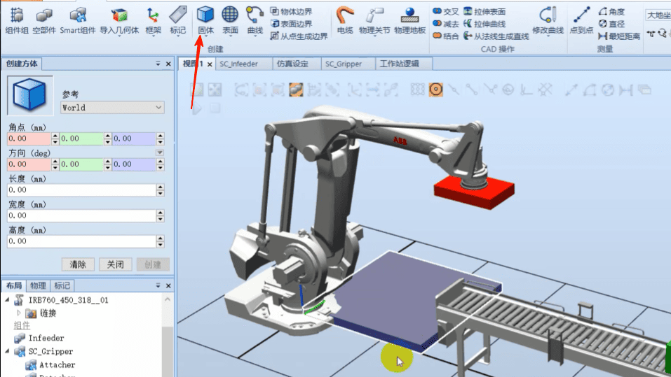
#### 测试机器人能不能够到托盘
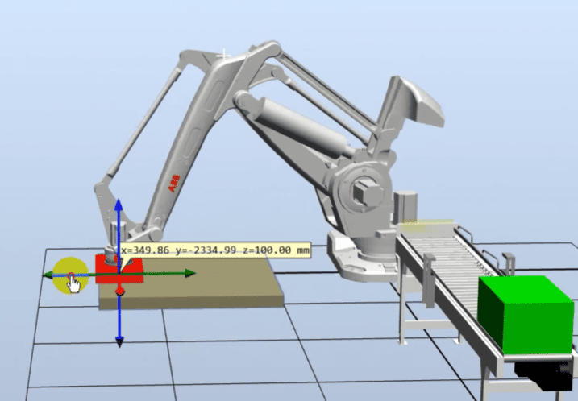

#### 示教目标点 安全点phome
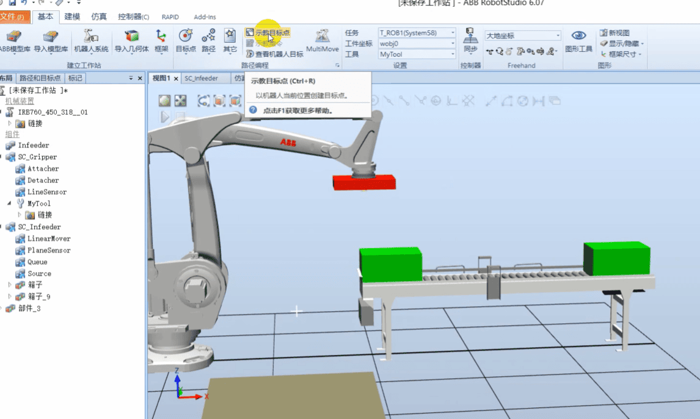
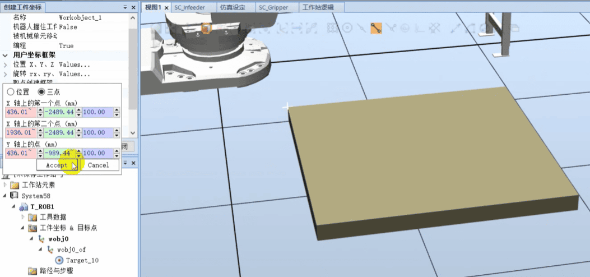
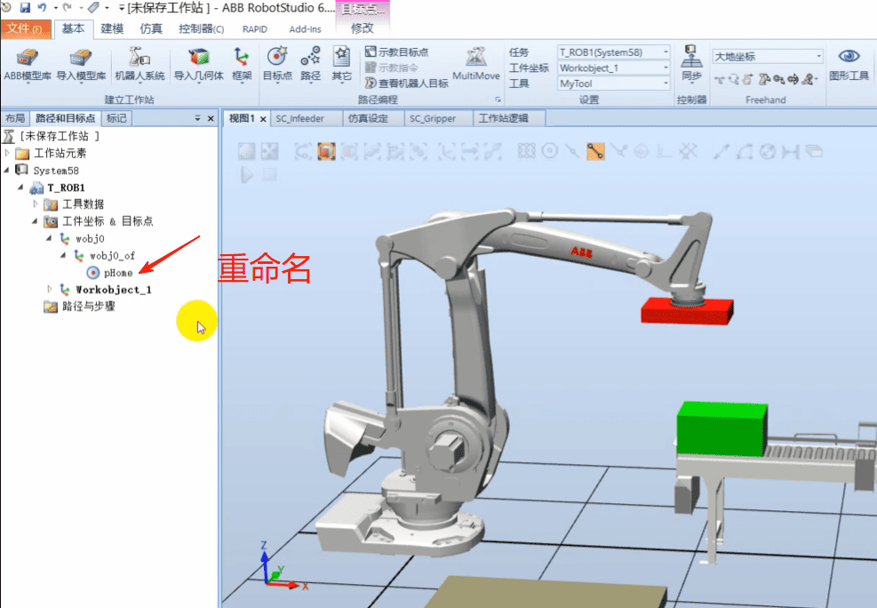

#### 示教抓取点
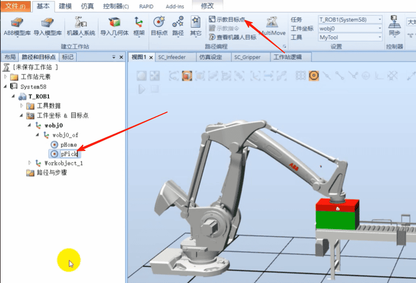

#### 示教抓取的基准点
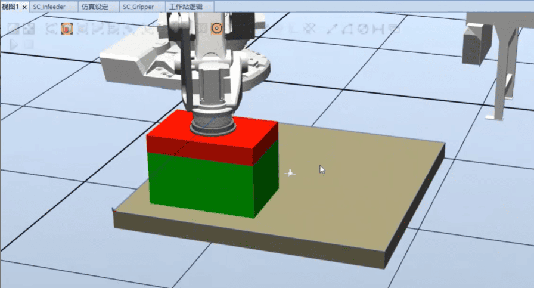
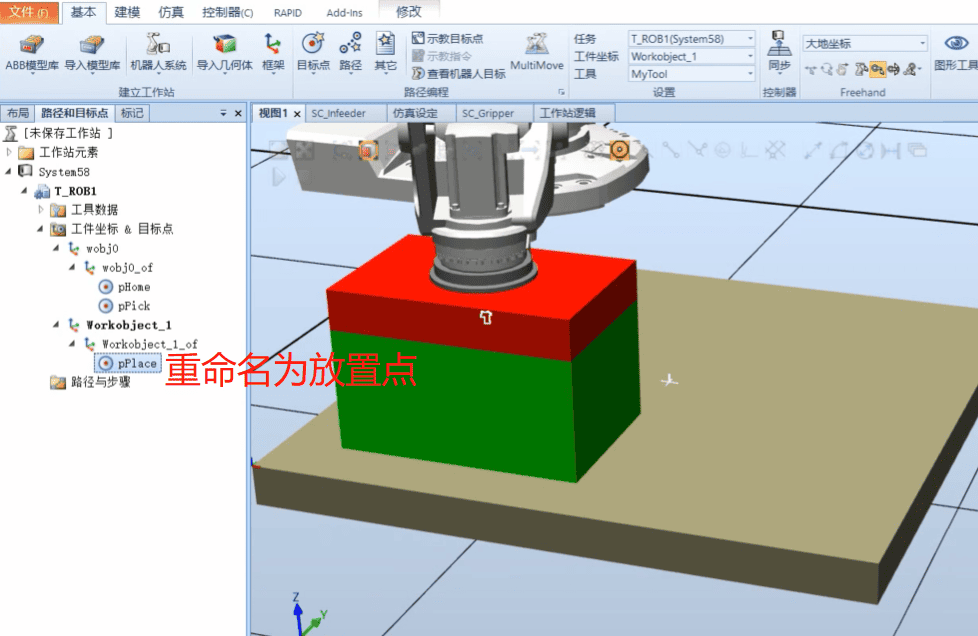

#### 给三个点添加新路径
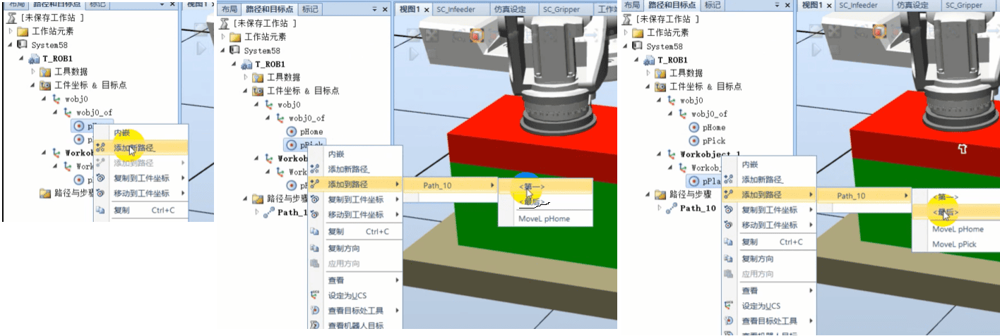

#### 将路径同步到RaPID
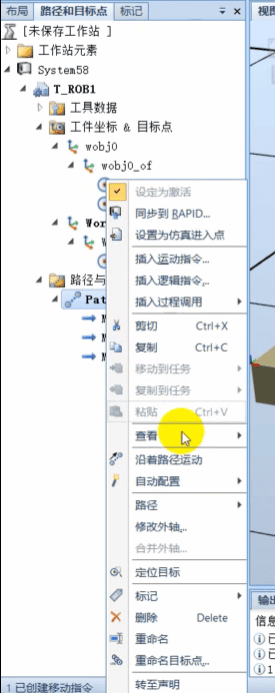
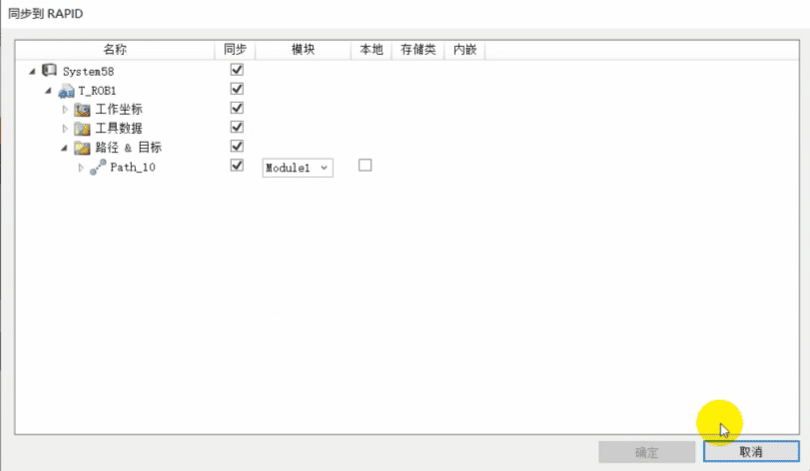

### 写程序
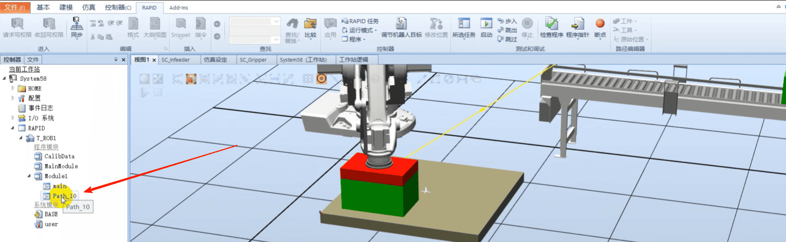
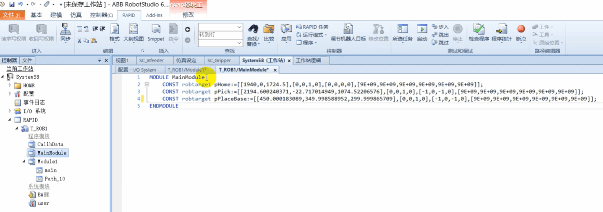
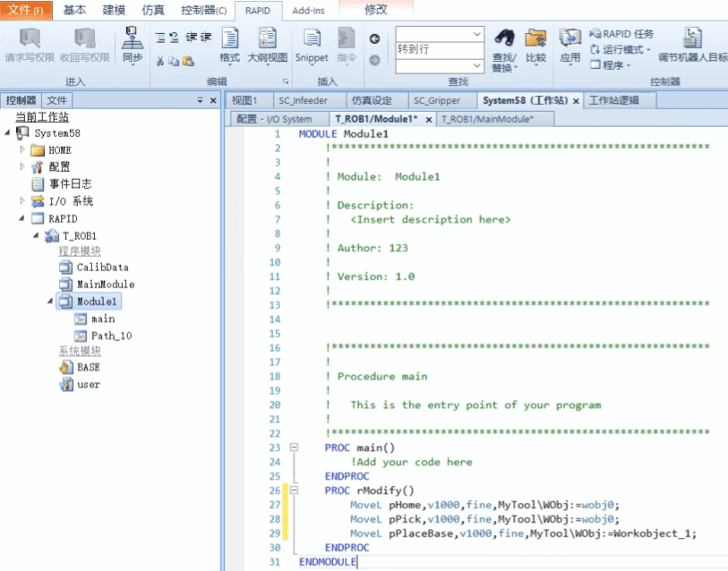

