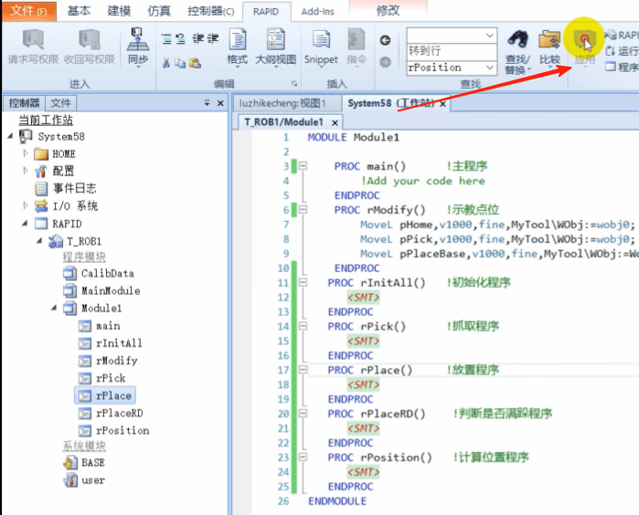
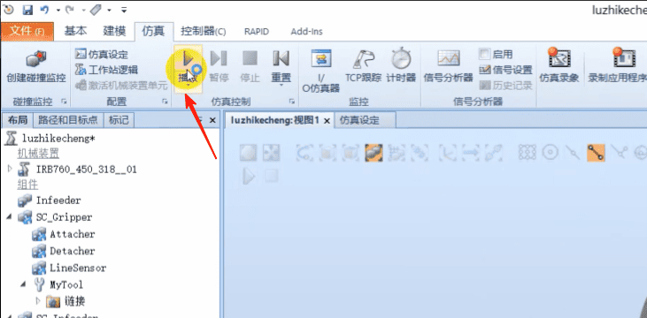
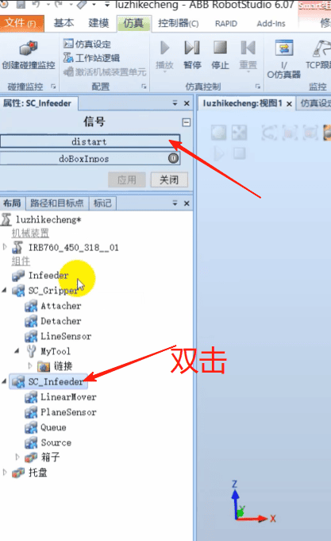
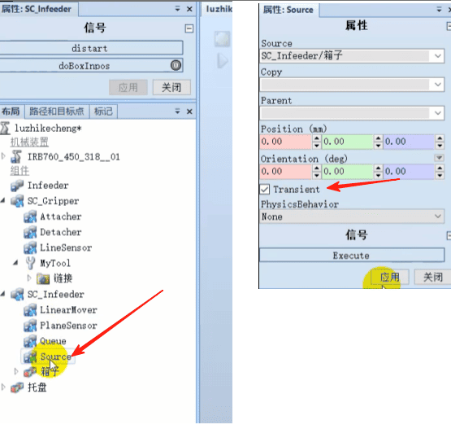

## 第十二章 ABB机器人三层码垛程序的编写

### 需求分析
1、三层码垛,每层5个
2、如果码满了就等待0.5秒后回到安全点,没有码满继续码；
3、程序段分解
主程序
示教点位
始化程序
抓取程序
放置程序
判断是否满跺程序
计算位置程序 计算每次放的位置


```
MODULE Module1
    CONST robtarget pHome:-[[1940,0,1724.5],[0,0,1,0],[0,0,0,0],[9E+09,9E+09,9E+09,9E+09,9E+89.9E+0911:
    CONST robtarget ppick:=[[2194.600240371,-22.717014949,1074.52206576],[0,0,1,0],[-1,0,-1,0],[9E+09,9E+09,9E+09,9E+09,9E+09,9E+09];
    CONST robtarget pPlacease:=[[450.000183089,349.998588952,299.999865709],[0,0,1,0],[-1,0,-1,0],[9E+09,9E+09,9E+09,9E+09,9E+09,9E+09]
    VAR rotarget pplace; ! 点动变量 放置点
    PERS num ncount; ! 码垛计数
    PERS bool palletfull; ! 是否满垛
PROC main() !主程序
    rInitA11;
    WHILE true DO
        IF palletfull=FALSE THEN ! 如果没满垛 继续抓放
            rPick; ! 抓取
            rPlace; !放置
        ELSE ! 如果满了
            WaitTime 0.5;
        ENDIF
    ENDWHILE
ENDPROC

PROC rModify()!示教点位
    Movel pHome,v1000,fine,MyTool\wobj:=wobj0; ! 安全点
    MoveL pPick,v1000,fine,MyTool\wobj:=wobj0; ! 抓取点
    Movel pPlaceBase,v1000,fine,MyTool\wobj:=Workobject_1; ! 放置点
ENDPROC

PROC rInitA11() !初始化程序
    Movej pHome,v1000,fine,MyTool\wobj:=wobje; ! pHome安全点
    reset domytool; ! 初始化之前先复位
    ncount:=1;
    palletfull:=FALSE;
ENDPROC

PROC rPick() !抓取程序
    Movej offs(pPick,0,0,100),v1000,fine,MyTool\wobj:=wobje; ! 到达抓取点上方100毫米处等待等待
    WaitDI diboxinpos,1; ! 等待diboxinpos(输送链给机器人系统的信号)为1的时候 就说明箱子到位了
    MoveL pPick,v500,fine,MyTool\wobj:=wobj0; ! 去抓取点
    set domytool; ! 夹住
    MoveL offs(pPick,0,0,300),v500,z20,MyTool\wobj:=wobje;
    MoveJ offs(pPick,-300,-600,300),v1000,z20,MyTool\wobj:=wobje;
ENDPROC

PROC rPlace() !放置程序
    rPosition; ! 每次放置之前调用获取一下放置位置
    ! RelTool 参考的工具坐标(Z轴正方向向下)  走到抓取点上方200毫米处
    MoveJ offs(pplace,0,0,200),v1000,z20,MyTool\wobj:=Workobject_1;
    Movel pplace,v500,fine,MyTool\wobj:=Workobject_1; ! 前往放置点 每次放置点不一样 所以用变量pplace赋值处理
    Reset domytool; ! 放下吸盘
    ! 直线起来 避免蹭到箱子
    MoveL offs(pplace,0,0,200),v1000,z20,MyTool\wobj:=Workobject_1;
    rPlaceRD; !每次放置之后都判断满垛了没有 如果没满就继续抓 如果满了就停止
ENDPROC

PROC rPlaceRD() !判断是否满跺程序
    ncount:=ncount+1;
    IF ncount>=16 THEN
        ncount:=1;
        palletfull:=TRUE;
        MoveJ pHome,v1000,fine,MyTool\wobj:=wobj0; // 满垛之后，回到安全点
    ENDIF
ENDPROC

PROC rPosition() !计算位置程序 计算每次放的位置

    TEST ncount

    CASE 1:pplace:=RelTool(pPlaceBase,0,0,0,\Rz:=0); ! 第一个位置 不偏移 不旋转
    CASE 2:pplace:=RelTool(pPlaceBase,0,400,0,\Rz:=0); ! 第二个位置 Y正方向偏移400
    CASE 3:pplace:=RelTool(pPlaceBase,0,800,0,\Rz:=0); ! 第三个位置 Y正方向偏移800
    CASE 4:pplace:=RelTool(pPlaceBase,-500,Y100,0,\Rz:=90); !第四个位置 X负方向偏移500，Y正方向偏移100 旋转90度
    CASE 5:pplace:=RelTool(pPlaceBase,-500,Y700,0,\Rz:=90);

    CASE 6:pplace:=RelTool(pPlaceBase,100,Y100,-300,\Rz:=90); ! 第二层开始
    CASE 7:pplace:=RelTool(pPlaceBase,100,Y700,-300,\Rz:=90);
    CASE 8:pplace:=RelTool(pPlaceBase,-400,0,-300,\Rz:=0);
    CASE 9:pplace:=RelTool(pPlaceBase,-400,400,-300,\Rz:=0);
    CASE 10:pplace:=RelTool(pPlaceBase,-400,800,-300,\Rz:=0);

    CASE 11:pplace:=RelTool(pPlaceBase,0,0,-600,\Rz:=0); !第三层开始
    CASE 12:pplace:=RelTool(pPlaceBase,0,400,-600,\Rz:=0);
    CASE 13:pplace:=RelTool(pPlaceBase,0,800,-600,\Rz:=0);
    CASE 14:pplace:=RelTool(pPlaceBase,-500,Y100,-600,\Rz:=90);
    CASE 15:pplace:=RelTool(pPlaceBase,-500,Y700,600,\Rz:=90);

    DEFAULT:stop; ! 如果超过范围就停止
    TENDTEST

ENDPROC
ENDMODULE
```

### 点击应用


### 点击仿真 点击播放


### 启动输送链


### 双击Source

这样就不会创建太多箱子


