## 转数计数器更新
### ABB机器人六个关节轴都有一个机械原点的位置。在以下的情况，需要对机械原点的位置进行转数计数器更新操作:
1)更换伺服电机转数计数器电池后。
2)当转数计数器发生故障，修复后。
3)转数计数器与测量板之间断开过以后。
4)断电后，机器人关节轴发生了位移。
5)当系统报警提示“10036转数计数器未更新”时

### 以下是进行ABB机器人IRB1200转数计数器更新的操作
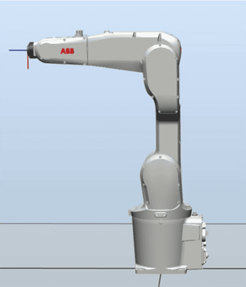

key:使用手动操纵让机器人各关节轴运动到机械原点刻度位置的顺序是:4-5-6-1-2-3。
1.机器人六个关节轴的机械原点刻度位置示意图。
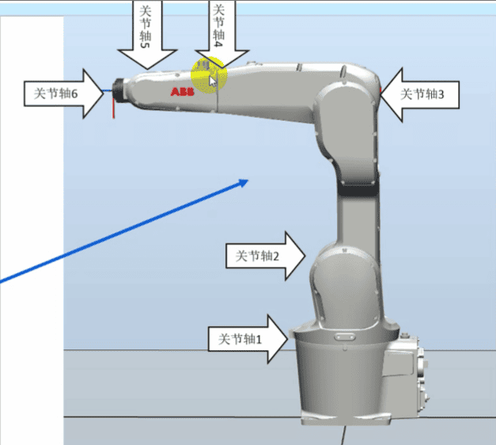
2.在手动操纵菜单中，动作模式选择“轴4-6”，将关节轴4运动到机械原点的刻度位置。
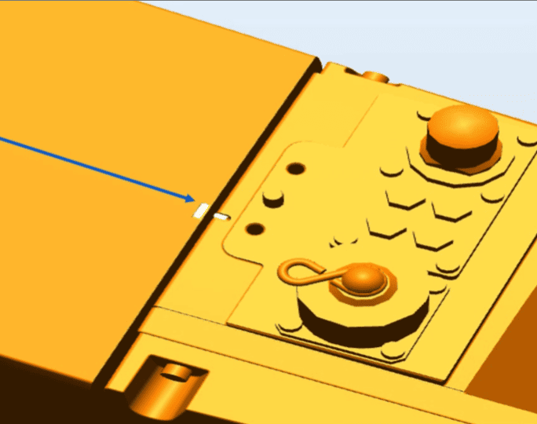
3.在手动操纵菜单中，动作模式选择“轴4-6”，将关节轴5运动到机械原点的刻度位置。
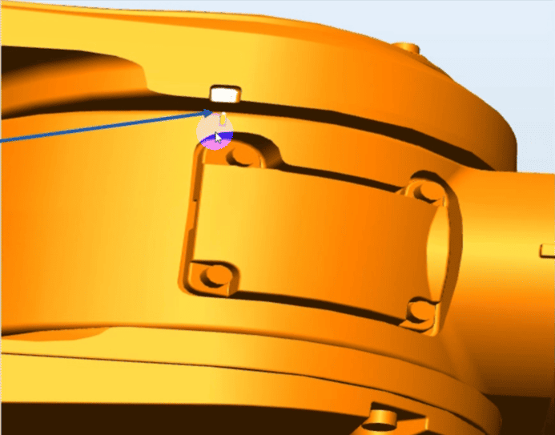
4.在手动操纵菜单中，动作模式选择“轴4-6”，将关节轴6运动到机械原点的刻度位置。
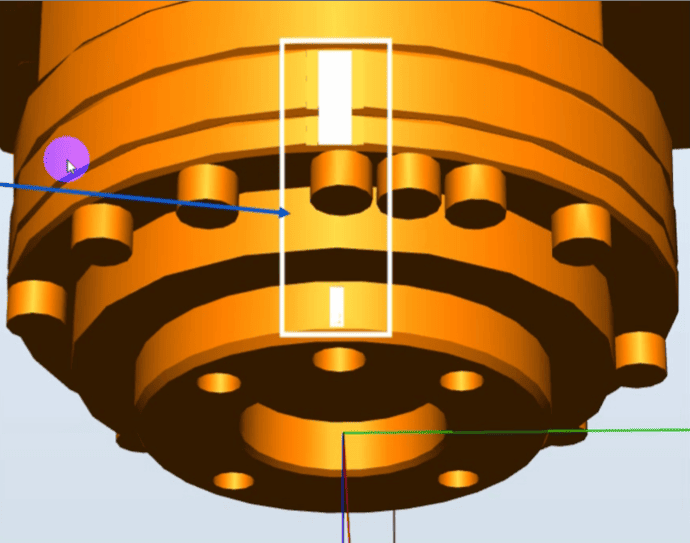
5.在手动操纵菜单中，动作模式选择“轴4-6”，将关节轴1运动到机械原点的刻度位置。
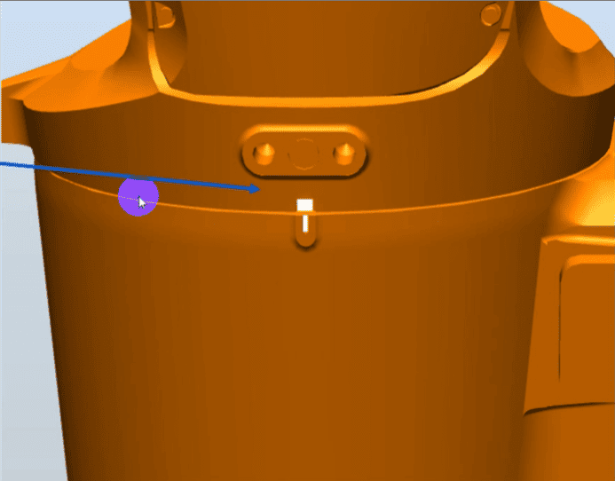
6.在手动操纵菜单中，动作模式选择“轴4-6”，将关节轴2运动到机械原点的刻度位置。
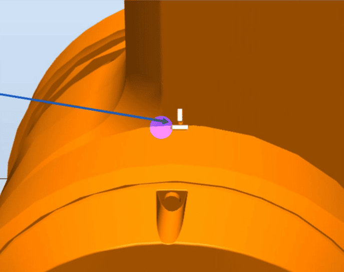
7.在手动操纵菜单中，动作模式选择“轴4-6”，将关节轴3运动到机械原点的刻度位置。
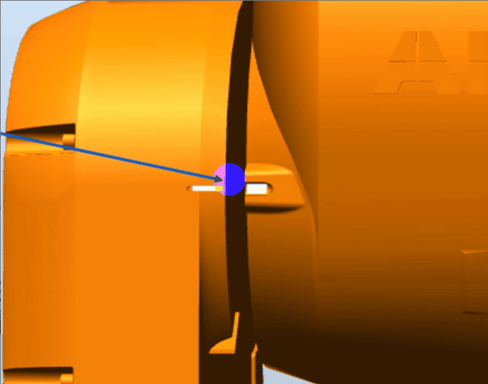
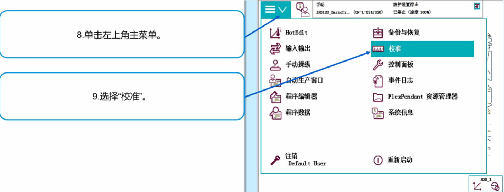
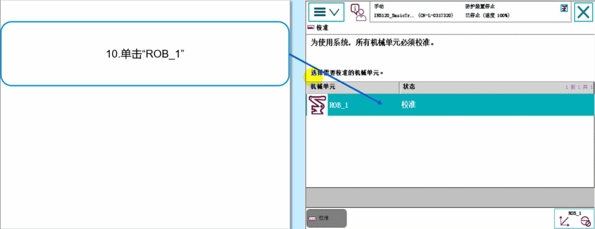
通常在机器人的底座上
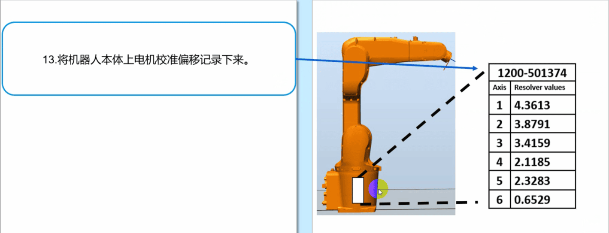
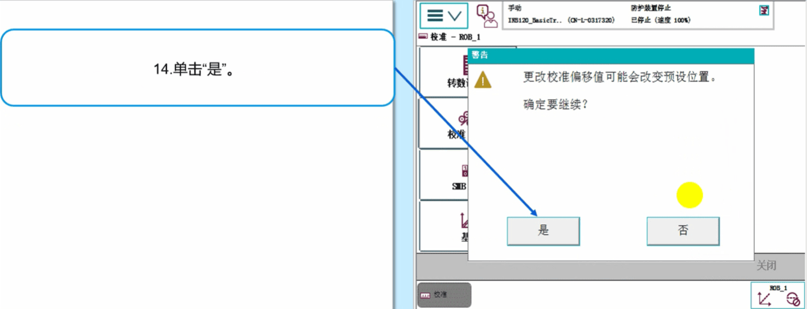
15.输入刚才从机器人本体记录的电机校准偏移数据然后单击“确定”。
如果示教器中显示的数值与机器人本体上的标签数值一致，则无需修改，直接单击“取消”退出，跳到第19步。
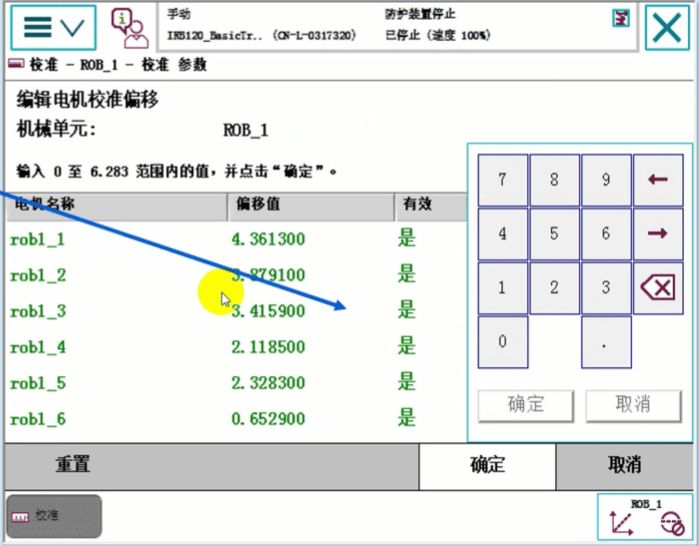
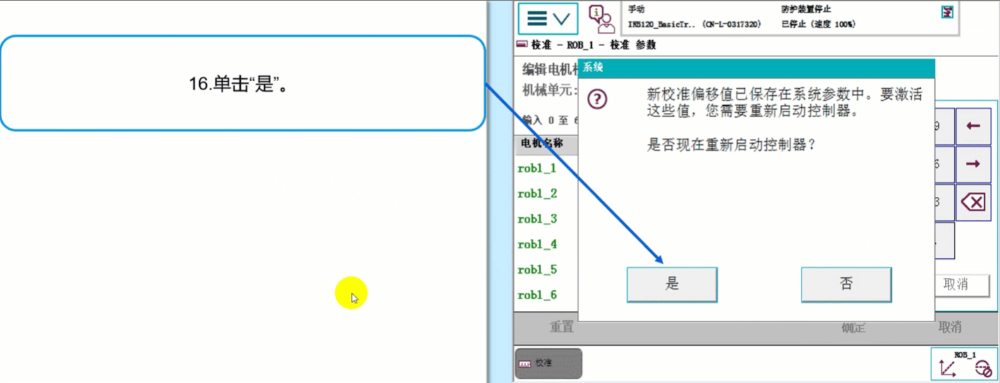
然后会重启。
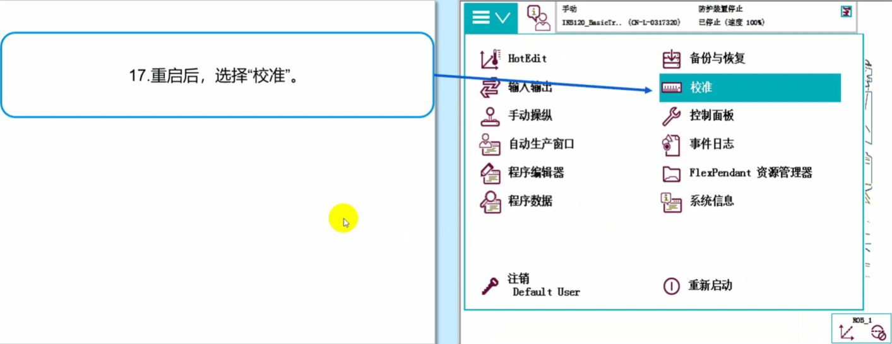
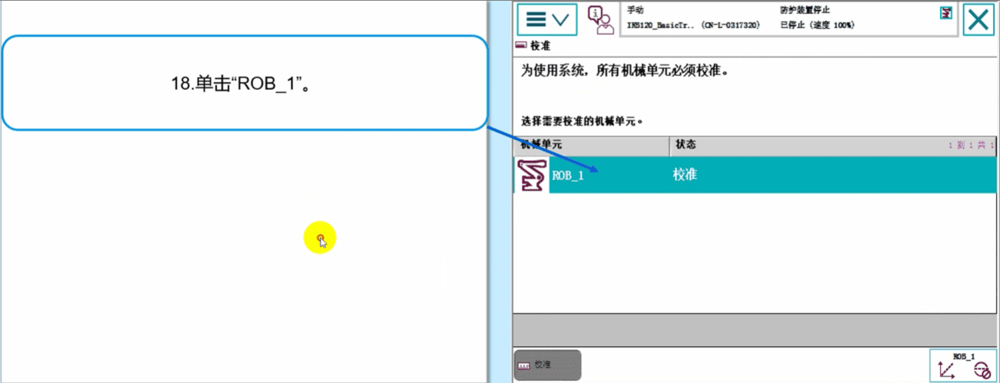
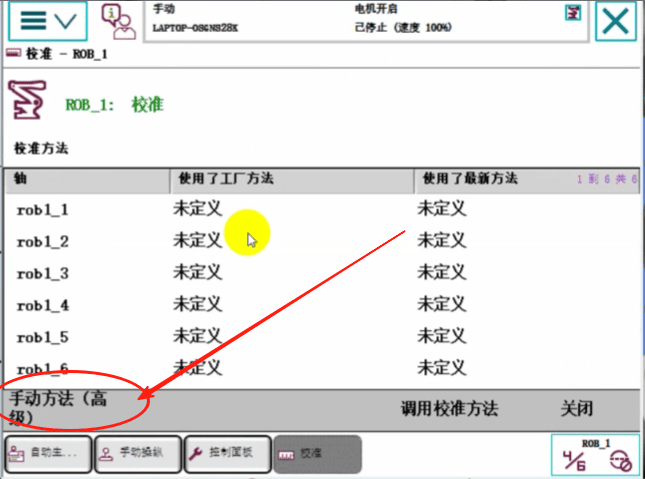
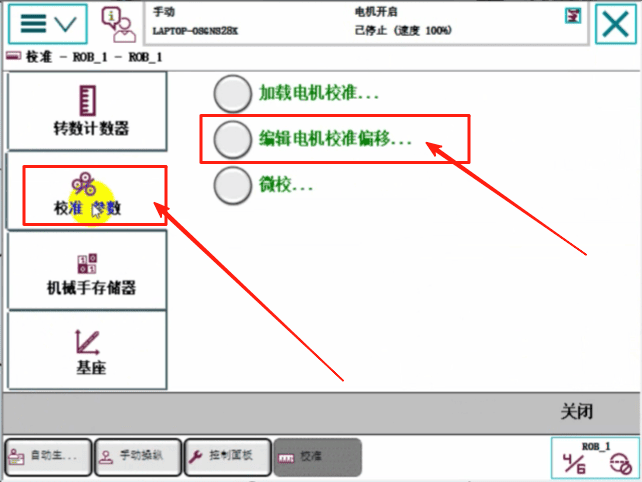
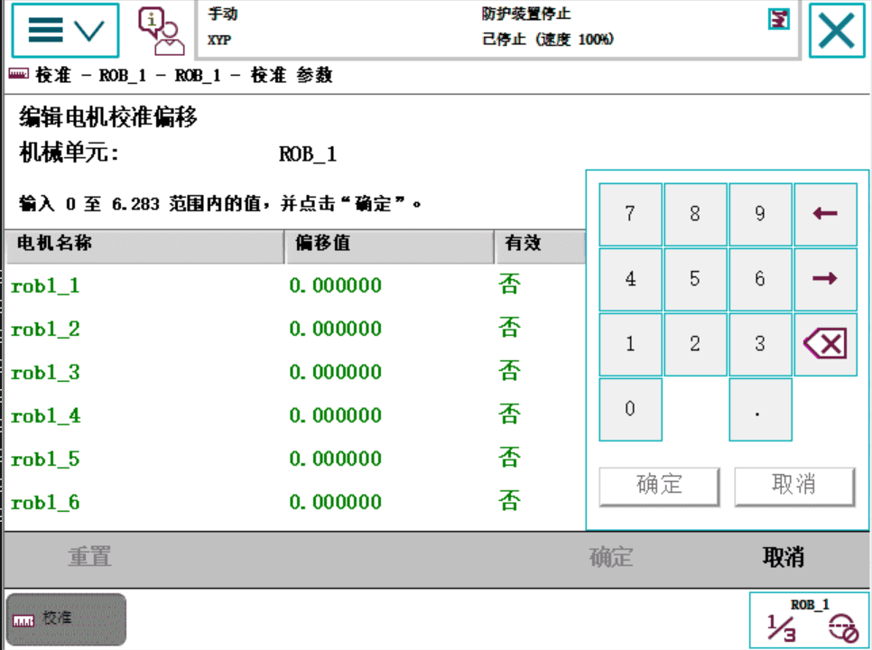
如何实际真机上发现这个值和机器人本体底座上的值不一样，那么就将本体上的值填在这。
22.单击“全选”，然后单击“更新”
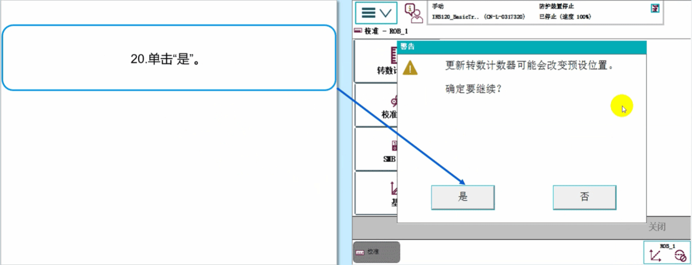
输入完之后【确定】，重启。
重启之后，更新一下转数计数器，在点击【主菜单】【校准】
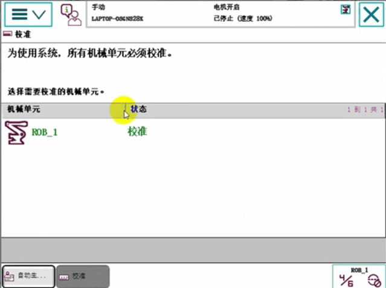
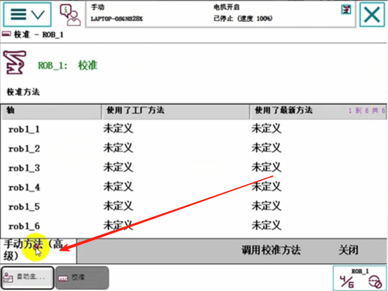
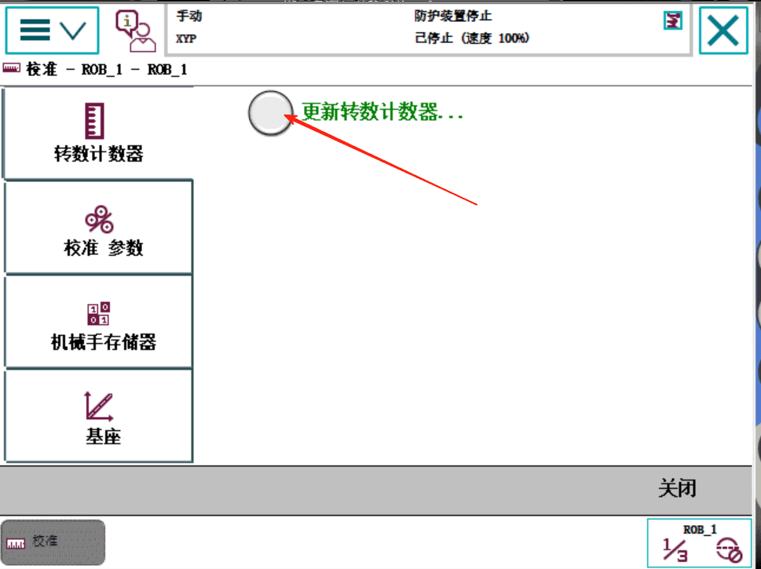
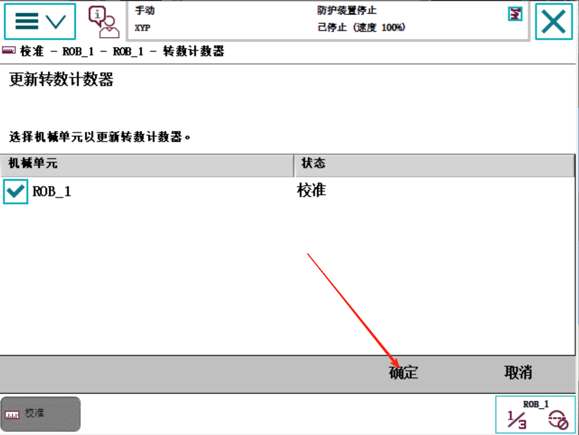
key:如果机器人由于安装位置的关系，无法六个轴同时到达机械原点刻度位置，则可以逐一对关节轴进行转数计数器更新。
确保是下电状态。点击【更新】
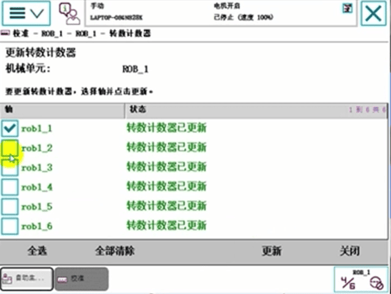
全部更新之后，点击【确认】
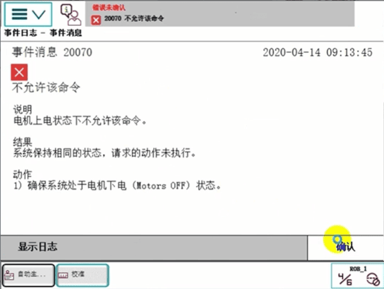

