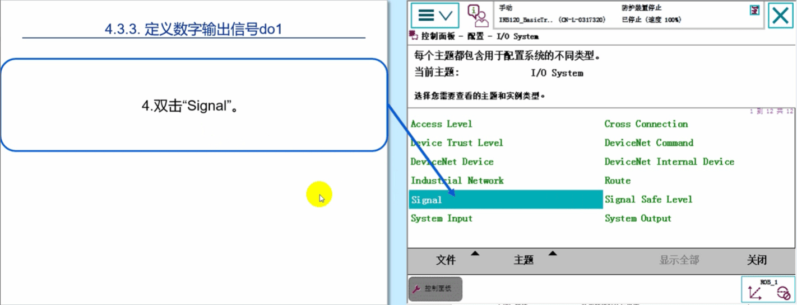
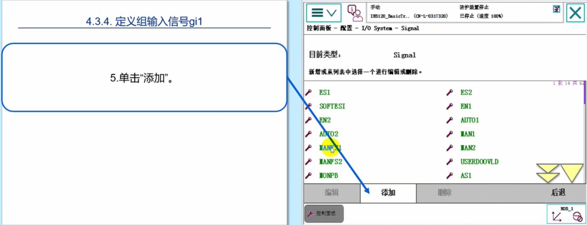
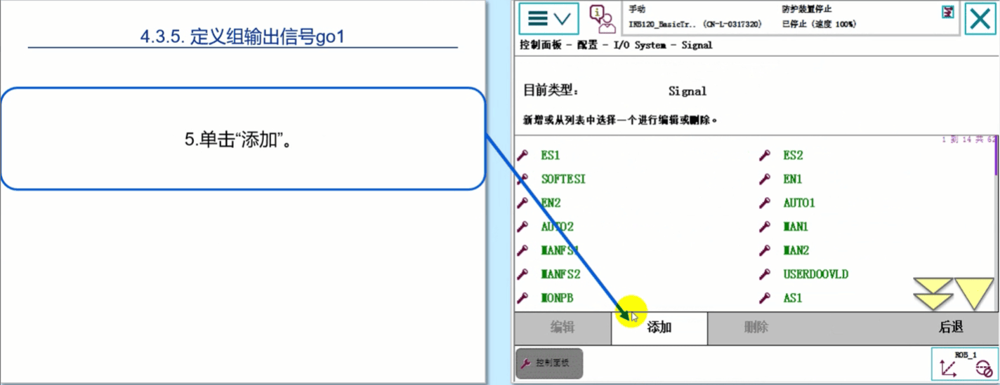
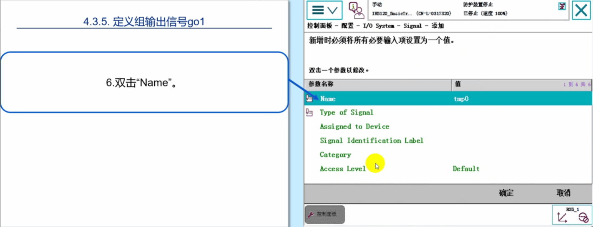

# 2 第三章 机器人IO信号的配置与接线 机器人IO信号的配置与接线

## 实战ABB标准I0板卡--DSQC651配置

### ABB标准I/O板DSQC651是最为常用的模块，下面以创建数字输入信号di、数字输出信号do、组输入信号gi、组输出信号go和模拟输出信号ao为例做一个详细的讲解。

## 首先点击【修改选项】,选择【709-1】选项，这样后面才会选到【DeviceNet Device】

#### 第一步 选择“控制面板”

#### 第二步 选择“配置”

#### 第三步 双击"DeviceNet Device".

#### 第四步 单击“添加”

#### 第五步 选择“DSQC 651 Combi l/0 Device”。

#### 第六步 双击“Name”进行DSQC651板在系统中名字的设定

#### 第七步 在系统中将DSQC651板的名字设定为"board10"

#### 下翻页

#### 第八步 将"Address”设定为10，然后单击”确定”

#### 单击”是”，这样DSQC651板的定义就完成了。

### 定义数字输入信号di1
#### 第一步

#### 第二步

#### 第三步

#### 第四步

#### 第五步

#### 第六步

#### 第七步

#### 第八步

#### 第九步

#### 第十步

#### 第十一步

#### 第十二步

#### 第十三步

#### 第十四步

#### 第十五步

### 定义数字输出信号do1
#### 第一步

#### 第二步

#### 第三步

#### 第四步

#### 第五步

#### 第六步

#### 第七步

#### 第八步

#### 第九步

#### 第十步

#### 第十一步

### 定义组输入信号gi1
#### 第一步

#### 第二步

#### 第三步

#### 第五步

#### 第六步

#### 第七步

#### 第八步

#### 第九步

#### 第十步

#### 第十一步

#### 第十二步

#### 第十三步

### 定义组输出信号go1
#### 第一步

#### 第二步

#### 第三步

#### 第四步

#### 第五步

#### 第六步

#### 第七步

#### 第八步

#### 第九步

#### 第十步

#### 第十一步

#### 第十二步

#### 第十三步

### 定义模拟输出信号ao1
#### 第一步

#### 第二步

#### 第三步

#### 第四步

#### 第五步

#### 第六步

#### 第七步

#### 第八步

#### 第九步

#### 第十步

#### 第十一步

#### 第十二步

#### 第十三步

#### 第十四步

#### 第十五步

