# 第三章 机器人IO信号的配置与接线 通讯板卡的配置

## 进行PROFIBUS通信

## 首先点击【修改选项】，搜索709-1和840-2并勾选
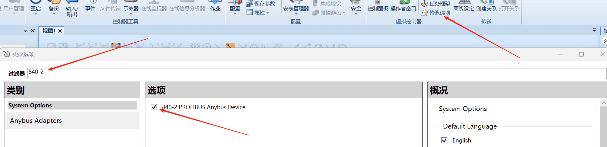
### 【主菜单】【系统信息】【系统属性】【控制模块】【选项】
可以看到这里已经支持了PROFIBUS
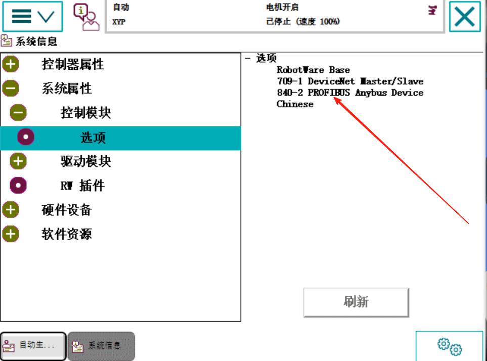

## ABB机器人和PLC通信的时候有个GSD文件给到PLC，让PLC去组态的

## 我们先看机器人端的PROFIBUS通信设置

### PROFIBUS地址设置
【主菜单】【控制面板】【配置系统参数】【Industrial Network】【PROFIBUS_Anybus】【Address】这个就是机器人通信的地址，改成8
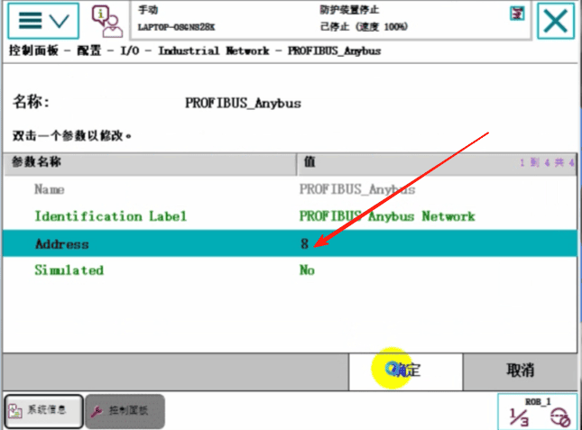

### 设置通信字节数设置 
【主菜单】【控制面板】【配置系统参数】【PROFIBUS Internal Anybus Device】【PB_Internal_Anybus】【Input Size (img6/bytes)】
我们通信输入输出字节数都 设置为8个字节 也就是64位 地址是0至63
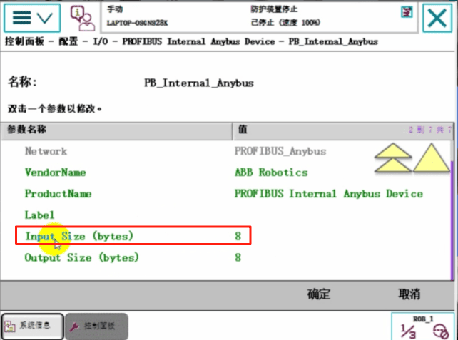
点击【确定】

### 建立通信信号
【主菜单】【控制面板】【配置系统参数】【Signal】【添加】
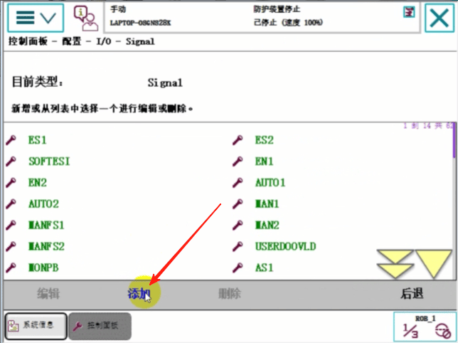
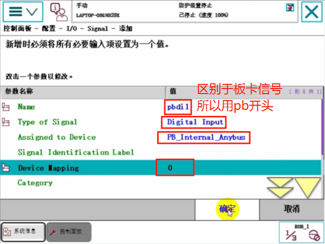
暂不重启【否】

### 建一个板卡的信号做对比
【主菜单】【控制面板】【配置系统参数】【DeviceNet Device】【添加】

DSQC 652 24 VDC I/0 Device 板卡是16个数字输入 16个数字输出 没有模拟量
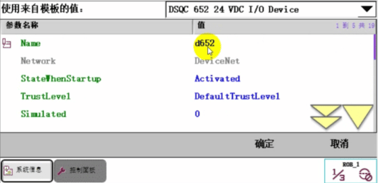
设置地址 这个地址和跳线引脚有关系 和短接的地址有关系
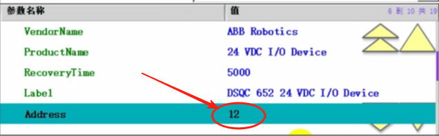
暂不重启【否】

在DSQC 652 24 VDC I/0 Device板卡上建一个信号
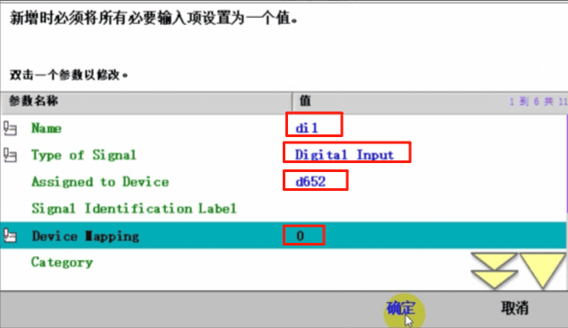
暂不重启【否】

这时候我们知道 di1的地址是0，pbdi1的地址也是0，他们两个地址是不冲突的，因为pbdi1这个地址是建在Profibus总线上面的，di1的地址是建在DSQC 652 24 VDC I/0 Device板卡上面的

添加一个pbdo1信号 在Profibus上
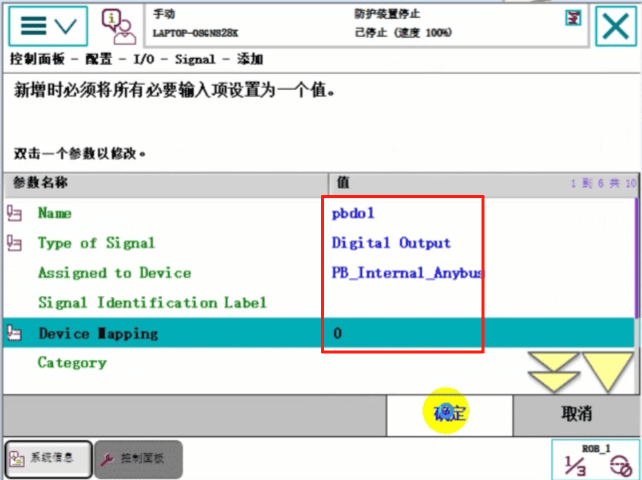
暂不重启【否】

添加一个do1信号 在DSQC 652 24 VDC I/0 Device板卡上
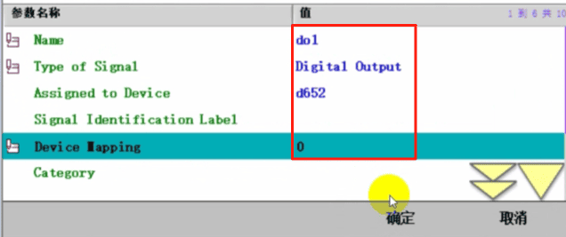
重启示教器

### 设置到手动模式，【主菜单】【输入输出】【ROB_1】【全部信号】观察
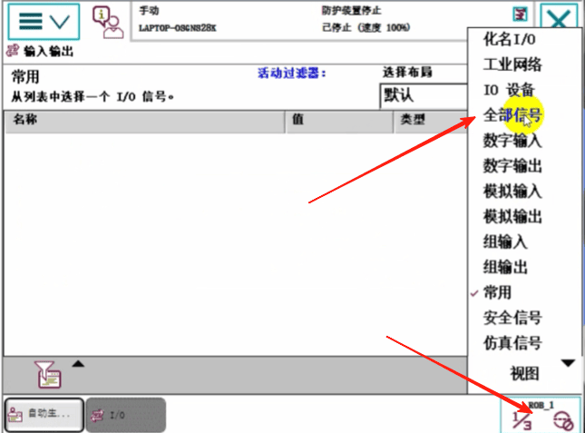
在这里可以看到，di1、do1是建立在d652板卡上面的，pbdi1、pbdo1是建立在Profibus通讯上面的
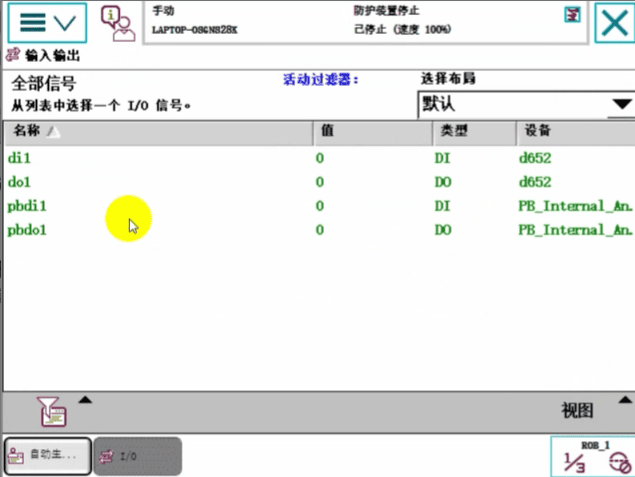

### Profinet通信机器人端的设置
Profinet也需要一个GSD文件给到PLC，让PLC去组态

点击RobotStudio【修改选项】搜索840-3选上
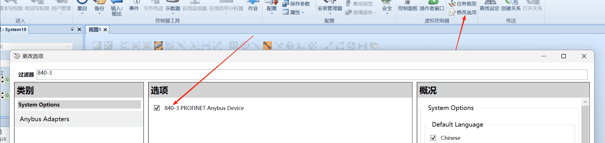
#### 【主菜单】【系统信息】【系统属性】【控制模块】【选项】
看到已经存在了
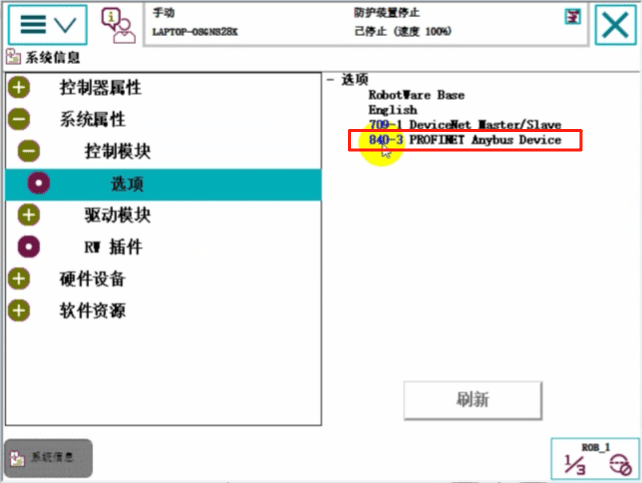
【主菜单】【控制面板】【配置系统参数】【Industrial Network】
【PROFINET Anybus】
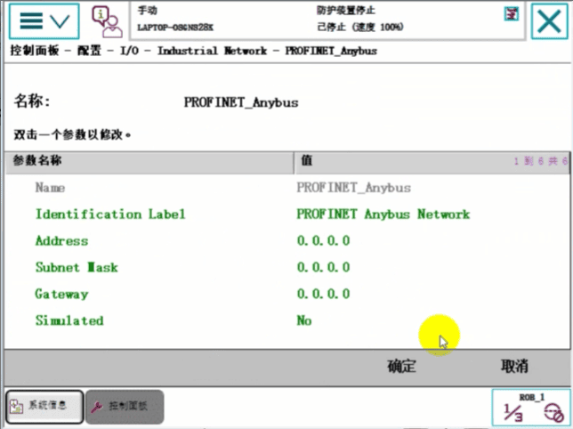

#### 设置ProfiNet的通信字节数
【主菜单】【控制面板】【配置系统参数】【PROFINET Internal Anybus Device】【PN_Internal Anybus】
设置为8个字节 64位通信
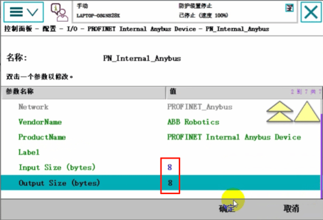

#### 建立Profinet信号
【主菜单】【控制面板】【配置系统参数】【Signal】【添加】
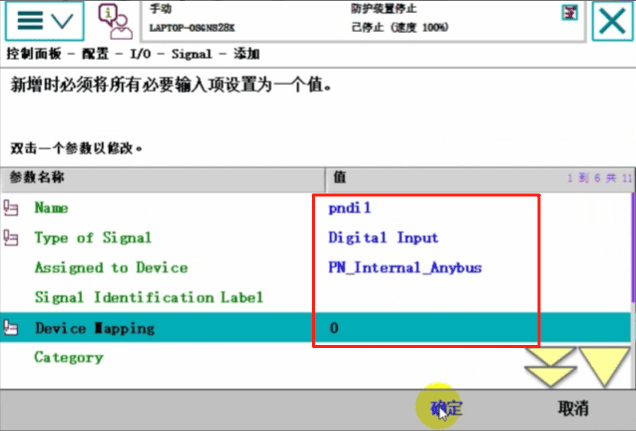
【否】暂不重启

#### 建立一个DSQC652板卡信号做对比
添加一个DSQC652板卡
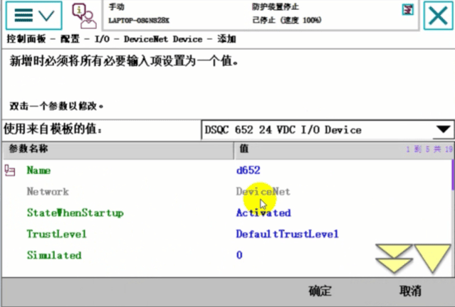
设置板卡地址
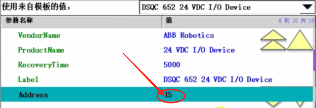

#### 建立DSQC652板卡信号
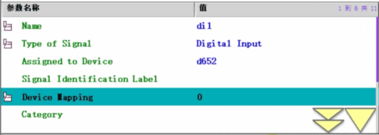
#### 【主菜单】【输入输出】【ROB_1】【全部信号】观察对比建立在Profinet和DSQC652板卡上的信号
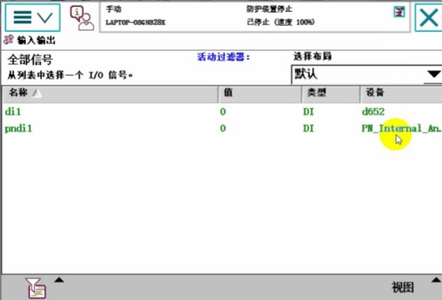

