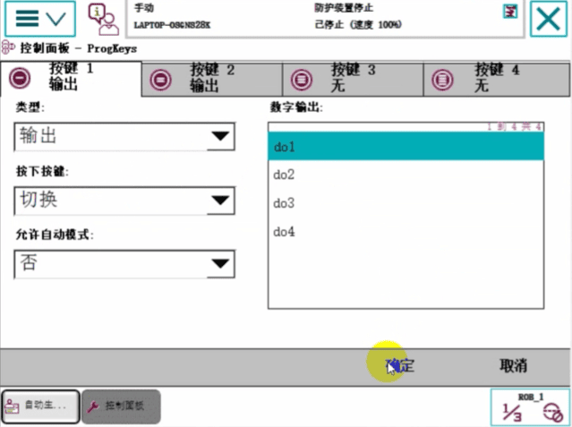

# 第三章 3.机器人IO信号的配置与接线IO信号的关联和可编程按键的设置

# 系统输入输出和IO信号的关联
这个关联起来的作用是可以通过外部的按钮可以直接去启动机器人

设置到手动模式，
## 添加一个652板卡
【主菜单】【控制面板】【配置系统参数】【DeviceNet Device】【添加】

设置地址

【确定】【否】

### 建信号
【主菜单】【控制面板】【配置系统参数】【Signal】【添加】

【主菜单】【控制面板】【配置系统参数】【Signal】【添加】

### 与系统信号做关联

System Input 系统输入
System Output 系统输出

点击系统【System Input】输入建立关联信号

【否】暂不重启

点击系统【System Output】输出建立关联信号

【是】重启

### 示教器上可编程按键的使用
先建输出信号
【主菜单】【控制面板】【配置系统参数】【Signal】【添加】

【确定】重启
#### 配置可编程按键

配置好之后就可以按示教器上的按钮控制了

