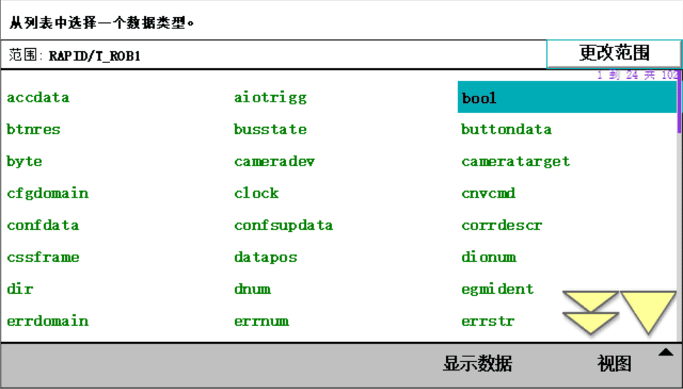

# 第四章 1.程序数据

## 数据类型

【主菜单】【程序数据】【视图】【全部数据类型】

使用某个数据需要先建立才能使用

robtarget 机器人位置数据类型
num 数值数据类型
bool 布尔类型

## 如何建立一个程序数据
方法一
【菜单】【程序数据】找到想建的数据类型
例如 bool

点击新建

这样一个bool类型的程序数据就建好了

方法二
写程序的时候自动生成

双击*号

点击新建

Movej p20, V1000, z50, tool0 表示让机器人移动
p20 表示是一个位置数据
v1000 表示一个速度数据
z50 表示转角区域数据
tool0 表示一个工具数据

点击下面程序数据按钮

找到robtarget并且双击

这样就看到我们刚刚在程序中新建的数据了

## 变量、可变量与常量的区别
先建2个数据

点击例行程序

VAR 表示变量,可以赋值
PERS 表示可变量,可以赋值
CONST 表示常量, 不能被赋值

:= 表示赋值指令

变量可以自加赋值，
可变量不可以自加赋值。

人为的恢复，变量会恢复初始值，可变量不会恢复初始值，可变量永远以最后一次赋值为准。

